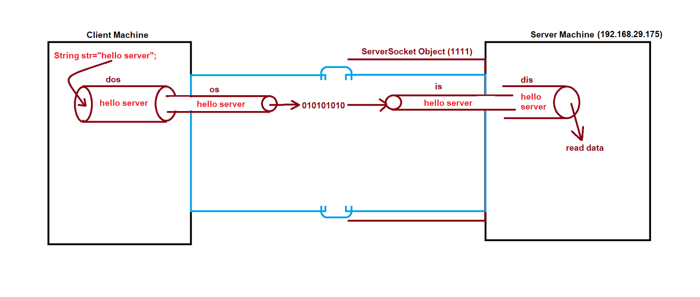

## Socket Programming

### Socket Programming :-
- Socket Programming is used for communication between two systems (two JRE).
- Socket Programming can be connection-oriented or connection-less.
- To achieve Socket Programming java has provided one package `java.net` package.
- For connection-oriented TCP is used and java provides some classes i.e. ServerSocket & Socket.
- For connection-less UDP is used and java provides some classes i.e. DatagramPacket & DatagramSocket
- These all classes are present in java.net package
- Socket Programming is used to create distributed applications.

### Steps for Socket Programming :-

**Steps for Server side :**

1. Create ServerSocket object and run it on certain port number.
2. Call accept() method of ServerSocket class.
   - It will wait for client request and as soon as client sends the request, it will accept the request.

**Steps for Client side :**

1. Create Socket object on client side and provide IP Address and Port Number

**Read and Write the data from one machine to another machine:**
  - `java.io` package : read write
  - right now we are sending the data on the network. 
  - we can send data in any form like data-object, buffer, piped.




- ServerSocketObject: it is an object of the Server Machine
- When client send the request, that client socket object gets return on the server side. 
- So, you can say, one copy is on the client machine and one copy is on sever machine.

#### See Programs:
- [Test.java](_2_Socket_Programming%2FSocketProgrammingDemo%2Fdemo%2FTest.java) : for reading class and interfaces, socket, serversocket.
- Client and Server :
  - [MyClient.java](_2_Socket_Programming%2FSocketProgrammingDemo%2Fspclient%2FMyClient.java)
  - [MyServer.java](_2_Socket_Programming%2FSocketProgrammingDemo%2Fspserver%2FMyServer.java)
  -  explanation is given below


- Both Client and Server send & receive the message/data. 
  - [test1](_2_Socket_Programming%2FChatServer%2Ftest1) : both send messages each other
  - [test2](_2_Socket_Programming%2FChatServer%2Ftest2) : both send messages infinite times to each other
  - [test3](_2_Socket_Programming%2FChatServer%2Ftest3) : creating client in another laptop
    - So, in **test3** you need to run server and client in different system, 
    - you need to provide ip address of the server's machine.
    - both PC/machine should be connect with same network(wifi).
    - or you can create server and client project differently and save in different folder. then you run through terminal/CMD and check the messages from both side.
    - it has small errors like you can send multiple messages in new lines then check the output.. you need to change the logic part.

----

### Server Client Connection
```

C:\Windows\System32>ipconfig

Windows IP Configuration


Ethernet adapter Ethernet 2:

   Connection-specific DNS Suffix  . :
   Link-local IPv6 Address . . . . . : fe80::b1c1:b4f1:249d:54d4%4
   IPv4 Address. . . . . . . . . . . : 192.168.56.1
   Subnet Mask . . . . . . . . . . . : 255.255.255.0
   Default Gateway . . . . . . . . . :
```
```java
/*
        1. Run MyServer Program - see output
        2. then run MyClient program - see output
 */
public class MyServer {
   public static void main(String[] args) {
      try {
         ServerSocket serversocket = new ServerSocket(1111);
         System.out.println("Server is waiting for client");

         Socket socket = serversocket.accept();
         System.out.println("Client found");
      } catch (Exception e) {
         System.out.println(e);
      }
   }
}
// Output: Server is waiting for client

public class MyClient {
   public static void main(String[] args) {
      try {
//            Socket socket = new Socket("192.168.29.175", 1111);
         Socket socket = new Socket("192.168.56.1", 1111);
      } catch (Exception e) {
         System.out.println(e);
      }
   }
}


// After running MyClient, again check output at server side
/*
        Server is waiting for Client
        Client found
 */
```

### Read Data from Client to Server

```java
public class MyClient {
    public static void main(String[] args) {
        try {
//            Socket socket = new Socket("192.168.29.175", 1111);
            Socket socket = new Socket("192.168.56.1", 1111);

            OutputStream os = socket.getOutputStream();

            DataOutputStream dos = new DataOutputStream(os);

            String str = "Hello Server";
            dos.writeUTF(str);

            dos.flush();

            dos.close();
            os.close();
            socket.close();
        } catch (Exception e) {
            System.out.println(e);
        }
    }
}

public class MyServer {
    public static void main(String[] args) {
        try {
            ServerSocket serversocket = new ServerSocket(1111);
            System.out.println("Server is waiting for client");

            Socket socket = serversocket.accept();
            System.out.println("Client found");

            InputStream is = socket.getInputStream();

            DataInputStream dis = new DataInputStream(is);
            String str = dis.readUTF();

            System.out.println("Message from client : " + str);

            dis.close();
            is.close();
            socket.close();
            serversocket.close();
        } catch (Exception e) {
            System.out.println(e);
        }
    }
}

/*
    getOutputStream(), getInputStream() : Methods of the Socket
    Both sockets are same(client side and server side)
    It is copy of each other
 */

/*
OutPut:

---> Server Start
    Server is waiting for client

---> Client Start

---> Server Start
    Server is waiting for client
    Client found
    Message from client : Hello Server

 */
```

------------------

Note:
- we can take user input for 3 ways : 
1. Scanner class
2. Input Stream or Output Stream
3. Buffer Reader or Buffer Writer