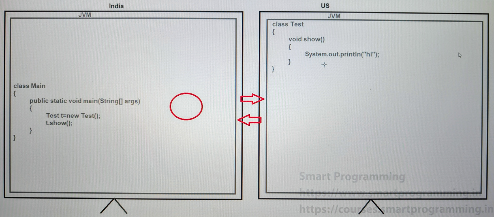
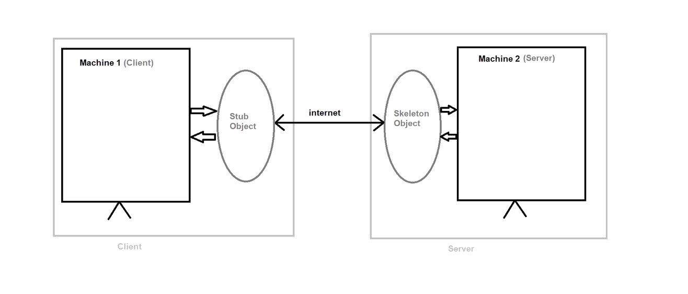
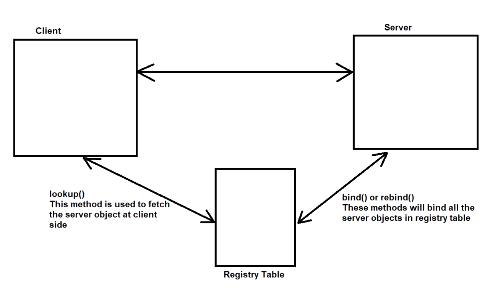

## Remote Method Invocation

### RMI : Remote Method Invocation

- RMI is an API which is used to create Distributed Applications in java.
- RMI API allows an object to invoke another method that exists in another address space or another JVM.
- RMI provides remote communication between the applications using two objects i.e. "stub" & "skeleton".

NOTE : 
- RMI API is provided in "`java.rmi`" package.

##  Stub & Skeleton

### Stub object :-
- Stub is an object which acts as a gateway for the client side. All the outgoings request are routed through stub object.

Stub object has the following tasks :-
1. It initiates the connection with remote machine (remote JVM)
2. It writes and transmits the parameters from client to server (remote machine).
3. It will wait for the result
4. It can read the returned result/expression or exception
5. Finally, it can return the value to the caller/client

### Skeleton Object :-
- Skeleton is an object which acts as a gateway for the server side. All the incoming requests are routed through skeleton object

Skeleton object has the following tasks :-
1. It can read the parameters for remote machine
2. It will invoke the remote method
3. It can write and transmits the result

**NOTE :**
- From `rmic` 1.2 version, skeleton object is not generated. New `JRMP` (Java Remote Method Protocol) has got rid of skeleton object.

### RMI Registry

It is the namespace on which all the server objects are placed.

### Steps for RMI program :-
1. Create the remote interface
2. Create an implemented class for remote interface
3. Create client and server
4. Compile, stub & skeleton (rmic)
5. start the registry (rmiregistry)
6. Start the server
7. Run the client

### See Programs:

Note:

- If you're using JDK 11 or later, rmic is no longer included, as RMI stubs are generated dynamically. Consider updating your code to use dynamic RMI or switch to JDK 8 for legacy support.
- Starting with JDK 11, rmic was removed because Java RMI now uses dynamic proxies — you no longer need to generate stub classes manually using rmic.

1. rmidemo : 
   - [Client](_3_RMI%2Frmidemo%2FClient)
   - [Server](_3_RMI%2Frmidemo%2FServer)
   - Steps
     - For this 2 programs: go to terminal in that folder(1st server and 2nd client) and run `javac *.java` command for generating class files. (this command compile the program and generate the .class file).
     - now we need to generate stub & skeleton object by using rmic command. see below
     - `rmic AddImplClass` : this will generate stub .class.
     - copy this file and paste in Client folder.
     - now we need to map in the rmic register table using this command. `start rmicregistry`
     - now run this command and give port: `rmiregistry 1111`
     - this will open one black screen: just minimize the screen.
     - now server program start it.
     - now open one more terminal and run the client. cmd: `java Client`
   

2. For localhost:
   - this for local host : rmidemoo
     - [Client.java](_3_RMI%2Frmidemoo%2FClient.java)
     - [Server.java](_3_RMI%2Frmidemoo%2FServer.java)
