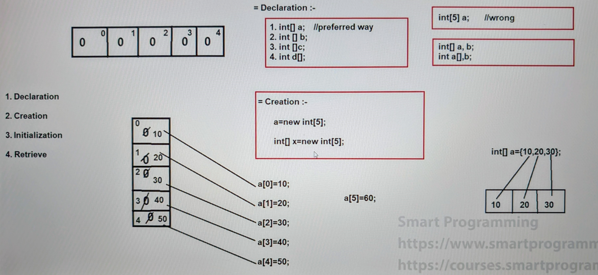

#### Single Dimensional Array in Java

## Types of Arrays :-

1. Single Dimensional Array
   - 1D Array
   

2. Multi-Dimensional Array
   - 2D Array
   - 3D Array
   - 4D, 5D, 6D.... Array
   - Zic-Zac Array (Jagged Array)


3. Anonymous Array


## Single Dimensional Array (for example 1D Array) :-
- In this type of array, there is only one row or one column
- Following points for each type of array : 
  - Declaration 
  - Creation
  - Initialization 
  - Retrieve

Declaration :
1. Array can be declared normally like simple variables but we have to provide square([]) braces.
2. When we declare an array, we don't need to provide the size of an array.
   ```java
   public class Test {
      
       int rollno; =>  this is normal declaration of datatype
       int[] rollno; =>  this is array
      
      =>  you can declare an array like these many ways
      int[] a;    =>  prefereed way
      int [] b;
      int []c;
      int a[];
   
      =>  also you can do this
      Test[] t; 
   
       =>  Array can store premitive and non-premitive data type.

   }
   
   ```

Creation : 

1. When we create an array by using new keyword, we have to provide the size of an array.
2. When we create an array by using new keyword, all the index position will be initialized by its default values.

   ```
   int[] a = new int[5]
    ___________________
   | 0 | 0 | 0 | 0 | 0 |
    ------------------- 
   in every element, 0 value is Initialized
   
   ----------------------------------------------------
   
   String[] name = new String[5]       OR
   Test[] t = new Test[5];          =>  here Test is a class name.
    __________________________________
   | null | null | null | null | null |
    ----------------------------------
   in every element, null value is Initialized
   
   ```

   - **Note:**
     - We can declare and create an array within a single line


Initialization :

1. We can provide the values at particular index position


   - **Note:**
     - We can declare, create and initlize an array within single line

Retrieve :
1. We can retrieve the value by using for loop

----


## Different cases for Declaration, Creation & Initialization of an array

### Declaration :

```
1. int[] a,b; => a and b are both arrays
2. int []a,b; => a and b both are arrays
3. int a[],b; => correct, a is an array but b is simple variable
4. int a,b[]; => correct, a is normal variable but b is an array
5. int a[], b[]; => both a and b are array
6. int []a, b[]; => a and b are both arrays

7. int a,[]b; => compile time error 
(you can do array brackets before 1st variable 
but if you do not use before 1st variable
then for 2nd position you can not provide it)
```

### Creation :
```
1. a = new int[5]; => correct
2. a = new int[]; => error
3. int[] a = new int[5]; => correct
4. int a[] = new int[5]; => correct
5. int []a = new [5]int; => error
6. int[] a = new int[0]; => it will successfully compile and run
7. int[] a = new int[-3]; => it will compile but provides runtime exception i.e. `java.lang.NegativeArraySizeException`
```

### Initialization :-
```
1. int[] a = new int[3];
   a[3]=100; => compile successfully but will throw runtime exception saying `ArrayIndexOutOfBoundsException`

2. If we don't initialize any proper index position value, then it will compile and run successfully

3. a[-1] = 100; => compile successfully but will provide runtime exception saying ArrayIndexOutOfBoundsException
```
### Points to remember :
1. Array are Objects in java.
2. Arrays are stored in "`Heap Area`".

### Interview Questions :-
1. Difference between declaring, creating and initializing an array with and without using new keyword
   - When we create an array without using new keyword then default value will not be initialized in the array, all the values will be initialized automatically in the array.



### See Programs:
- [Test1.java](_2%2FTest1.java)

----
in Array, length is a variable not method.

Length method is in a String not here in Array.

In Java, length is an attribute which is used to calculate the total number of elements present in an array.
