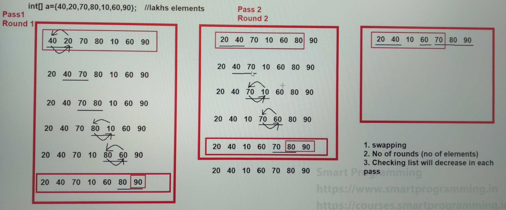

### Sorting
- These sorting algorithm is performed on the Arrays.

1. Bubble Sort
2. Selection Sort
3. Insertion Sort
4. Merge Sort
5. Quick Sort
6. Heap Sort

### Bubble Sort

- here in this diagram, we can see `no_of_rounds = no_of_elements` in some cases, but in more often `no_of_rounds = no_of_elements - 1`.
- this is the simplest sorting algorithm. 
- in the real world projects this kind of the algorithm uses very rare.
- the speed of this algorithm is very slow.

### See Programs

- WAP to sort the element of an array using Bubble Sort : [BubbleSort.java](_6%2FBubbleSort.java)
- [BubbleSortString.java](_6%2FBubbleSortString.java)
- WAP to find the maximum and minimum elements in an array: [MinMaxElement.java](_6%2FMinMaxElement.java)
- WAP to find the second largest element in an array : [SecondLargestElement.java](_6%2FSecondLargestElement.java)
- WAP to fins the Kth largest element in an array : total different 7-8 ways to solve for this question

------

You need to do all sorting algorithm like this step by step.