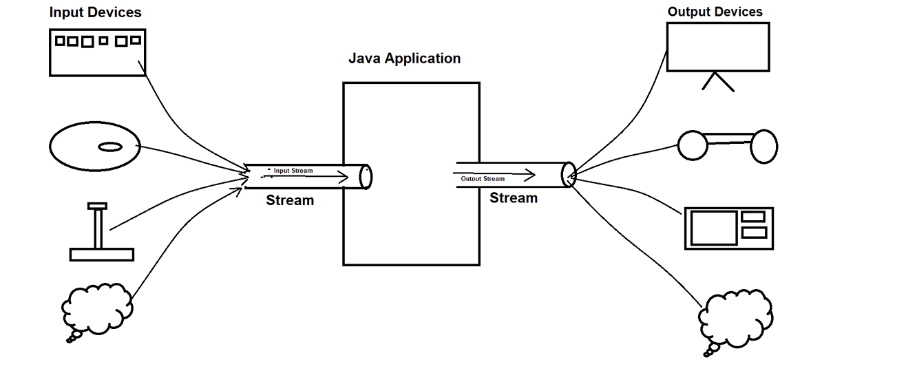
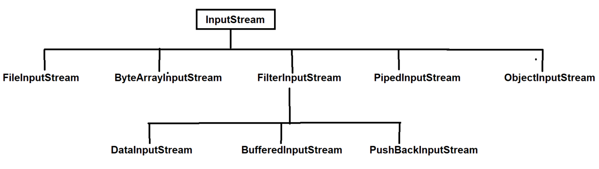
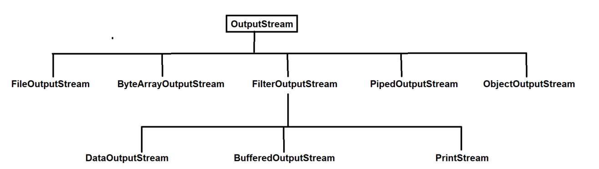
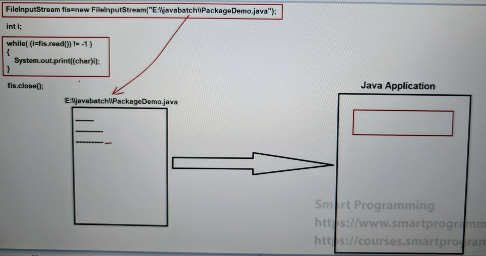
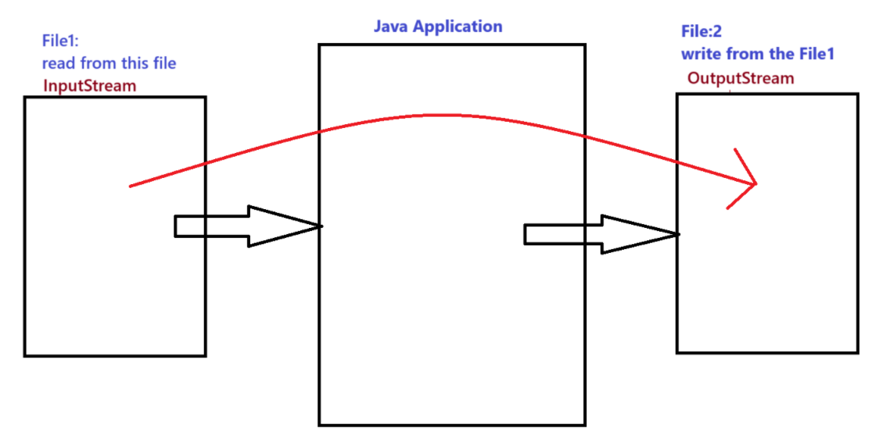

## Byte Stream in Java

### Java IO :-
- Terms used in Java IO :-
1. Input Devices : Keyboard, mouse, Optical pen, Joystick, network etc.
2. Output Devices : Screen, Head Set, Printers, Speakers, network etc.

3. Stream : Flow of data, Real world example Water flow

### Stream : 
- Stream is a medium which allow the data to flow from input devices to java application or from java application to output devices.
- here in the diagram we can see the stream as pipe, which transfer the data.

- In java there are 3 predefined stream which transfer the data from CMD to java application which are as follows :-
  1. `System.out`
  2. `System.in`
  3. `System.err`

- To transfer the data from input devices to java application or java application to output devices, java has provided many classes which are present in `java.io` package.

- Types of Streams :-
  1. Byte Stream
  2. Character Stream
   
### Byte Stream :-
- In this stream data is transferred in the form of bytes i.e. 0 and 1
- The length of byte stream is 1 byte

- Types of byte stream :-
  1. InputStream
     - `public int read(-) throws IOException`
     - `public int available() throws IOException`
     - `public void close() throws IOException`
  2. OutputStream
     - `public void write(-) throws IOException`
     - `public void flush() throws IOException`
     - `public void close() throws IOException`

- `Note`: 
- Input-Output Stream both class implements Closeable interface, and it has close() method. So, whenever anyone implements this interface, it should be close the object og that class properly due to security reason(otherwise can be hacked).
- InputStream class is an abstract class that is why we can not make the object of the class. (`Rule:` can not create the object of the abstract class.)
- So, we need to make the object of the implementation class.

- Hierarchy of InputStream and OutputStream classes :-

### See Programs:
- InputStream
  - [ReadData.java](_1_Java_IO_Intro_Byte_Stream%2FJavaIoDemo%2Finputstreamdemo%2FReadData.java)
  - [ReadData1.java](_1_Java_IO_Intro_Byte_Stream%2FJavaIoDemo%2Finputstreamdemo%2FReadData1.java)
  - [ReadData2.java](_1_Java_IO_Intro_Byte_Stream%2FJavaIoDemo%2Finputstreamdemo%2FReadData2.java)
- OutputStream 
  - [WriteData.java](_1_Java_IO_Intro_Byte_Stream%2FJavaIoDemo%2Foutputstreamdemo%2FWriteData.java)

### Diagram

### Question
WAP a program : read from one file and write in another file.

- [CopyFileDemo.java](_1_Java_IO_Intro_Byte_Stream%2FJavaIoDemo%2FCopyFIle%2FCopyFileDemo.java)

- workflow
