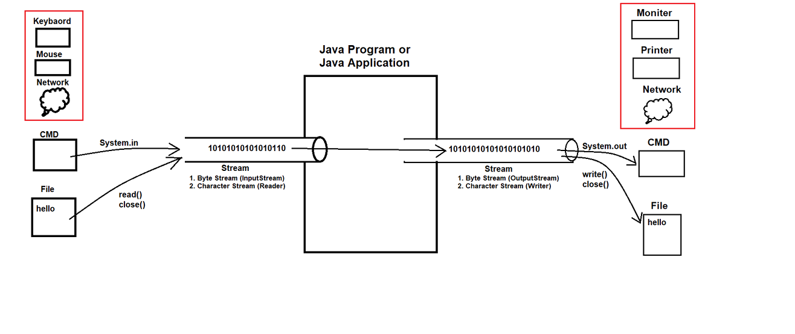
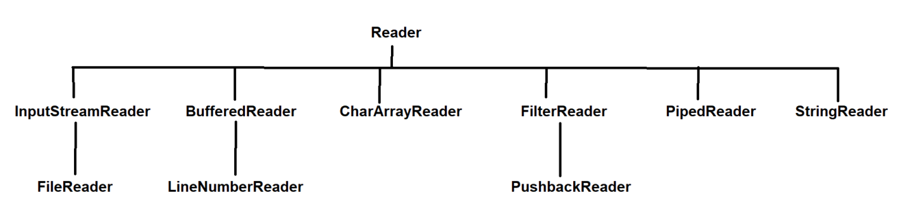
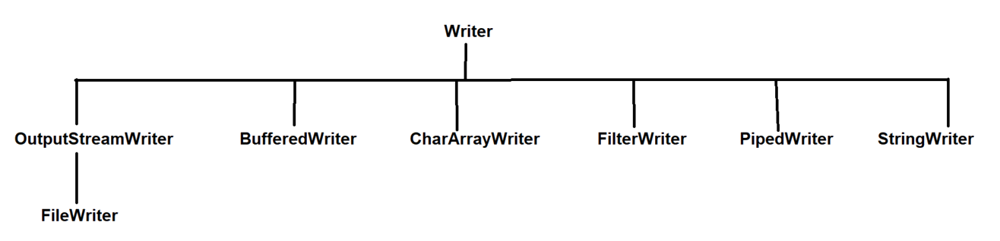
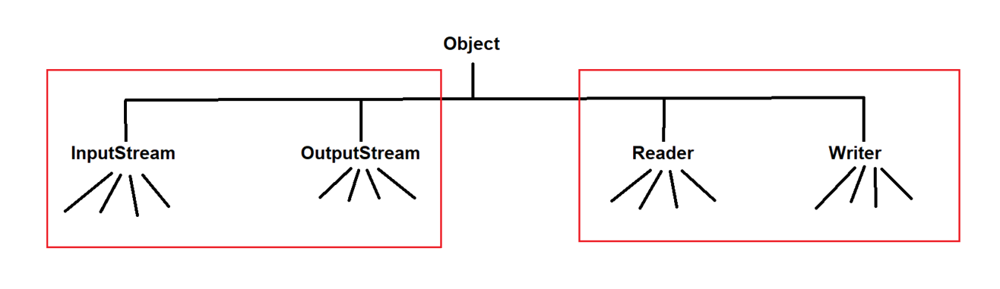
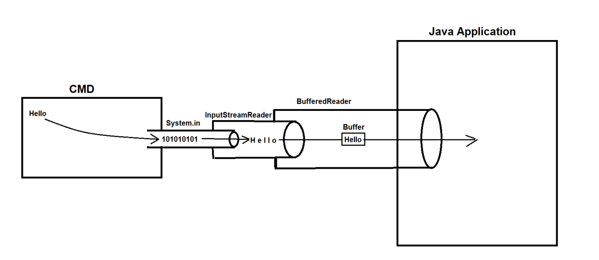

## Character Stream in Java & Dynamic Input Approaches

InputStream & OutputStream Diagram :-

- Note: 
  - Byte stream is much better than character stream.
  - Because using byte stream we can transfer anything like images, videos etc. but this is not possible in the character stream.
  - That is why Byte Stream is more powerful, strong and more useful than character stream.

- `See Programs`: 
  - [CopyPaste.java](_2_Character_Stream_Dynamic_Input_Appr%2FJavaIoDemo%2Fcopypaste%2FCopyPaste.java)

### Character Stream :
- It is used to transfer the data in characters form.
- In character stream the length of data is 2 bytes.

- Types of Character Stream :-
  1. Reader
     - read(-)
     - close()
  2. Writer
     - write()
     - close()
     - Hierarchy of Writer & Reader classes

- `Note`: Reader and Writer both are predefine abstract class. So we can not create object of these classes. 

- `See Programs`:
  - [ReadDemo.java](_2_Character_Stream_Dynamic_Input_Appr%2FJavaIoDemo%2FCharStreamDemo%2FReadDemo.java)
  - [WriteDemo.java](_2_Character_Stream_Dynamic_Input_Appr%2FJavaIoDemo%2FCharStreamDemo%2FWriteDemo.java)

Object is the parent class or all the classes in java and thus InputStream, OutputStream, Reader & Writer classes comes directly in Object class

---

### Dynamic Input Approches :-
- Dynamic Input Approach is the way by which programmer take the input value at runtime.

- There are 3 ways for dynamic input approach:
  1. Scanner
  2. BufferedReader
  3. Console

- BufferedReader

  

- Explain: 
    - CMD : take input from the command line
    - System.in : convert into Byte form
    - InputStreamReader : convert each part into character.
    - BufferReader : 
      - store in the memory (Buffer Area/ Buffer memory)
      - then combine all characters
      - then send (whole Buffer) to JavaApplication

- Note: 
    - BufferReader is making speed faster for our programming.
    - Compare to Scanner class, BufferReader is faster and better way.

- Note:
  - advance version of the Scanner is Console
  - Console: for security
  - Put password in character form (array),
  - so when you type in terminal, you can not see but then enter you will successfully login.
  - console Gives security.

- See Programs:
  - [BufferedReaderDemo.java](_2_Character_Stream_Dynamic_Input_Appr%2FDynamicInputApproch%2FBufferedReaderDemo.java)
  - [ConsoleDemo.java](_2_Character_Stream_Dynamic_Input_Appr%2FDynamicInputApproch%2FConsoleDemo.java)
  - [ScannerDemo.java](_2_Character_Stream_Dynamic_Input_Appr%2FDynamicInputApproch%2FScannerDemo.java)