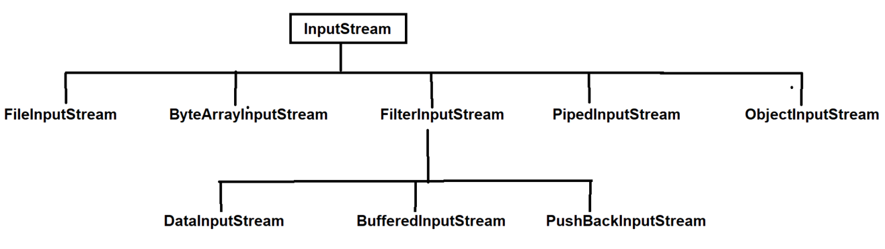
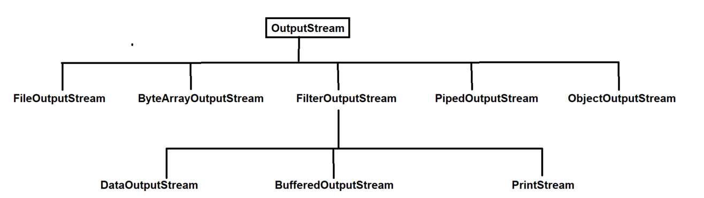
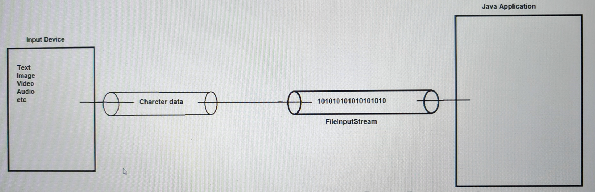
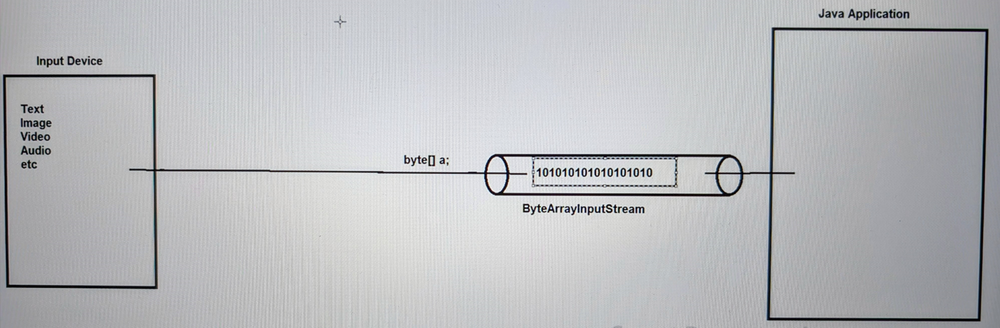
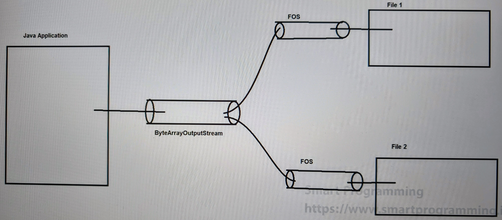
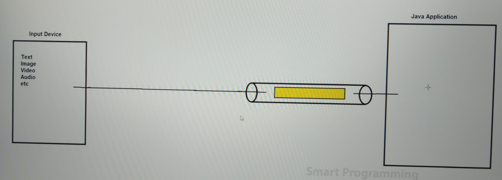
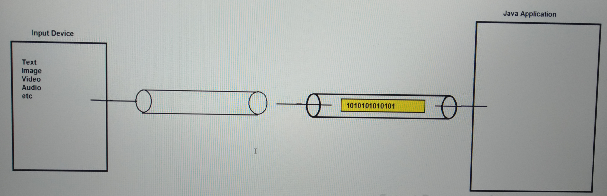
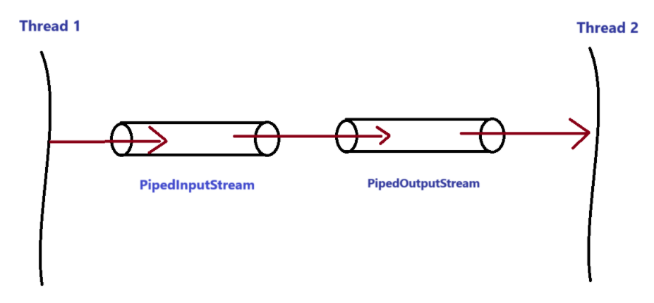

## Byte Stream
### InputStream & OutputStream classes in Java

- InputStream & OutputStream Diagram :-

### FileInputStream :-
- FileInputStream is used to read the data for example text, image, video, audio etc. in the form of bytes.
- FileInputStream can read the character stream data also, but you should use FileReader to read character type of data.
- In this case, if file/data is not found, then it will throw FileNotFoundException.

### FileOutputStream :-
- FileOutputStream is used to write the data for eg text, image, video, audio etc in the form of bytes
- FileOutputStream can read the character stream data also, but you should use FileWriter to write character stream data.
- In this case if file is not found, then it will create new file. (only for text file.)

### ByteArrayInputStream :-
- `ByteArray + InputStream` : As name suggests, ByteArrayInputStream can be used to read ByteArray data only as an input stream.
- ByteArrayInputStream uses internal buffer to read the byte array data.
- `See Program`: [ByteArrayInputStreamDemo.java](_3_Byte_Stream_Classes%2Finputoutputstreamsdemo%2FByteArrayInputStreamDemo.java)

### ByteArrayOutputStream :-
- ByteArrayOutputStream is used to write the common data to multiple files.
- `See Program`: [ByteArrayOutputStreamDemo.java](_3_Byte_Stream_Classes%2Finputoutputstreamsdemo%2FByteArrayOutputStreamDemo.java)

### FilterInputStream :
- FileInputStream is less used because it provides sub-classes for more functionalities i.e. DataInputStream, BufferedInputStream & PushBackInputStream.

### FilterOutputStream :-
- FilterOutputStream is less used because it provides subclass for more functionalities i.e. DataOutputStream, BufferedOutputStream & PrintStream.

### DataInputStream :-
- DataInputStream is used to read the primitive data from input stream in a machine-independent way.
- See Programs: [DataInputStreamDemo.java](_3_Byte_Stream_Classes%2Finputoutputstreamsdemo%2FDataInputStreamDemo.java)

### DataOutputStream :-
- DataOutputStream is used to write the primitive data form input stream in a machine-independent way.
- See Programs (having DataOutputStream): [DataInputStreamDemo.java](_3_Byte_Stream_Classes%2Finputoutputstreamsdemo%2FDataInputStreamDemo.java)

### BufferedInputStream :-
- In this case buffer mechanism is used internally which will improve the performance.

- See Program: [BufferedInputStreamDemo.java](_3_Byte_Stream_Classes%2Finputoutputstreamsdemo%2FBufferedInputStreamDemo.java)

### BufferedOutputStream :-
- BufferedOutputStream also use buffer to write the data in order to improve the performance.
- flush() method is working for buffer.
- flush() method is used forcefully write the data into the stream or output file before erasing the buffer memory.

- See Program: [BufferedOutputStreamDemo.java](_3_Byte_Stream_Classes%2Finputoutputstreamsdemo%2FBufferedOutputStreamDemo.java)

### PushBackInputStream :
- PushBackInputStream can be used to unread a byte which is already read and push back one byte.

### PrintStream :-
- PrintStream provides the methods to write the data into another stream.
- PrintStream class automatically flushes the data so there is no need to use flush() method.
- PrintStream method does not throw IOException.

- See Program: [PrintStreamDemo.java](_3_Byte_Stream_Classes%2Finputoutputstreamsdemo%2FPrintStreamDemo.java)

### PipedInputStream & PipedOutputStream :-
- PipedInputStream and PipedOutputStream are used simultaneously.
- These streams are used to transfer the data from one thread to another thread.
- Both these streams should be connected.

- See Program: [PipedInputOutputStreamDemo.java](_3_Byte_Stream_Classes%2Finputoutputstreamsdemo%2FPipedInputOutputStreamDemo.java)

### ObjectInputStream & ObjectOutputStream :-
- These streams are used in serialization.
