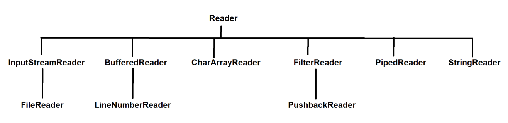

## Character Stream Classes
### Reader & Writer classes explanation in Java

### InputStreamReader :-
- InputStreamReader is a bridge which take the input from byte stream and decodes into character stream.
- See Program: [InputStreamReaderDemo.java](_4_Character_Stream_Classes%2FCharStreamClassesDemo%2FInputStreamReaderDemo.java)

### OutputStreamWriter :-
- OutputStreamWriter converts the character stream into byte stream using a specified charset.
- See Program: [OutputStreamWriterDemo.java](_4_Character_Stream_Classes%2FCharStreamClassesDemo%2FOutputStreamWriterDemo.java)

### FileReader :-
- It inherits the InputStreamReader class.
- FileReader is used to read character stream.
- See Program: [FileReaderDemo.java](_4_Character_Stream_Classes%2FCharStreamClassesDemo%2FFileReaderDemo.java)

### FileWriter :-
- FileWriter class inherits OutputStreamWriter class.
- FileWriter is used to write character stream.
- See Program: [FileWriterDemo.java](_4_Character_Stream_Classes%2FCharStreamClassesDemo%2FFileWriterDemo.java)

### BufferedReader :-
- BufferedReader is used to read the text from character stream.
- BufferedReader can be used to read data line-by-line by readLine() method.
- Performance of BufferedReader is fast.
- See Program: [BufferedReaderDemo.java](_4_Character_Stream_Classes%2FCharStreamClassesDemo%2FBufferedReaderDemo.java)

### BufferedWriter :-
- BufferedWriter is used to write the char array or string into the file.
- BufferedWriter performance is fast.
- See Program: [BufferedWriterDemo.java](_4_Character_Stream_Classes%2FCharStreamClassesDemo%2FBufferedWriterDemo.java)

### LineNumberReader :-
- LineNumberReader is a buffered character input stream which keeps the track of line numbers.
- There is no such LineNumberWriter class because when writing the data we do not need to track the line number that's why.

### CharArrayReader :-
- CharArray + Reader : As the name suggests it is used to read the character array stream.
- See Program: [CharArrayReaderDemo.java](_4_Character_Stream_Classes%2FCharStreamClassesDemo%2FCharArrayReaderDemo.java)

### CharArrayWriter :-
- CharArray + Writer : It is used to write the common data to multiple file.
- See Program: [CharArrayWriterDemo.java](_4_Character_Stream_Classes%2FCharStreamClassesDemo%2FCharArrayWriterDemo.java)

### FilterReader :-
- FilterReader is used to perform filtering operations on reader stream.
- FilterReader is an abstract class.
- See Program: [FileReaderDemo.java](_4_Character_Stream_Classes%2FCharStreamClassesDemo%2FFileReaderDemo.java)

### FilterWriter :-
- FilterWriter class is used to write filtered character stream
- FilterWriter is an abstract class
- See Program: [FileWriterDemo.java](_4_Character_Stream_Classes%2FCharStreamClassesDemo%2FFileWriterDemo.java)

### PushbackReader :-
- PushbackReader is used to push back the one character into stream and read again.

### PipedReader :-
- PipedReader is used to read the content from a pipe as character stream.
- It is used in case of multiple threads.

### PipedWriter :-
- PipedWriter is used to write the content to a pipe as a character stream.
- It is also used in case of multiple threads.

### StringReader :-
- StringReader is character stream which string as a source.
- See Program: [StringReaderDemo.java](_4_Character_Stream_Classes%2FCharStreamClassesDemo%2FStringReaderDemo.java)

### StringWriter :-
- StringWriter is a character stream which can be used to write data from string as a source.
- See Program: [StringWriterDemo.java](_4_Character_Stream_Classes%2FCharStreamClassesDemo%2FStringWriterDemo.java)
