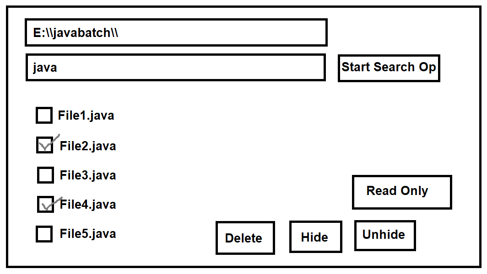

## File Handling in Java

### File :
- A file is an object on a computer which stores the data, information, settings, commands etc.
- There are many file operations for example, creating new file, rename file, deleting file, writing into file, reading from the file etc

- There are 2 ways by which we can read data form the file :-
  1. **Sequential Access** :
     - In this way we can read or write the data in sequential form i.e. from beginning or starting of the file.
  
  2. **Random Access** : 
     - In this way we can read or write the data in random way i.e. from any location of the file.

- To perform these operations java provided many classes and methods but main class is "`java.io.File`" class

### Sequential Access
- done in the programs using java.io.File class

### Random Access :
- To read and write the files in random way, we have to use "`java.io.RandomAccessFile`" class.
- There can permissions i.e "r" or "rw".
  - writeXXX(XXX value)
  - readXXX(XXX value)
  - seek(long pos)

### See Programs - Sequential Access:

- [FileOperations.java](_5_File_Handling%2FFileOperations%2Ffileoperations%2FFileOperations.java)
- [RenameFile.java](_5_File_Handling%2FFileOperations%2Ffileoperations%2FRenameFile.java)
- [DeleteFile.java](_5_File_Handling%2FFileOperations%2Ffileoperations%2FDeleteFile.java)
- [GetSpaceInfo.java](_5_File_Handling%2FFileOperations%2Ffileoperations%2FGetSpaceInfo.java)
- [GetFileSize.java](_5_File_Handling%2FFileOperations%2Ffileoperations%2FGetFileSize.java)
- [CreateFolder.java](_5_File_Handling%2FFileOperations%2Ffileoperations%2FCreateFolder.java)
- [SearchFile1.java](_5_File_Handling%2FFileOperations%2Ffileoperations%2FSearchFile1.java)
- [SearchFile2.java](_5_File_Handling%2FFileOperations%2Ffileoperations%2FSearchFile2.java)
- [SearchFile3.java](_5_File_Handling%2FFileOperations%2Ffileoperations%2FSearchFile3.java)
- [ReadOnlyDemo.java](_5_File_Handling%2FFileOperations%2Ffileoperations%2FReadOnlyDemo.java)
- [HideFile.java](_5_File_Handling%2FFileOperations%2Ffileoperations%2FHideFile.java)

### See Programs - Random Access:
- [Test.java](_5_File_Handling%2FFileOperations%2Frandomaccessdemo%2FTest.java)

### Task : 
Create a frame, search for file and print all the files, then select any file, and you will be able to delete, hide, unhide, read only from buttons.

