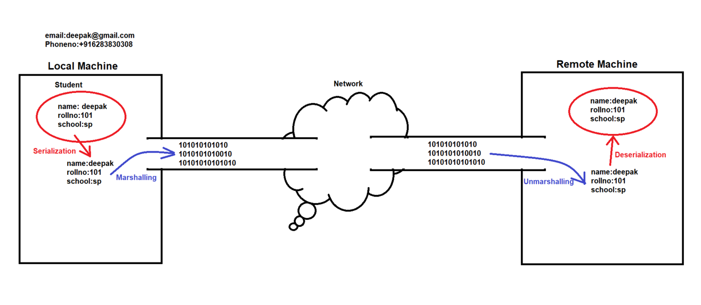
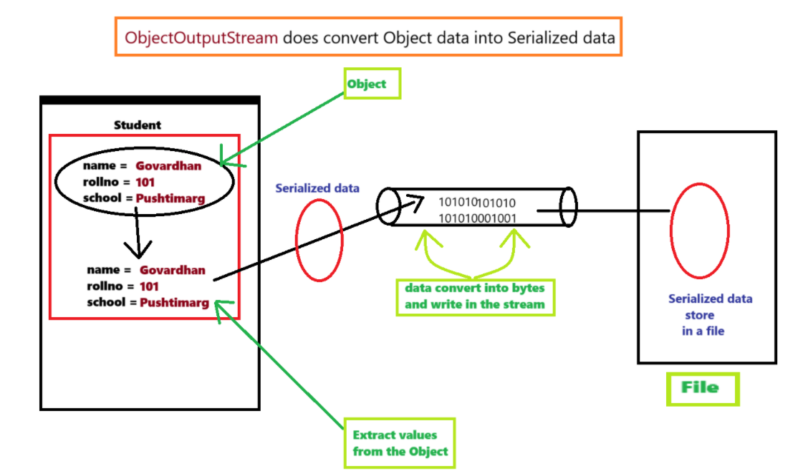
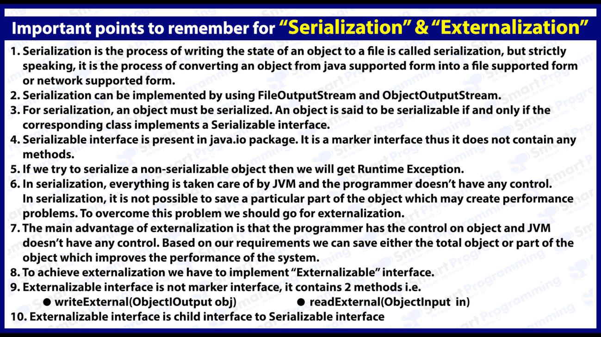

## Serialization & Externalization in Java

### Serialization & Deserialization :-
- Serialization is the mechanism by which object state is converted into byte stream and converting byte stream into object state is known as deserialization.
- The byte stream created is platform independent, so the object serialized on one platform can be deserialized on another platform.

- Serialization : Extract data from the Object, this process called Serialization.
- Marshalling : Write data into byte stream, this process called Marshalling.
- UnMarshalling : Byte stream to data, 
- Deserialization : Data to Object

#### Advantages of Serialization and Deserialization :-
1. We can save or persist the state of an object.
2. Object can travel in the network
    
### How to achieve Serialization & Deserialization?
- We have to use following 2 points :-
1. Serializable Interface
2. 
   - ObjectOutputStream (Serialization) - writeObject()
   - ObjectInputStream (Deserialization) - readObject()

- Only those objects can be serialized which implements `java.io.Serializable interface`.

### Serializable Interface :-
- Serializable interface is a `marker interface` (marker interface are those which does not have any data member and methods and marker interface does not have any "business logic").
- It can be used to inject some abilities to the object at runtime.
- More examples of marker interface : Cloneable, Remote etc.
- All the wrapper classes and String class by default inherit Serializable interface.

#### See Program
- [Test.java](_6_Serialization%2FSerDerDemo%2FTest.java)

- Diagram flow of how to do.

### transient keyword :-
- If we don't want any variable to serialize then we can create that object as transient.

### Points to remember :-
1. If parent class implements Serializable interface, then we can serialize child class object.
2. If we don't want to serialize any variable then we can create that variable as transient or static.
3. Constructor of an object is not called when an object is deserialized.

### Externalization :-
- Externalization is when we need customized serialization.

- How to achieve Externalization :-
  1. java.io.Externalizable interface
     - `writeExternal(-)`
     - `readExternal(-)`

#### See Program
- [ExtDemo.java](_6_Serialization%2FSerDerDemo%2FExtDemo.java)

