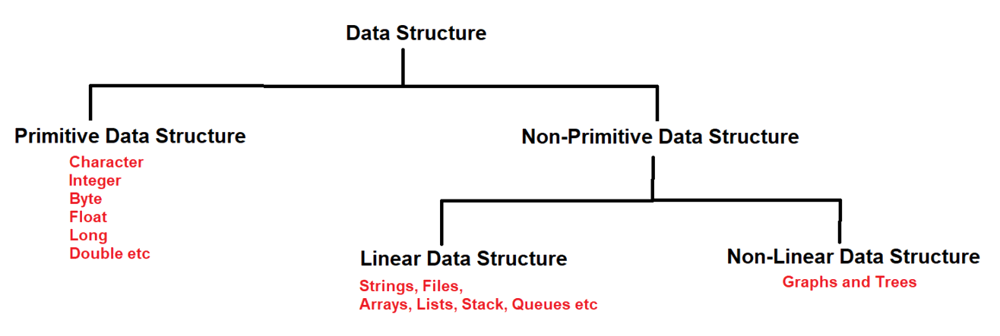

## Data Structure & Arrays in Java

### Data Structure :-
- A data structure is a particular way by which we organize, manage and store the data in the computer so that it can be used effectively.
- **Data structure is not a programming language** like c, c++, java or python. It is a set of algorithms which we can implement in any programming languages.


### Operations that we can perform on data :
1. Searching
2. Sorting
3. Insertion
4. Deletion
5. Updation

#### Advantages :-
1. We can process the data easily.
2. It stores the data very efficiently on the disk.
3. Data structure is used to develop algorithms.
4. It stores the data in a secured way.
   
## Types of Data Structure




1. Primitive Data Structure (eg Integer, Float, Long, Double etc)
2. Non-Primitive Data Structure

   1. Linear DS (eg String, Files, Arrays, Lists, Stacks, Queues etc)
      - In Linear DS the data is arranged in a sequential form i.e. one element is connected to only one other element in linear form
   2. Non-Linear DS (eg Graphs & Trees)
      - In non-linear DS, one element can connect with 'n' number of elements.

### See Programs:

1. [demo](_1%2Fdemo) : Login, Profile

    - We have different options to pass the value (like name)
        - setter and getter
        - constructor
        - method
    - The best way is, use constructor instead of method because when it hits the object then it uses for different objects. Also when we declare instance variable at that class, so we can use that variable values multiple time.


2. Passing more than one values in the constructor
    - [demo2](_1%2Fdemo2) : Login, Profile
    - here we pass more than one values through constructor
    - but, what if we have 100 and more than 100 values then?
    - then we need to use `Non-Primitive_Data_Type` (like Collection).
    - **now you understand why we are studying `Non-Primitive_Data_Type/Structure`.**
    - here we can also provide 2 parameters in the constructor, one String array and second int type which will be explained in the project also.


### Arrays
1. Array is a collection of similar type of data (homogeneous data).
2. Array elements are stored in contiguous memory locations.
3. Array can contain primitive or non-primitive elements.
4. Array is index based data structure, first index position of an array is 0.
5. Array length starts from 1.
6. We can Store array inside the array too.

```java
public class Employee {
    /*
        String empid1 = "101";
        String empid2 = "102";
        String empid3 = "103";
          ...   ....    ....
          ...   ....    ....
        total one lakh employees

        we are not going to do for each and every employee
        so we are using the arrays.
     */
}
```

