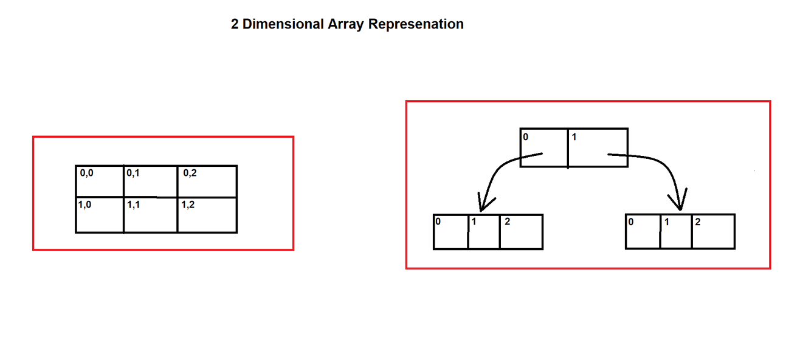
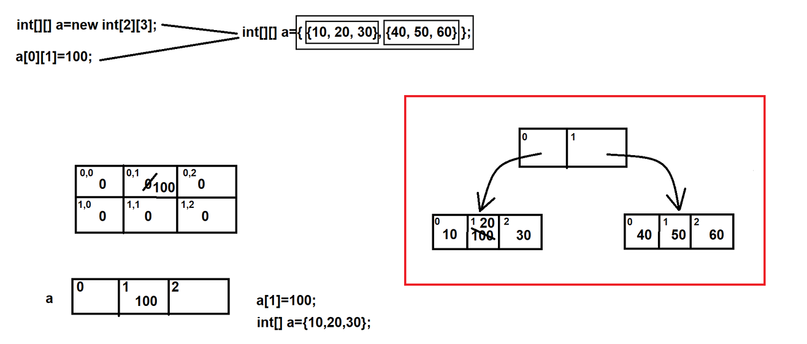
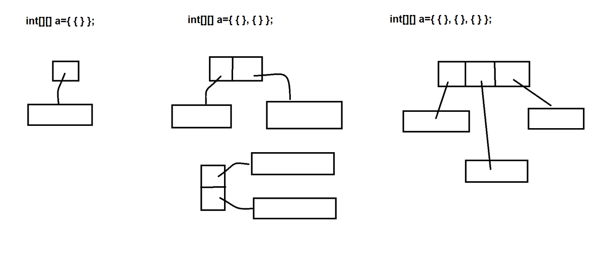
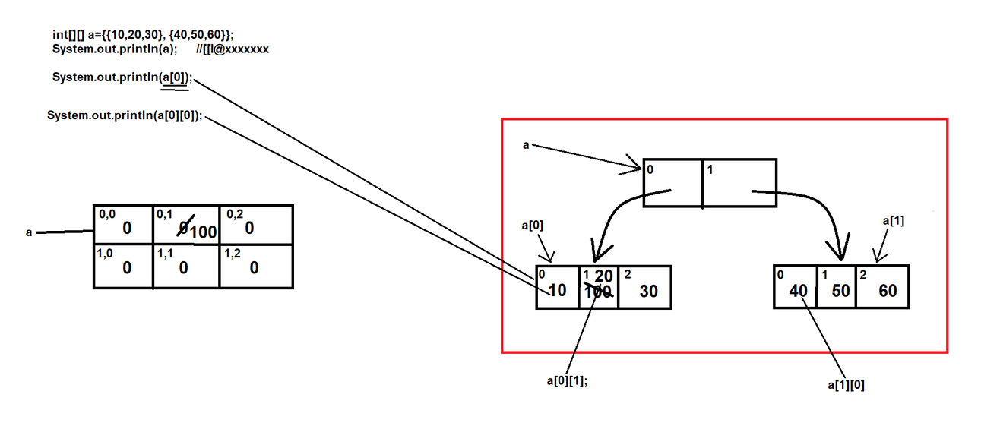

### Two Dimensional Array in Java

### Types of Arrays :-
1. Single Dimensional Array
   - 1D Array
2. Multi-Dimensional Array (Array of an Array)
   - 2D Array
   - 3D Array
   - 4D, 5D, 6D.... Array
   - Zic-Zac Array (Jagged Array)
3. Anonymous Array


### Multi-Dimensional Array (Array of an Array)
- if an array has multiple rows and multiple columns then it is known as multi-dimensional array.
- Types of Multi-Dimensional Array (Array of an Array)
  - 2D Array
  - 3D Array
  - 4D, 5D, 6D.... Array
  - Zic-Zac Array (Jagged Array)

### 2D Array :-

- Diagram Representation:



- Following points for 2D array :-
    - Declaration
    - Creation
    - Initialization
    - Retrieve
  
Declaration
- For declaring 2D array, we have to use double square braces

Creation :
- When we create 2D array, we have to provide the size of an array.
- `a = new int[2][3];` // there are 2 rows and 3 columns
- Whenever we create an array by using new keyword, then default values will be initialized in the array blocks
- We can declare and create 2D array in a single line
   - `int[][] a = new int[2][3];`
   

Initialization
- `a[0][1] = 100;` // will initialize 100 value at 0,1 index position
- We can declare, create and initialize an array in single line
   - `int[][] a = {{10,20,30}, {40,50,60}};`

    
    
    
    
    

Retrieve
- We can retrieve elements by using for loop

--------


### Declaration :-
```
1. int[][] a; // prefered way
2. int [][]a;
3. int[][]a;
4. int [][] a;
5. int []a[];
```
### Cases for Declaration :-
```
1. int [][]a, b; => a (2D array); b (2D array)
2. int a[][], b; => a (2D array); b (simple variable)
3. int []a[], b; => a (2D array); b (1D array)
4. int []a[], b[]; => a (2D array); b (2D array)
5. int [][]a, b[]; => a (2D array); b (3D array)
6. int [][]a, []b; => compile time error
```
### Cases for Creation :-
```
1. a = new int[2][3]; => correct
2. a = new int[][]; => compile time error (array dimension missing)
3. a = new int[2][]; => correct
4. a = new int[][3]; => compile time error (']' expected)
```

### Cases for creation within single line :-
```
1. int[][] a = new int[2][3]; => correct
2. int[][] a = new int[2][]; => correct
3. int[][] a = new int[][]; => error
4. int[][] a = new int[0][0]; => correct
5. int[][] a = new int[-2][3]; => will compile successfully but provides runtime exception saying java.lang.NegativeArraySizeException
```

### See Programs:
- [TwoDArray.java](_3%2Fprogram%2FTwoDArray.java)