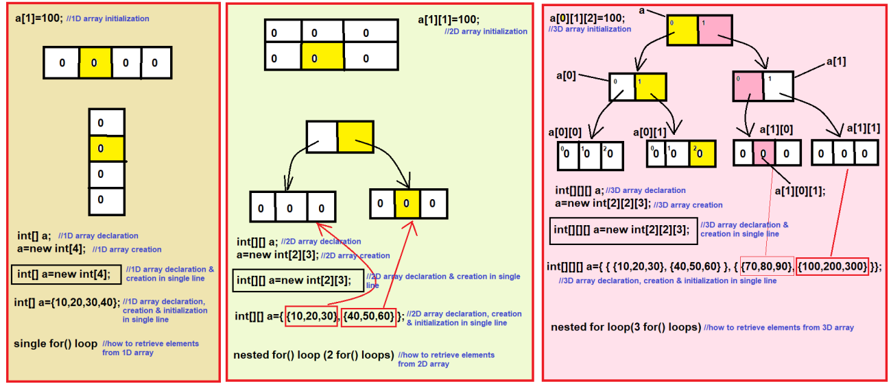

### Three Dimensional Array in Java

### Types of Arrays :-
1. Single Dimensional Array
   - 1D Array
2. Multi-Dimensional Array (Array of an Array)
   - 2D Array
   - 3D Array
   - 4D, 5D, 6D.... Array
   - Zic-Zac Array (Jagged Array)
3. Anonymous Array


## 3D Array :-

Diagram representation




**How to declare, create and initialize 3D array?**
   
Declaration :
- We can declare 3D array by using 3 square braces.

Creation :
- We can create an array by using new keyword

Initialization :
- `a[0][1][2] = 100;`
   
Retrieve :
- We can retrieve the elements of 3D array by using 3 for loops.


-----

### Declaration :

```
1. int[][][] a;
2. int[] [][]a;
3. int [][][]a;
4. int []a[][];
5. int [][]a[];
6. int a[][][];
```
### Cases for Declaration :
```
1. int[][][]a, b;    => a & b are 3D array
2. int [][]a[],b;    => a is 3D array & b is 2D array
3. int [][]a[], b[]; => a and b are 3D array
4. int [][][]a, b[]; => a is 3D array & b is 4D array
5. int [][][]a, []b; => error
```

### Cases for creation :
```
1. a = new int[2][2][3]; => correct
2. a = new int[2][2][];  => correct
3. a = new int[2][][];   => correct
4. a = new int[][][];    => error
5. a = new int[2][][3];  => error
```

------

### See Programs:
- [threeDArray](_4%2FthreeDArray) : [Test.java](_4%2FthreeDArray%2FTest.java)