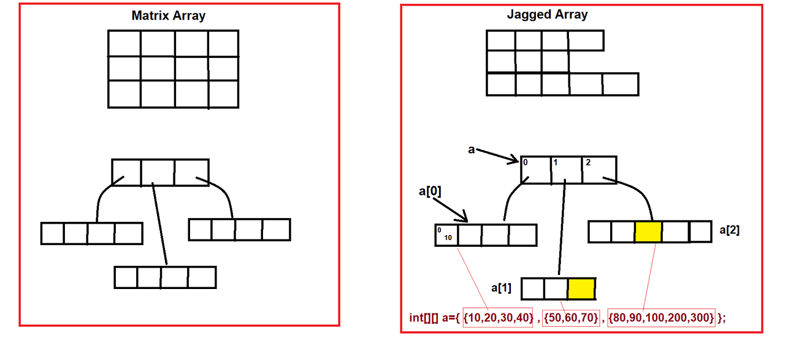

## Matrix, Jagged & Anonymous Arrays; Arrays Class in Java


### Types of Arrays :-
1. Single Dimensional Array
    - 1D Array
2. Multi-Dimensional Array (Array of an Array)
    - 2D Array (Matrix Array Or Zic-Zac/Jagged Array)
    - 3D Array (Matrix Array Or Zic-Zac/Jagged Array)
    - 4D, 5D, 6D.... Array  (Matrix Array Or Zic-Zac/Jagged Array)
3. Anonymous Array


## Multi-Dimensional Array :
- Multi-Dimensional array can be Matrix Array or Jagged Array.
- Matrix Array : The array in which there is fixed number of rows & columns.
- Jagged Array : The array in which number of columns can be changed.



#### See Programs:
- [Test.java](_5%2Fdemo%2FTest.java)

## Anonymous Array :-
- An array that does not have any name is known as Anonymous Array
- For example :
`new int[]{10,20,30,40};`
- Use : Anonymous arrays are created when we want to use them instantly or only for single time.
- Anonymous arrays are used as an argument in the method.
- Anonymous array can be single dimensional or multi-dimensional array.

#### See Programs:
- 2D Array: [TwoDArray.java](_5%2Fdemo%2FTwoDArray.java)
- Anonymous Array: [AnonymousArray.java](_5%2Fdemo%2FAnonymousArray.java)

-----

## Different ways to print/iterate an array elements
- for loop
- while loop
- for-each loop
    
### for-each loop  
- when we access array elements through for loop, that time out application/program speed is going to slow down, so to increase that speed (making fast), Java created for-each loop. 
- normally we use for-each loop in array, collection where we need to traverse again and again. so this for-each loop does traverse automatically.
- Syntax:
    ```java
    for(type var : array)
    {
        // print(var)
    }
    ```
- To iterate/get the elements of array, we use for-each loop. This is only point for using for-each loop due to increase program speed.


#### Limitations of for-each loop :-
1. It does not track the index position of an array.
2. It only iterates the elements in forward direction.
3. It cannot be used to modify the array.

#### See Programs:
- [DifferentWaysToPrintArray.java](_5%2Fdemo%2FDifferentWaysToPrintArray.java)

------

## Arrays class
- Java has created an "`Arrays`" class in "`java.util`" package.
- Arrays class directly inherits the Object class.
- "`Arrays`" class provides the static methods only.

#### See Programs:
- [ArraysClassDemo.java](_5%2Fdemo%2FArraysClassDemo.java)

#### Note:
- normally we are not using the methods of the `Array` class.
- In interview, we also not use this `Array` class method because we need to write the proper logic.