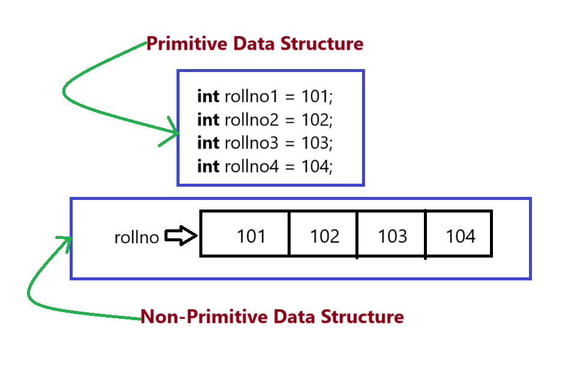
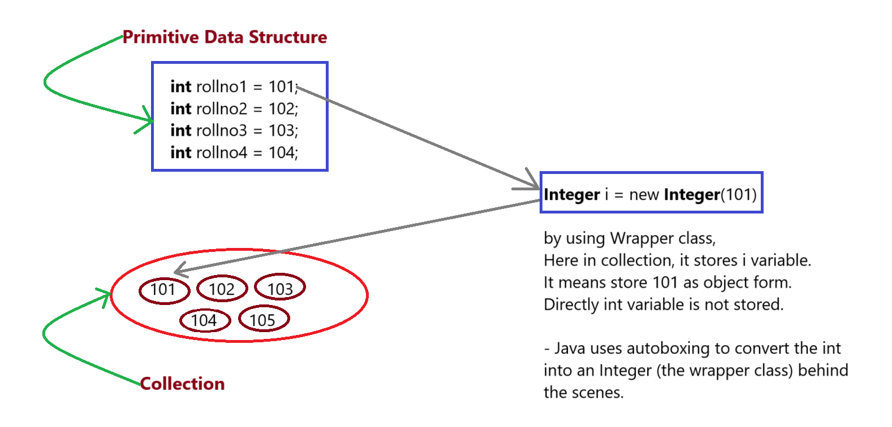
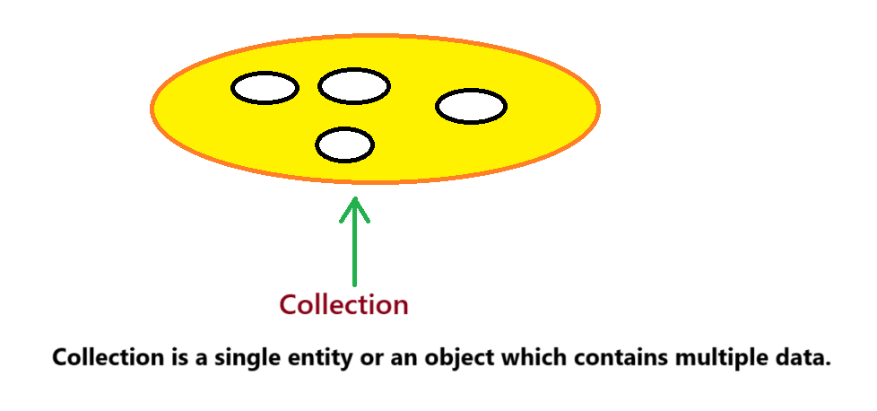
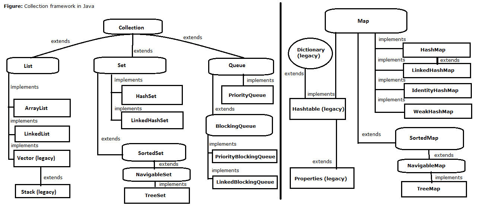

## Collection Framework in Java

### Types Of Data Structure :-

1. Primitive Data Structure
   - Examples are : boolean, char, byte, short, int, long, float, double
   

2. Non-Primitive Data Structure
   - Examples are : String, Files, Arrays, Collection Framework (Collection, Map)

- Note:
Above category(Primitive & Non-Primitive data structure) is according to Java.

### Applications of Arrays

1. Arrays are used to store multiple data with single variable name which reduces the number of variables to be declared.

    

2. Arrays are used to develop some algorithms like Bubble sort, Insertion sort, Selection sort etc.

3. Arrays can be used to perform matrix operations.

4. Arrays can be used for CPU scheduling.

5. Array are used to implement data structure for example Stack, ArrayList, Queues etc.
    - these data structure(Stack, ArrayList, Queues etc.) comes under collection framework but those implementation is based on Array.

### Point to remember for Array & Collection Framework :-
1. 
   - Array is java language feature inbuilt support provided by Sun Microsystems. We have to develop algorithms to sort or insert or delete etc.
   - Collection Framework are API feature. It provides predefined classes and interfaces and methods by which we can easily iterate or delete or sort the elements.

2.  
   - Array can store primitive (int, char etc .) and non-primitive (objects) data types
   - Collection Framework can store only non-primitive data types (objects).

3. 
   - Array can store only homogeneous data types i.e. array can store only similar type of data
   - Collection Framework can store heterogeneous data i.e. we can store different type of data.

4. 
   - The size of an array cannot be increased or decreased according to our requirement at runtime.
   - The size of collection can be increased or decreased according to our needs.

5. 
   - Array are not good with respect to memory.
   - Collection framework are very good with respect to memory.

6. 
   - Arrays are good by performance wise.
   - Collection are not good by performance wise.

### What is Collection Framework ?
- Collection Framework consists of 2 words i.e. Collection and Framework.
  - Collection is a single entity or an object which contains multiple data.
  
  - Framework represents the library.

- Collection framework is the set of classes and interfaces that implement commonly reusable collection data structure.

#### Collection framework contains 2 main parts :
1. `java.util.Collection`
2. `java.util.Map`

#### "9 key interfaces" of Collection Framework
`java.util.Collection`
1. Collection
2. List
3. Set
4. SortedSet
5. NavigableSet
6. Queue

`java.util.Map`
7. Map
8. SortedMap
9. NavigableMap

### Hierarchy of Collection Framework :-

   (image copyright to https://www.benchresources.net/collection-framework-in-java/)

### Note
In Collection, we can store the data directly but in Map we can store the data in key-value pairs.
  