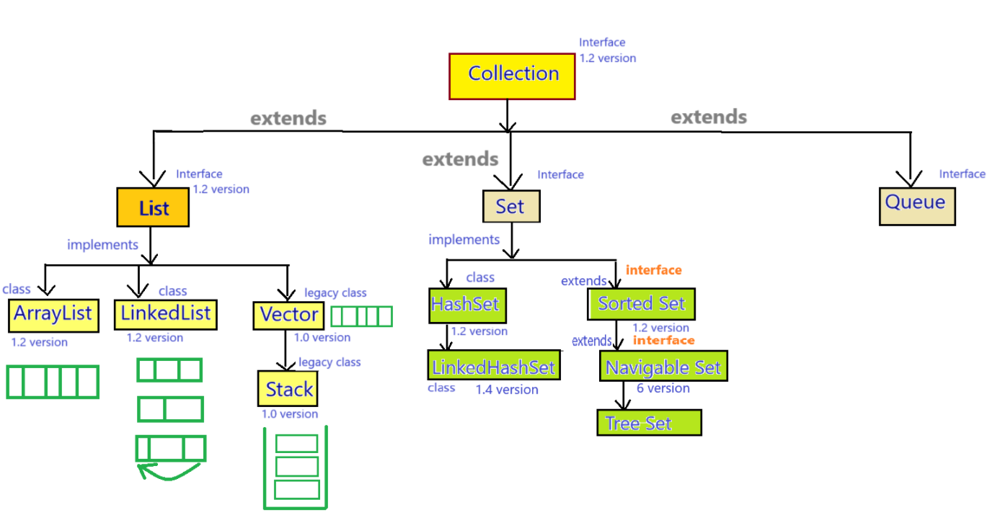
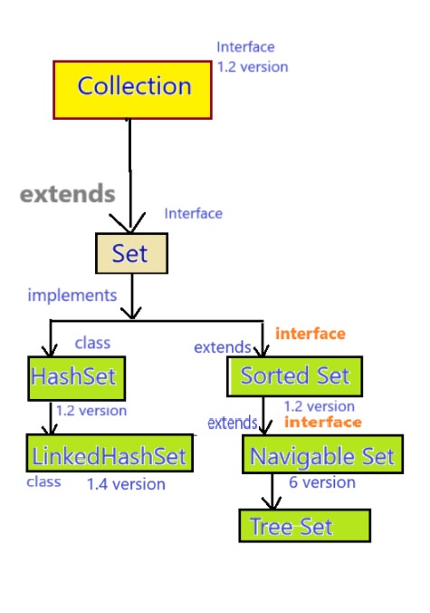
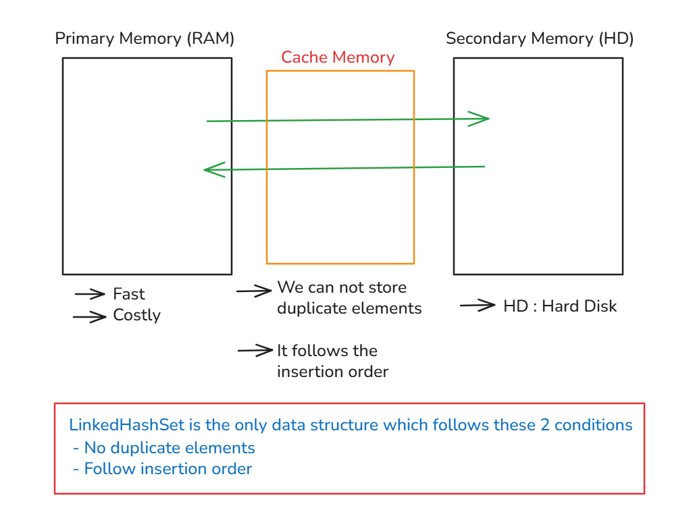
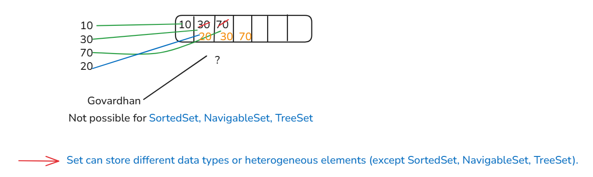

## LinkedHashSet, SortedSet, NavigableSet in Java

### See Programs

HashSetDemo

* [Test1.java](_10%2FhashSetDemo%2FTest1.java)
* [Test2.java](_10%2FhashSetDemo%2FTest2.java)
* [Test3.java](_10%2FhashSetDemo%2FTest3.java)
* [Test4.java](_10%2FhashSetDemo%2FTest4.java)

### Note:
- Those data structure is working based on hashcode is very good for searching operation.





### LinkedHashSet :-
- LinkedHashSet is the child class of HashSet which is present in `java.util` package.
- Syntax : 
   ```java
   public class LinkedHashSet extends HashSet implements Set, Cloneable, Serializable {
       // -------- 
   }
   ```
- The underline data structure of LinkedHashSet is "`Hashtable + LinkedList`".
- LinkedHashSet was introduced in `JDK 1.4 version`.

#### Properties of LinkedHashSet :-
- All properties of LinkedHashSet is same as HashSet except LinkedHashSet follows the insertion order.

#### Constructors of LinkedHashSet :-
- same constructors as HashSet

#### Methods of LinkedHashSet :-
- Same methods as HashSet.

#### When we should use LinkedHashSet ?
- If we have to create Cache based applications then we can use LinkedHashSet.



- The primary memory (RAM) is very fast and costly, too.
- When we need to frequently interact with secondary memory(Hard Disk), that time we use Cache memory.
- Because secondary memory is slow, so when we interact again and again then our application is getting slow.
- For solution of this problem, Cache memory is used.
- Properties of Cache memory:
  - No duplicate elements.
  - Follow insertion order.

#### See Programs

LinkedHashSetDemo

* [Test5.java](_10%2FlinkedHashSetDemo%2FTest5.java)

#### Difference between HashSet & LinkedHashSet

1. 
   - HashSet was introduced in `JDK 1.2 version`.
   - LinkedHashSet was introduced in `J2SE 1.4 version`.


2. 
   - HashSet does not follow the insertion order.
   - LinkedHashSet follows the insertion order.


3. 
   - HashSet underline data structure is "`Hashtable`".
   - LinkedHashSet underline data structure is "`Hashtable + LinkedList`"


### SortedSet :-
- SortedSet is a child interface of Set interface which is present in `java.util` package.
- Syntax : 
   ```java
   public interface SortedSet extends Set { 
       // --- 
   }
   ```
- SortedSet was introduced in `JDK 1.2 version`.

#### Properties of SortedSet :-
1. SortedSet is not an index based data structure.
2. SortedSet does not follow the insertion order.
3. SortedSet follows the sorting order.
   
   - if number is greater, then +ve value will be returned (+ve value may be +1 or any other +ve number) and same with smaller number, it will return any -ve number.
   - when 2 objects are compared then three type of values are returned:
     - `+1`
     - `0` : if try to insert the same element then it returns 0 and it will not add that element again.
     - `-1`
   - But why it returns these integer values?
    ```java
    // String : ctrl+click on this class
    // Integer : ctrl+click
    // all primitive data types are inherit comparable interface.
    
    public final class String
            implements java.io.Serializable, Comparable<String>, CharSequence,
            Constable, ConstantDesc {
        //---
    }
    
    // click on Comparable
    
    public interface Comparable<T> {
        public int compareTo(T o);
        // this is the reason to return the integer value.
    }
    ```


4. SortedSet can store same data types or homogeneous elements. If we provide different data type element, then it will provide exception i.e. `java.lang.ClassCastException`.
5. SortedSet cannot store the duplicate elements.
6. We should not store null value in SortedSet because SortedSet follows the sorting order so while comparing the elements with null value, it will provide the `java.lang.NullPointerException`.
    - so first time, you insert null and then try to insert any other values or null then it will compare with that present value in the set (which is null) so it gives an exception.
7. SortedSet allows Comparable objects by default, but if we insert non-comparable objects, then it will provide an exception i.e. `java.lang.ClassCastException`.
8. SortedSet is non-synchronized collection.


#### Methods of SortedSet :-
1. `Object first();`
2. `Object last();`
3. `SortedSet headSet(Object toElement);`
4. `SortedSet tailSet(Object fromElement);`
5. `SortedSet subSet(Object fromElement, Object toElement);`

#### See Programs

SortedSet

* [Test6.java](_10%2FsortedSet%2FTest6.java) : read all comments and notes written in this program.
* [Test7.java](_10%2FsortedSet%2FTest7.java)

### NavigableSet
- NavigableSet is the child interface of SortedSet interface which is present in `java.util` package.
- Syntax : 
   ```java
   public interface NavigableSet extends SortedSet { 
       // ---- 
   }
   ```
- NavigableSet was introduced in `Java SE 6 version`.

#### Properties of NavigableSet
- NavigableSet has the same properties as that of SortedSet but it provides some extra navigable methods.

#### Methods :
1. `public NavigableSet descendingSet()`
2. `public Object ceiling(Object obj)`
3. `public Object higher(Object obj)`
4. `public Object floor(Object obj)`
5. `public Object lower(Object obj)`
6. `public Object pollFirst()`
7. `public Object pollLast()`

#### See Programs:
NavigableSet
* [Test8.java](_10%2FnavigableSet%2FTest8.java)