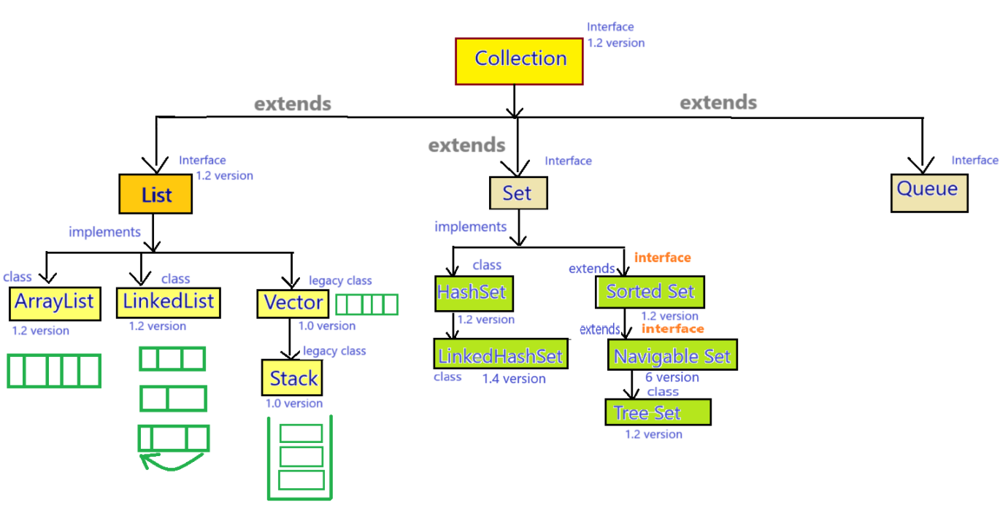
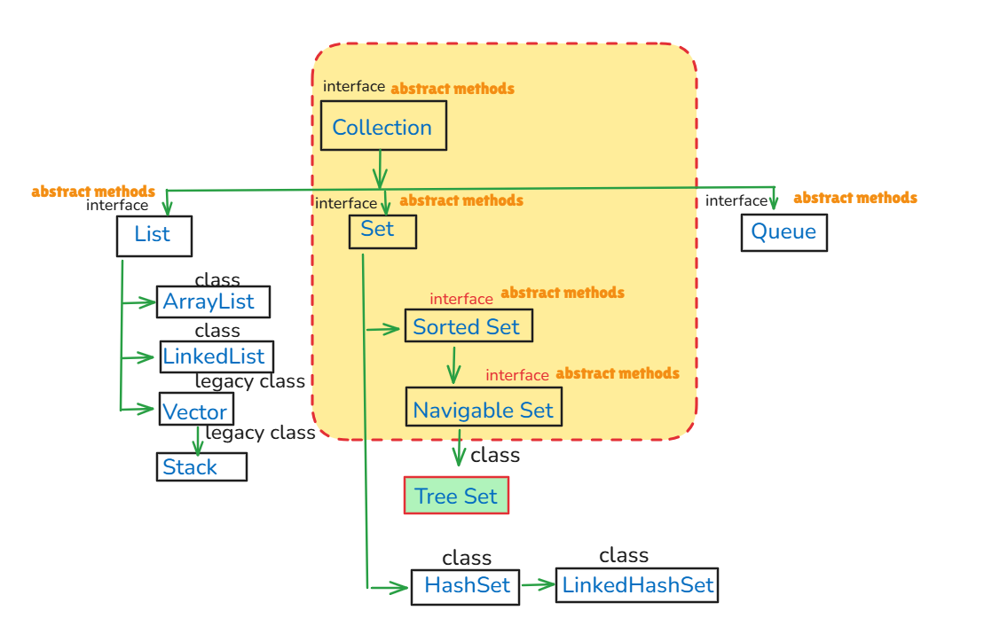
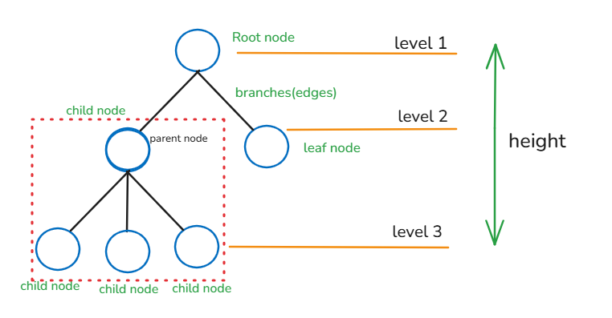
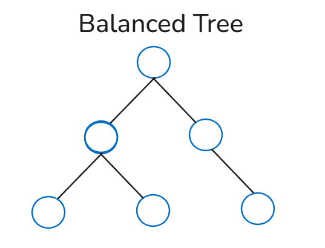
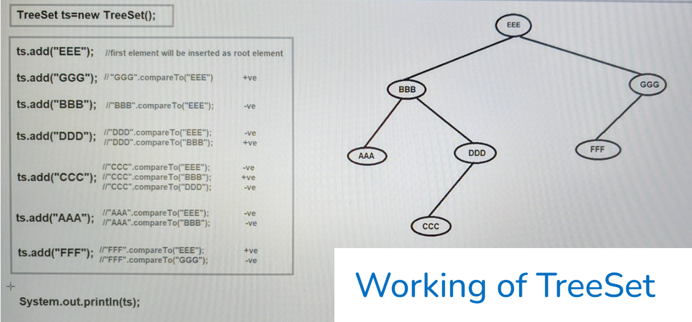

## TreeSet in Java

### TreeSet


- TreeSet is the direct implementation for NavigableSet interface, but it also provides the implementation for SortedSet, Set & Collection interface.
- Syntax : 
   ```java
   public class TreeSet extends AbstractSet implements NavigableSet, Cloneable, Serializable { 
       // --- 
   }
   ```
- The underline data structure of TreeSet is "`Balanced Tree`".
- TreeSet was introduced in `JDK 1.2 version`.

#### Properties of TreeSet :-
1. TreeSet is not index based data structure.
2. TreeSet does not follow the insertion order.
3. TreeSet follows the sorting order, it may be default sorting order or customized sorting order.
4. TreeSet stores the same data type elements or homogeneous elements. If we provide different data type elements in TreeSet then it will provide `java.lang.ClassCastException`.
5. TreeSet cannot store the duplicate elements.
6. TreeSet can store only one null value.
7. TreeSet is non-synchronized collection.
8. TreeSet allows more than one thread at one time.
9. TreeSet allows the parallel execution.
10. TreeSet reduces the execution time which makes our application fast.
11. TreeSet is not thread safe.
12. TreeSet does not provide guarantee for data consistency.

#### See Programs
TreeSet Demo
* [Test1.java](_11%2FtreeSetDemo%2FTest1.java)

#### Tree


#### Balanced Tree


#### Working of TreeSet


1. When we insert the first element, it will become the root node.
2. Then when we insert next element, it will compare with the root node (`"next element".compareTo("root element");`), 
   - if the return value is -ve, then it will go to the left side and
   - if the return value is +ve then it will go to the right side.
3. Then again it will check whether there is any parent node or not, if there is any parent node, then again it will compare and check the return value, then if return value is +ve, it will go to right side and if return value is -ve, it will go to the left side.
4. When we retrieve the elements, it will retrieve as "`LEFT - ROOT - RIGHT`".
   - Output : `[AAA, BBB, CCC, DDD, EEE, FFF, GGG]`

#### Constructors :
1. `public TreeSet()` : it will create an empty TreeSet object where the elements are inserted according to natural default sorting order.
2. `public TreeSet(Comparator comparator)` : it will create an empty TreeSet object where the elements will be inserted according to the customized sorting order.
3. `public TreeSet(Collection c)` :  we can pass any other collection object.
4. `public TreeSet(SortedSet s)`.

#### Methods of TreeSet
- contains all the methods of Collection, Set, SortedSet & NavigableSet interfaces.

#### When we should use TreeSet ?
- When we want to store the large number of elements in sorting order and due to this retrieval operation is fast.

### Cases for "null" value insertion in TreeSet
1. We can store only one null value.
2. We can insert null value only at first position, but then if we insert any other element then it will provide "`java.lang.NullPointerException`".
3. NOTE : Until `1.6 version` we can successfully insert the null value at first position but after `1.6 version` we cannot store the null value even at first position.


### What is difference between HashSet, LinkedHashSet & TreeSet ?
1. 
   - HashSet underline data structure is "`Hashtable`".
   - LinkedHashSet underline data structure is "`Hashtable + Linked List`".
   - TreeSet underline data structure is "`Balanced Tree`".


2. 
   - HashSet does not allow insertion order.
   - LinkedHashSet allow the insertion order.
   - TreeSet does not allow the insertion order.


3. 
   - HashSet does not allow the sorting order.
   - LinkedHashSet does not allow sorting order.
   - TreeSet allows the sorting order.
   

4. 
   - HashSet allows the heterogeneous objects.
   - LinkedHashSet allows the heterogeneous objects.
   - TreeSet does not allow the heterogeneous objects.


5. 
   - HashSet allows the null value insertion.
   - LinkedHashSet allows the null value insertion.
   - TreeSet allows the null value but at first position (but this is applicable till `java 1.6 version`).
   