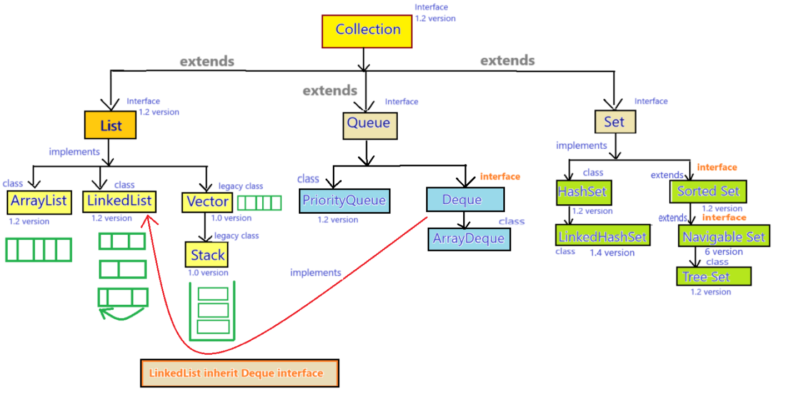
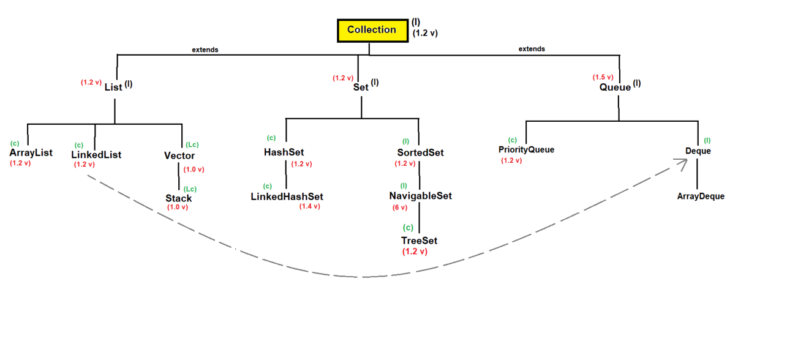
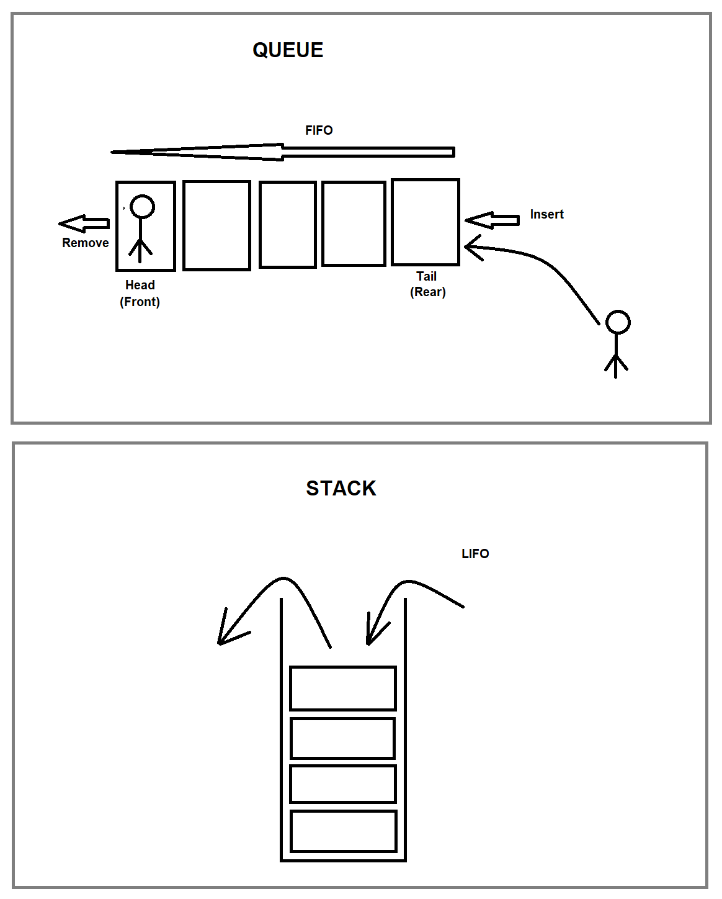

## Queue interface in Java



### Queue :-
- Queue is the child interface of Collection interface.
- Syntax : 
    ```java
    public interface Queue extends Collection { 
        // ------ 
    }
    ```
- Queue was introduced in `JDK 1.5 version`.
- Queue orders the elements in `FIFO(First In First Out)` manner, but we can change this algorithm according to our requirements.

#### Hierarchy of Queue


#### Implementation of Queue


#### Properties of Queue :-
1. Queue does not follow the insertion order.
2. Queue follows the sorting order.
3. Queue stores the same data type elements or homogeneous elements. 
   - If we try to store different elements then it will throw an exception saying "`java.lang.ClassCastException`"
4. Queue can store the duplicate elements.
5. Queue does not store any null value. 
   - If we try to store null value then it will throw an exception i.e. "`java.lang.NullPointerException`".

#### Methods of Queue :-
1. `boolean offer(Object obj)` - to add the elements in the queue


2. `Object peek()` - It will return the head element of the queue. 
   - If no element is found in the queue it will return null value.


3. `Object element()` - It will return the head element of the queue. 
   - If no element is found, it will throw an exception i.e. "`java.util.NoSuchElementException`".


4. `Object poll()` - It is used to remove the head element and also it will return that element, If no element is found, then it will return null value.


5. `Object remove()` - It is used to remove the head element and also it will return that element. If no element is found, it will throw an exception i.e. "`java.util.NoSuchElementException`".

### PriorityQueue
- PriorityQueue is an implementation class for Queue (but not direct implementation).

    ```java
    /* 
            now you can see, 
            PriorityQueue extends AbstractQueue and
            AbstractQueue extends Queue
            
            that is why 
            PriorityQueue is an implementation class for Queue (but not direct implementation).
     */
    public class Demo {
        public static void main(String[] args) {
            // ctrl + click on PriorityQueue.
            PriorityQueue pq = new PriorityQueue();
        }
    }
    
    public class PriorityQueue<E> extends AbstractQueue<E>
            implements java.io.Serializable {
        // ----    
    }
    
    public abstract class AbstractQueue<E>
            extends AbstractCollection<E>
            implements Queue<E> {
        
    }
    ```
- Syntax : 
    ```java
    public class PriorityQueue extends AbstractQueue implements Serializable { 
        // ----- 
    }
    ```
- PriorityQueue was introduced in `JDK 1.2 version`.
- Its underline data structure is "`Balanced Tree`".
- PriorityQueue may not support on windows platform.
- The default initial capacity of Priority Queue is 11.
- It is able to process all the elements prior to processing as per priorities.


#### Properties of PriorityQueue :-
basic properties
1. PriorityQueue does not follow the insertion order.
2. PriorityQueue does not follow the sorting order.
3. PriorityQueue stores the same data type elements or homogeneous elements. If we try to store different data type elements then it will throw an exception i.e. "`java.lang.ClassCastException`".
4. PriorityQueue can stores the duplicate elements.
5. PriorityQueue cannot store the null values.

non-synchronized collection
6. PriorityQueue is non-synchronized collection.
7. PriorityQueue allows more than one thread at one time.
8. PriorityQueue allows the parallel execution.
9. PriorityQueue reduces the execution time which makes our application fast.
10. PriorityQueue is not thread-safe.
11. PriorityQueue does not provide guarantee for data consistency.

#### Constructors :-
1. `public PriorityQueue()`- When we use default PriorityQueue constructor its initial capacity is 11.
2. `public PriorityQueue(int capacity)`
3. `public PriorityQueue(Comparator c)`
4. `public PriorityQueue(int capacity, Comparator c)`
5. `public PriorityQueue(SortedSet ss)`
6. `public PriorityQueue(PriorityQueue pq)`
7. `public PriorityQueue(Collection c)`

#### Methods of PriorityQueue :-
- Contains the methods of Queue and Collection interface.

#### See Programs
- [Test1.java](_13%2FqueueDemo%2FTest1.java)

#### When we should use PriorityQueue :-
- We can use PriorityQueue in SMS (JMS - Java Message Service), mail, offers, prime users etc.

### Deque :
- It is also known as "`double ended queue`".
- In Deque we can add or remove the elements on both side.
- Deque is the child interface of Queue interface.
- Syntax : 
    ```java
    public interface Deque extends Queue { 
        // ----- 
    }
    ```
  
#### Methods of Deque :-
1. `void addFirst(Object e);`
2. `void addLast(Object e);`
3. `boolean offerFirst(Object e);`
4. `boolean offerLast(Object e);`
5. `Object removeFirst();`
6. `Object removeLast();`
7. `Object pollFirst();`
8. `Object pollLast();`
9. `Object getFirst();`
10. `Object getLast();`
11. `Object peekFirst();`
12. `Object peekLast();`


### ArrayDeque :-
- ArrayDeque is an implemented class for Deque interface
- Syntax : 
    ```java
    public class ArrayDeque extends AbstractCollection implements Deque, Cloneable, Serializable { 
        // ----- 
    }
    ```
- ArrayDeque is used to provide the facility of Deque and Resizable-Array.

#### Properties of ArrayDeque :-
- In this also we can add and remove the elements from both side.
- Null is not allowed in ArrayDeque.
- ArrayDeque is not synchronized collection.
- ArrayDeque has no capacity concept.

#### Advantage :-
- ArrayDeque is faster as compared to LinkedList or Stack.
