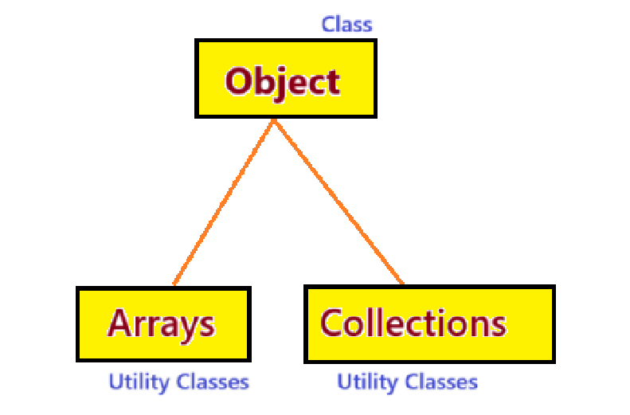
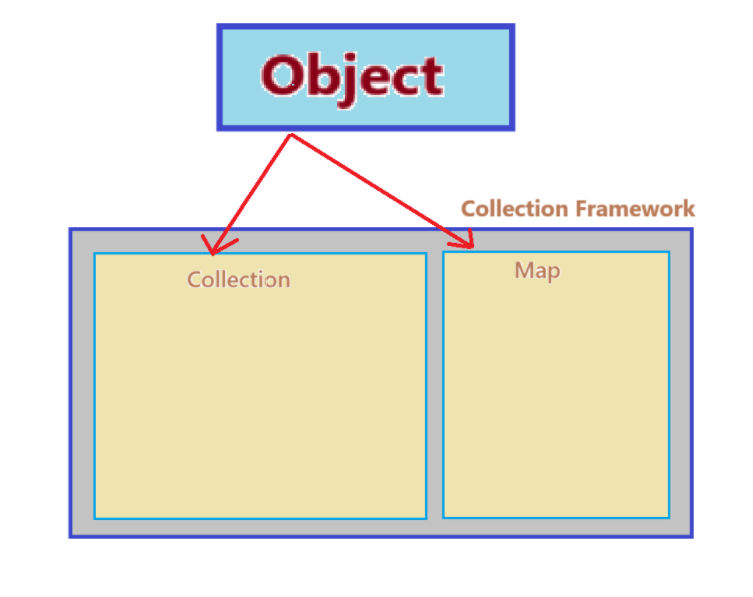
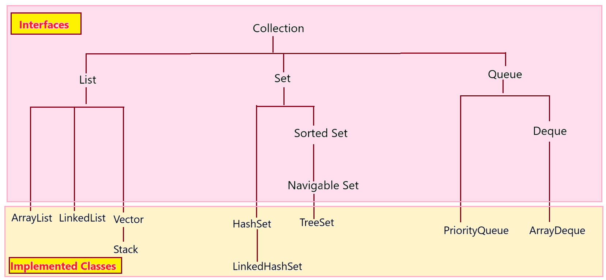
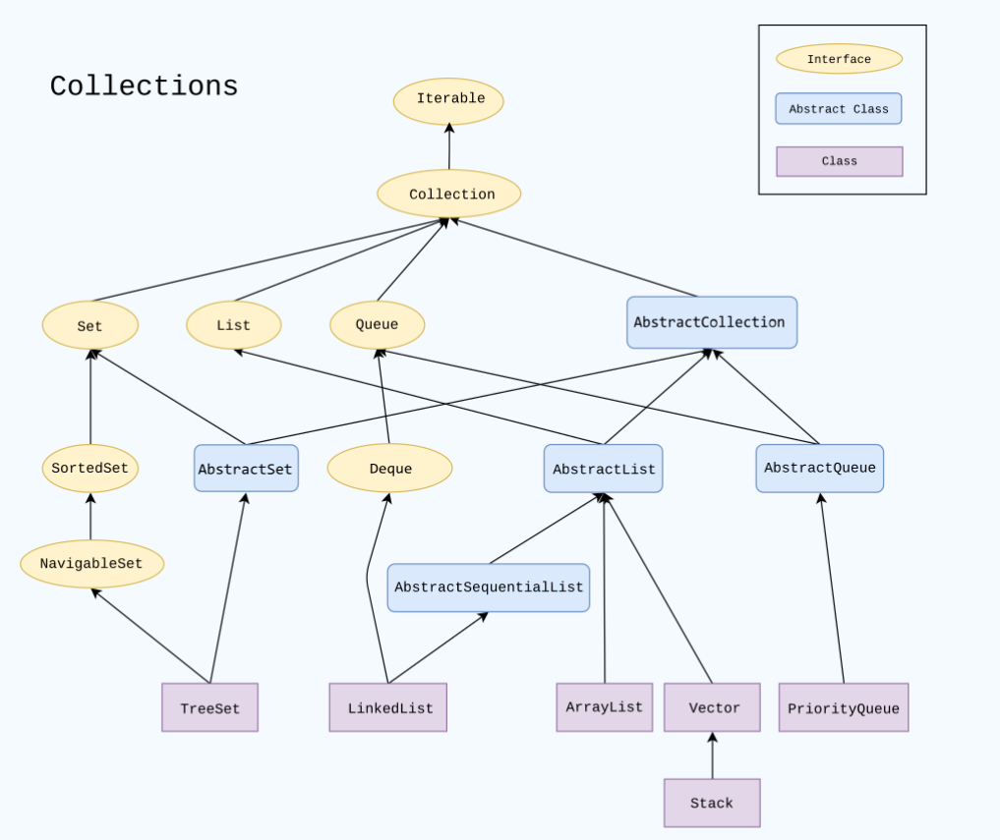
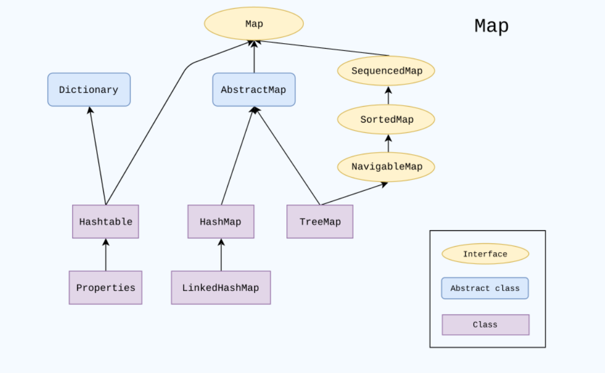
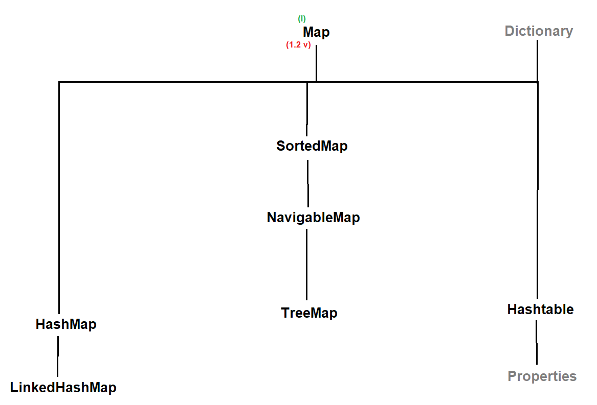
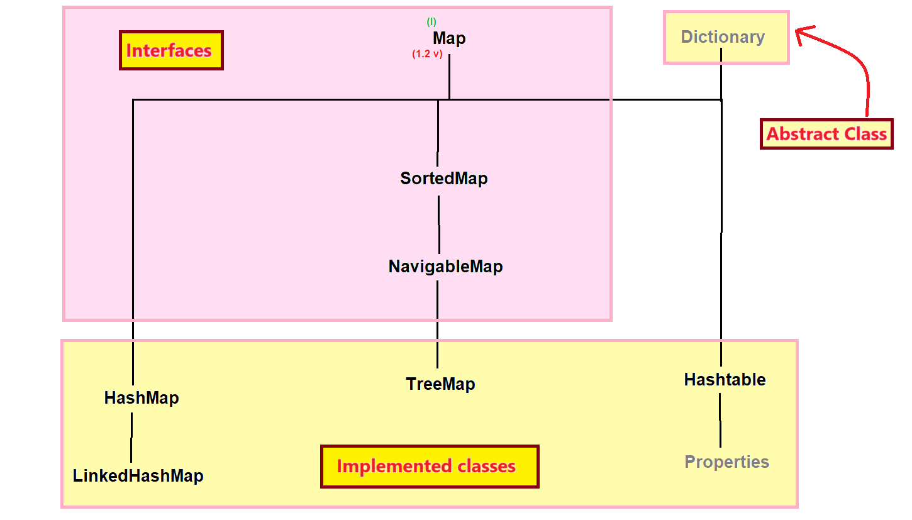

### Abstract Design Pattern
- It provides a way by which we don't have to implement all the methods of an interface.
- we just have to declare an abstract class which inherits the interface and in that abstract class we will override the methods of an interface. 
- When we create a class which inherits the abstract class, then we don't need to override all the methods of interface.
- This is called `Abstract Design Pattern` OR `Abstract Factory Design Pattern`.

#### See Programs:
- Note: 
  - In this program, we made our own collection.
  - So, to avoid predefine collection interfaces and classes, we put last character as twp times of the word.
  - For example, `Listt`, `Collectionn`, `ArrayListt`, `AbstractListt`

We made our own `Predefine APIs, Predefine Packages`.
- demo 
  * [Test.java](_14%2FmapCollectionsDemo%2Fdemo%2FTest.java)
- UtilDemo  
  * [AbstractListt.java](_14%2FmapCollectionsDemo%2Futil%2FAbstractListt.java)
  * [ArrayListt.java](_14%2FmapCollectionsDemo%2Futil%2FArrayListt.java)
  * [Collectionn.java](_14%2FmapCollectionsDemo%2Futil%2FCollectionn.java)
  * [Listt.java](_14%2FmapCollectionsDemo%2Futil%2FListt.java)






--- 

## Map interface in Java

### Map
- Map is an interface which is present in java.util package.
- Map does not inherit Collection interface.
- Syntax : 
  ```java
  public interface Map { 
      // ---- 
  }
  ```
- Map was introduced in `JDK 1.2 version`.

#### Hierarchy of Map interface :-





Note:
- Hashtable : `"t"` is small in the `Hashtable` word.

####  Properties of Map :-
1. Map stores the data in `key-value pair`. Each key-value pair is known as `Entry`.
   - `Key and value both are Object.`
   

2. In Map, keys should always unique but values can be duplicate.
3. Map can store heterogeneous elements or different type of elements.
4. In Map keys we can store maximum one null value but in values we can store any number of null values.
5. Map does not follow the insertion order by default.
6. Map does not follow the sorting order by default.


#### Methods of Map interface :
1. `public Object put(Object key, Object value)`
2. `public void putAll(Map map)`
3. `public Object get(Object key)`
4. `public Object remove(Object key)`
5. `public void clear()`
6. `public boolean isEmpty()`
7. `public int size()`
8. `public boolean containsKey(Object key)`
9. `public boolean containsValue(Object value)`
10. `public Set keySet();`
11. `public Collection values();`


- These all methods are the Map interface methods so we can not directly use it, but we can use through implemented classes like HashMap, LinkedHashMap, etc. 