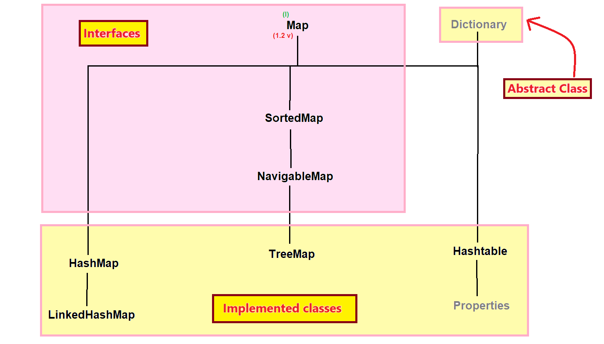

## Entry interface & HashMap class in Java



### Entry
- Entry is a one key-value pair in Map.
- Without Entry Map is always empty, or we can say Map does not contain any key-value pair.
- Entry is an interface which is present in Map interface (or we can say that Entry is a sub-interface of Map interface).
- Syntax :
```java
interface Map {
    //methods
    interface Entry {
        1. Object getKey()
        2. Object getValue()
        3. Object setValue(Object obj)
    }
}
```

### HashMap
- HashMap is a direct-implemented class of Map interface which is present in `java.util package`.
- Syntax : 
```java
public class HashMap extends AbstractMap implements Map, Cloneable, Serializable { 
    // ----- 
}
```
- HashMap was introduced in `JDK 1.2 version`.
- The underline data structure of HashMap is "`Hashtable`".

#### Properties of HashMap
1. HashMap stores the values in `key-value pair` and each key-value pair is known as `Entry`.
2. In HashMap, keys should always unique but values can be duplicate.
3. HashMap can store heterogeneous elements or different type of elements.
4. In HashMap keys we can store maximum one null value but in values we can store any number of null values.
5. HashMap does not follow the insertion order by default.
6. HashMap does not follow the sorting order by default.
7. HashMap is non-synchronized Map because HashMap does not contain any synchronized methods.
8. HashMap allows more than one thread at one time.
9. HashMap allows the parallel execution.
10. HashMap reduces the execution time which in turn makes our application fast.
11. HashMap is not thread-safe.
12. HashMap does not guarantee for data consistency.

#### Working of HashMap
1. Whenever we create HashMap, its initial capacity is 16 elements.
2. HashMap load factor is 75%.

#### Constructors of HashMap :-
1. `public HashMap()`
2. `public HashMap(int capacity)`
3. `public HashMap(int capacity, float loadFactor)`
4. `public HashMap(Map m)`

#### Methods of HashMap :-
-  same methods as that of Map interface

#### When we should use HashMap:-
- HashMap is good for searching or retrieval operations.

#### How to get synchronized version of HashMap:-
- By default, HashMap is non-synchronized but if we want to get synchronized version of HashMap then we have to use `synchronizedMap()` method of Collections class.


#### See Programs:

* [Test1.java](_15%2FmapDemo%2FTest1.java)
* [Test2.java](_15%2FmapDemo%2FTest2.java)
* [Test3.java](_15%2FmapDemo%2FTest3.java)
* [Test4.java](_15%2FmapDemo%2FTest4.java)
* [Test5.java](_15%2FmapDemo%2FTest5.java)   