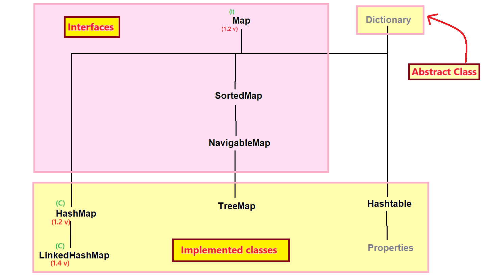
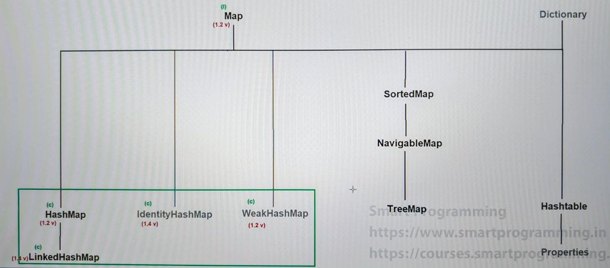
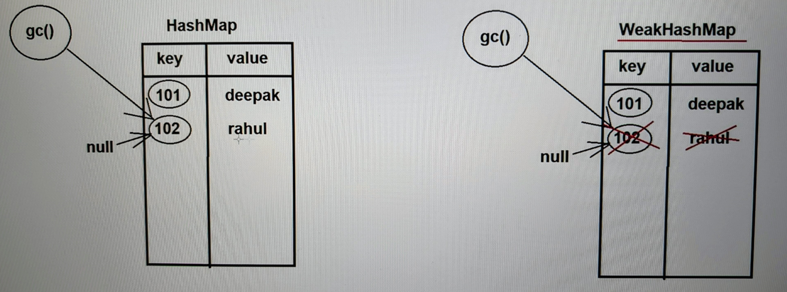

## LinkedHashMap, IdentityHashMap & WeakHashMap class in Java

### LinkedHashMap :-
- LinkedHashMap is the child class of HashMap which is present in `java.util` package.
- Syntax : 
    ```java
    public class LinkedHashMap extends HashMap implements Map { 
        // ---- 
    }
    ```
- LinkedHashMap was introduced in `JDK 1.4 version`.
- LinkedHashMap underline data structure is "`Hashtable + LinkedList`".



#### Properties of LinkedHashMap
- LinkedHashMap has the same properties as that of HashMap but one difference is LinkedHashMap follows the insertion order.

#### Constructors of LinkedHashMap
- Same constructors as that of HashMap

#### Methods of LinkedHashMap
-  Same methods as that of HashMap.

### When we should use LinkedHashMap
- If we have to create cache based applications then we can use LinkedHashMap.

#### See Programs
LinkedHashMapDemo:
[Test1.java](_16%2Flinkedhashmapdemo%2FTest1.java)

### What is difference between HashMap & LinkedHashMap :-
1. 
   - HashMap was introduced in `JDK 1.2` version.
   - LinkedHashMap was introduced in `JDK 1.4` version.


2. 
   - HashMap does not follow the insertion order.
   - LinkedHashMap follows the insertion order.


3. 
   - HashMap underline data structure is "`Hashtable`".
   - LinkedHashMap underline data structure is "`Hashtable + LinkedList`".


### Difference between == & .equals() method :-
- `==` is used for reference comparison or address comparison.
- `equals()` method is used for content comparison.

#### See Programs:
- [Test1.java](_16%2Fidentityhashmapdemo%2FTest1.java)




### IdentityHashMap :-
- IdentityHashMap is an implemented class of Map interface which is present in `java.util` package.
- Syntax : 
   ```java
   public class IdentityHashMap extends AbstractMap implements Map, Serializable, Cloneable { 
        // --- 
   }
   ```
- IdentityHashMap was introduced in `JDK 1.4 version.`
- Properties, Constructors & Methods are same as HashMap.

#### See Programs:
- [Test2.java](_16%2Fidentityhashmapdemo%2FTest2.java)


#### Point to remember :-
1. Map does not contain duplicate keys but can contain duplicate values.


2. If we insert key-value pair in HashMap internally `.equals` method will be called and keys will be compared, if the value is true, it will treat as duplicate key, and it will not insert that key.


3. If we insert key-value pair in IdentityHashMap, then internally `==` operator will be called, and keys will be compared, if the value is true, then it will replace the value or if the value is false then it will insert that key-value pair.


### Difference between HashMap & IdentityHashMap :-
1. 
   - HashMap was introduced in `JDK 1.2 version`.
   - IdentityHashMap was introduced in `JDK 1.4 version`.


2. 
   - In case of HashMap to check for duplicate keys, internally `.equals ()` method is called.
   - In case of IdentityHashMap, to check for duplicate keys, internally `==` operator will be called.

### How to delete an object in java ?
There are 2 steps to delete an object in java :
1. Provide null value to the reference.
2. Call `gc()` method.

#### See Programs:
- [Test1.java](_16%2Fweakhashmapdemo%2FTest1.java)

### WeakHashMap :-
- WeakHashMap is a class which implements the Map interface.
- Syntax : 
   ```java
   Public class WeakHashMap extends AbstractMap implements Map { 
       // --- 
   }
   ```
- WeakHashMap was introduced in `JDK 1.2 version`.
- Properties, Constructors and methods are same as HashMap.

### Difference between HashMap & WeakHashMap :-
1. 
   - HashMap does not allow the garbage collector to delete its elements.
   - WeakHashMap allows the garbage collector to delete its elements.



#### See Programs:
- [Test2.java](_16%2Fweakhashmapdemo%2FTest2.java)
- [WeakHashMapCustomKeyDemo.java](_16%2Fweakhashmapdemo%2FWeakHashMapCustomKeyDemo.java)
