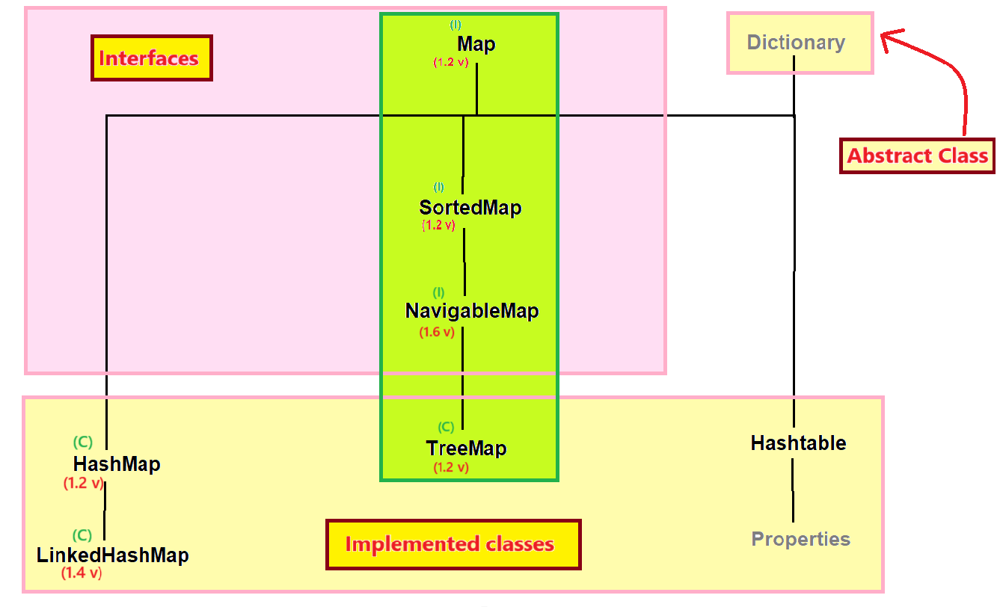

## SortedMap, NavigableMap & TreeMap in Java
- In Collection, internal data structure of the Set is the same as Map because it was made based on Map.




### SortedMap :-
- SortedMap is a child interface of Map interface which is present in `java.util` package
- Syntax : 
    ```java
    public interface SortedMap extends Map { 
        // ----- 
    }
    ```
- SortedMap was introduced in `JDK 1.2 version`.

#### Properties of SortedMap :-
w.r.t. : with respect to
1. SortedMap stores the data in key-value pair where key must be unique but values can be duplicate.
2. SortedMap does not follow the insertion order w.r.t. keys.
3. SortedMap follows the sorting order w.r.t. keys.
4. SortedMap can store homogeneous and heterogeneous keys :-
   - a.) If we are depend on default natural sorting order then the keys should be homogeneous and Comparable otherwise it will provide an exception saying "`java.lang.ClassCastException`".
   - b.) If we are defining our own sorting order by Comparator, then the keys can be heterogeneous.
5. We cannot store null values in SortedMap.
6. SortedMap is non-synchronized Map.

#### Methods of SortedMap
1. `Object firstKey();`
2. `Object lastKey();`
3. `SortedMap headMap(Object key);`
4. `SortedMap tailMap(Object key);`
5. `SortedMap subMap(Object key2, Object key2);`
6. `Comparator comparator();`

#### See Programs:
- SortedMapDemo: 
[Test1.java](_17%2Fsortedmapdemo%2FTest1.java)


### NavigableMap
- NavigableMap is the child interface is SortedMap which is present in `java.util` package.
- Syntax : 
    ```java
    public interface NavigableMap extends SortedMap { 
        // ---- 
    }
    ```
- NavigableMap was introduced in `Java SE 6 version`.

#### Properties of NavigableMap :-
- NavigableMap is same as SortedMap but it provides some extra navigable methods.

#### Methods of NavigableMap :-
1. `public NavigableMap descendingMap()`
2. `public Object ceilingKey(Object key)`
3. `public Object higherKey(Object key)`
4. `public Object floorKey(Object key)`
5. `public Object lowerKey(Object key)`
6. `public void pollFirstEntry()`
7. `public void pollLastEntry()`

#### See Programs:
- NavigableMapDemo: [Test1.java](_17%2Fnavigablemapdemo%2FTest1.java)

### TreeMap :-
- TreeMap is a clas which provides the implementation for NavigableMap, SortedMap & Map interface.
- Syntax : 
    ```java
    public class TreeMap extends AbstractMap implements NavigableMap, Cloneable, Serializable { 
        // ------ 
    }
    ```
- TreeMap was introduced in `JDK 1.2 version`.
- The underline data structure of TreeMap is "`Red-Black tree`".
  - read some information about the "Red-Black tree" online.

#### Properties of TreeMap
w.r.t. : with respect to
1. TreeMap stores the data in key-value pair which key must be unique but value can be duplicate.
2. TreeMap does not follow the insertion order wrt keys.
3. TreeMap follows the sorting order wrt keys.
4. We can store homogeneous & heterogeneous elements :
   - (a.) If we are depend on default natural sorting order then the keys must be homogeneous and comparable.
   - (b.) If we are defining our own sorting by Comparator then the keys can be heterogeneous.
5. We cannot store the null values in TreeMap.
6. TreeMap is non-synchronized Map.
7. TreeMap allows more than one thread at one time.
8. TreeMap allows the parallel execution.
9. TreeMap reduces the execution time which makes our application fast.
10. TreeMap are not thread-safe.
11. TreeMap does not provide guarantee for data consistency.

#### Constructors
1. `public TreeMap() { - }`
2. `public TreeMap(Comparator comparator) { - }`
3. `public TreeMap(Map m) { - }`
4. `public TreeMap(SortedMap m) { - }`


#### Methods
- implements all the methods of Map, SortedMap & NavigableMap interface.

#### See Programs:
- TreeMapDemo
  - [Test1.java](_17%2Ftreemapdemo%2FTest1.java)
  - [Test2.java](_17%2Ftreemapdemo%2FTest2.java)

#### When we should use TreeMap?
- When we want to store a large number of elements in sorting order then we have to use TreeMap which makes the retrieval operation fast

#### "null" value insertion in TreeMap :-
1. Till `1.6 version` we were able to insert null value at first key position but if we insert any other value then it will provide "`NullPointerException`".
2. If we insert null values after first position then it will throw an exception saying "`NullPointerException`".
3. From `1.7 version` we cannot insert the null value even at first position.

### Difference between HashMap, LinkedHashMap & TreeMap.
1. 
   - HashMap was introduced in `JDK 1.2 version`.
   - LinkedHashMap was introduced in `JDK 1.4 version`.
   - TreeMap was introduced in `JDK 1.2 version`.


2. 
   - HashMap underline data-structure is "`Hashtable`".
   - LinkedHashMap underline data-structure is "`Hashtable+LinkedList`".
   - TreeMap underline data-structure is "`Red-Black Tree`".


3. 
   - HashMap does not follow the insertion order.
   - LinkedHashMap follows the insertion order.
   - TreeMap does not follow the insertion order.
    

4. 
   - HashMap does not follow the sorting order.
   - LinkedHashMap does not follow the sorting order.
   - TreeMap follows the sorting order.


5. 
   - HashMap allows the heterogeneous objects by default.
   - LinkedHashMap allows heterogeneous objects by default.
   - TreeMap allows homogeneous objects by default.


6. 
   - HashMap allows the null value insertion at key position.
   - LinkedHashMap allows the null value insertion at key position.
   - TreeMap does not allow the null value insertion at key position.


