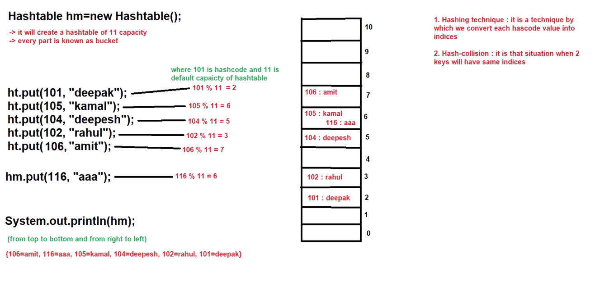
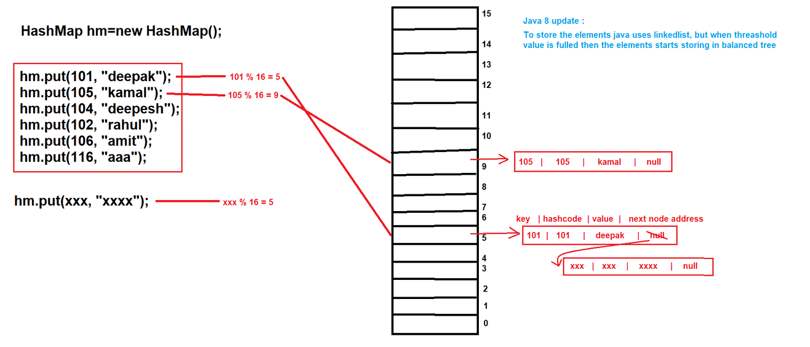

## Hashtable & Working of Hashtable & HashMap in Java

### Hashtable :-
- Hashtable is a direct implement class of Map interface which is present in `java.util` package.
- Syntax : 
   ```java
   public class Hashtable extends Dictionary implements Map, Cloneable, Serializable { 
       // ----- 
   }
   ```
- Hashtable was introduced in `JDK 1.0 version`.
- Hashtable is also known as `legacy class`.
- The underline data structure of Hashtable is "`Hashtable`".

#### Properties of Hashtable :-
1. Hashtable stores the values in key-value pair and each key-value pair is known as `entry`.
2. In Hashtable, keys should always unique but values can be duplicate.
3. Hashtable can store heterogeneous elements at key position.
4. In Hashtable we cannot insert null values at key or value position.
5. Hashtable does not follow the insertion order by default.
6. Hashtable does not follow the sorting order by default.
7. Hashtable is synchronized map.
8. Hashtable does not allow more than one thread at one time.
9. Hashtable allows the sequential execution. (It means it does not allow parallel execution).
10. Hashtable increases the execution time which in turn makes our application slow.
11. Hashtable is thread-safe.
12. Hashtable provides the guarantee for data consistency.

#### See Programs:
- HashTableDemo: [Test.java](_18%2FhashTableDemo%2FTest.java)
- 
#### Constructors :-
1. `public Hashtable() { - }` : it will create a Hashtable having 11 as capacity and default fill ratio is `75%`.
2. `public Hashtable(Map t) { - }`
3. `public Hashtable(int initialCapacity) { - }`
4. `public Hashtable(int initialCapacity, float loadFactor) { - }`

#### Methods :-
- same methods as that of Map interface.

#### When we should use Hashtable :-
- Hashtable is good for searching or retrieval operation.

#### Working of Hashtable :-
- "`hashcode`" is the unique integer value of each and every object that is provided by `JVM`.
- Hashtable initialCapacity is `11`.
- Then for each and every key hashcode value will be generated and its index position will be calculated by using hashing technique.
- And at that index position that key-value pair or entry will be inserted.
- If two elements have same index position, then that entry will be inserted at right side of previous entry.
- When the values are traversed then they are traversed from top to bottom and right to left.
- If all the buckets are full(it means, it reaches the threshold value (`75%`)), then it will create new hashtable and current all values will be copied in the new hashtable and again by using the hashing technique, it will start to insert new values.



- `threshold = capacity * loadFactor`
- `capacity = 11 and loadFactor = 0.75 → threshold = 8.25  → 8 (rounded down)`
- It means when 9 entries are added, the hashtable resizes, usually doubling its size plus one:
  `newCapacity = (oldCapacity * 2) + 1`
- All entries are then rehased into the new table.

#### See Programs:
- demo
    - [Test.java](_18%2Fdemo%2FTest.java)
    - [Test1.java](_18%2Fdemo%2FTest1.java)


### Working of HashMap :-
- HashMap initialCapacity is `16`.
- For every entry it will calculate the index position and store the element there.
- If multiple entries have same index position, then it will create linked list and starts storing in that linked-list.
- In java 8 updates, after threshold value is filled then it starts storing the elements in balanced tree (like a Red-Black Tree).



- `HashTable + LinkedList`
- Exactly not working as doubly linkedList but it stores address of next node. (Single LinkedList)
- `threshold = capacity * loadFactor`
- `capacity = 16 and loadFactor = 0.75 → threshold = 12`
- when the number of stored entries exceeds 12, the HashMap resizes (usually doubles the capacity) and rehashes all entries.

#### See Programs:
- HashMapDemo: [Test.java](_18%2FhashMapDemo%2FTest.java)


### Difference between HashMap & Hashtable :-
1. 
   - HashMap was introduced in `1.2 version`.
   - Hashtable was introduced in `1.0 version`.


2. 
   - HashMap is not a `legacy class`.
   - Hashtable is a legacy class.


3. 
   - In HashMap we can store the null values.
   - In Hashtable we cannot store the null value at key or value position.

4. 
   - HashMap is non-synchronized Map because HashMap does not contain any synchronized methods. 
   - Hashtable is synchronized Map because it contains synchronized methods.

5. Multiple points related to synchronization.
   


#### Summary

| Feature             | HashMap                         | Hashtable            |
| ------------------- | ------------------------------- | -------------------- |
| Thread-safe         | ❌ No                           | ✅ Yes               |
| Load factor default | 0.75                            | 0.75                 |
| Initial capacity    | 16                              | 11                   |
| Resizing strategy   | Doubles capacity                | Doubles capacity + 1 |
| Collision handling  | Linked list (Tree after Java 8) | Linked list          |
