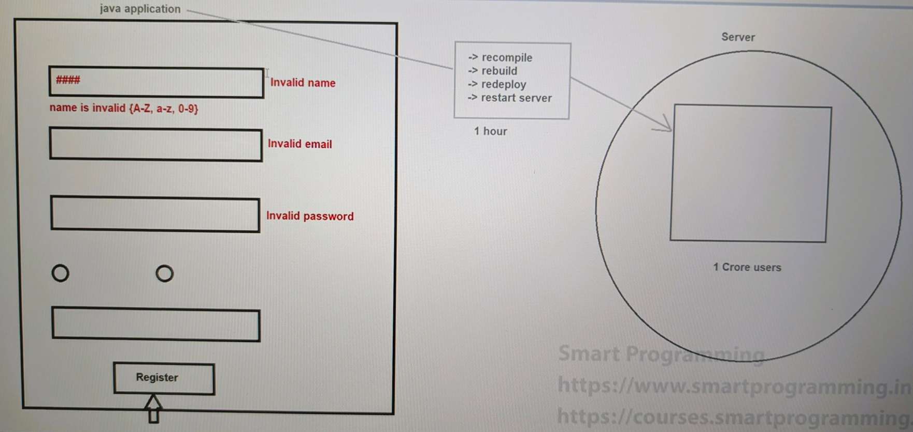
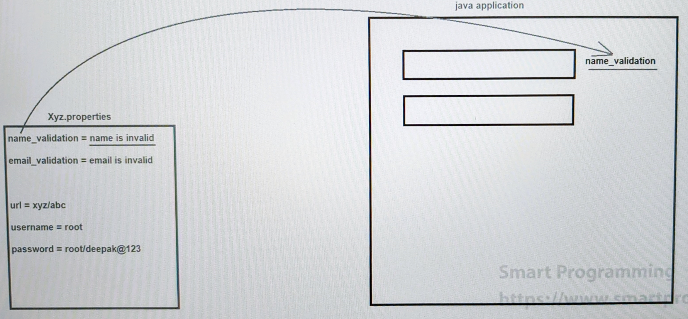
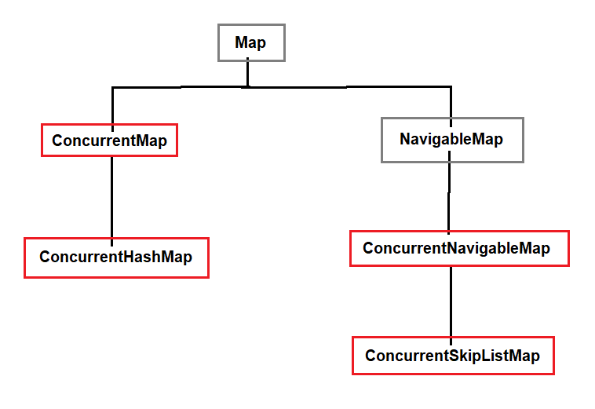

## Dictionary, Properties & Concurrent Classes in Java

### Dictionary :-
- Dictionary is an abstract class which is present in `java.util` package.
- Dictionary represents the key-value pair similar to Map interface.
- Syntax : 
    ```java
    public abstract class Dictionary { 
        // --- 
    }
    ```
- As Dictionary is an abstract class, thus we cannot create an object of it.
- Dictionary was introduced in `JDK 1.0 version`.
- Since java does not support multiple inheritance, if any class extends the Dictionary class, then it will not be able to inherit any other class and due to this reason, Map interface was created.
- Dictionary class is not used that much as Map interface.

#### Methods :-
1. `abstract public int size();`
2. `abstract public boolean isEmpty();`
3. `abstract public Enumeration keys();`
4. `abstract public Enumeration elements();`
5. `abstract public Object get(Object key);`
6. `abstract public Object put(Object key, Object value);`
7. `abstract public Object remove(Object key);`

### Properties :-
- Properties is the child class of Hashtable which is present in `java.util` package.
- Syntax : 
    ```java
    public class Properties extends Hashtable { 
        // ---- 
    }
    ```
- Properties is the file which stores the data in key-value pair.
- Properties can contain "`key-value pair in the form of String type only`".

#### When we should use Properties :-
- Whenever there is any data which can change frequently in future then we should not embed that data in our java application. 
- Instead of that we have to create properties file and provide the data in key-value pair so that we don't need to recompile, rebuild, redeploy and even no need to restart the server.
- For example, validations, database connection, exception handling etc.







#### Constructors :-
1. `public Properties() { - }`
2. `public Properties(Properties defaults) { - }`

#### Methods :-
1. `void load(InputStream is)`
2. `String getProperty(String pname)`
3. `String setProperty(String pname, pvalue);`
4. `void store(OutputStream os, String comments)`

#### See Programs
- [Register.java](_19%2Fpropertiesdemo%2FRegister.java)
- [Register2.java](_19%2Fpropertiesdemo%2FRegister2.java)

### Concurrent Collections :-
#### Why Concurrent Collections were introduced?
- Most of the classes that we have used till now (traditional collections) are non-synchronized. 
  - For example, ArrayList, LinkedList, HashSet, HashMap etc.
- If any class is non-synchronized then it does not guarantee for data consistency which can ruin our application.
  - non-synchronized: Multiple thread access at one time and parallel execution is allowed. So, Data inconsistency possible and data would be effected/changed.
- Some of the synchronized collection like Vector or Stack have low performance.
- In traditional collections, if a thread is iterating a Collection object and if another thread try to add new element in that iterating object, then it will provide an exception saying "`ConcurrentModificationException`".
- Due to above problems, traditional Collections were not good for multithreaded applications and due to this, concurrent collections were introduced.
- The concurrent Collections were introduced in `JDK 1.5 version`.
- These Concurrent Collection classes are present in `java.util.concurrent` package.

### Hierarchy of Concurrent Collection :-


