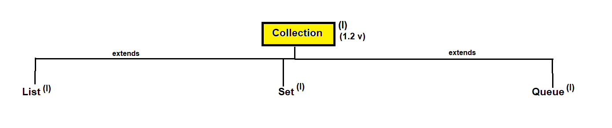
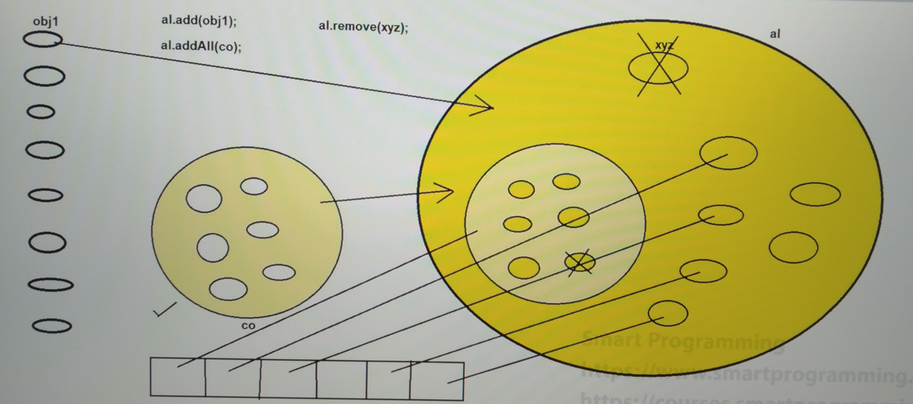

## Collection Interface in Java

### Collection :-
- Collection is an interface which is present in `java.util` package.
- Syntax : 
    ```java
    public interface Collection<E> extends Iterable<E> { 
        // --- 
    }
    // here E represents Object
    ```
- Collection was introduced in JDK 1.2 version.
- Collection is an object which is used to represent a group of individual objects as a single unit.
- Collection interface is the root interface of Collection Framework.
- There is no concrete class which implements the Collection interface directly but there are interfaces which inherit the Collection interface i.e. List, Set & Queue.

#### Hierarchy of Collection interface :

- Collection interface contains most common methods which are applicable for any collection object.




####  Methods of Collection Interface :-
add:
1. `boolean add(Object obj);` : add single object 
2. `boolean addAll(Collection c);` : add all object from one collection (ex. B) to another(ex. A).

remove:
3. `boolean remove(Object obj);` : remove single object which pass in argument.
4. `boolean removeAll(Collection c);` : another collection object (ex. B) which is stored in the other collection (ex. A), this methods remove all (multiple)the collection object of B. 
5. `default boolean removeIf(-) { - }`
6. `boolean retainAll(Collection c);` : this collection object (which is passed in argument) will be present and rest all collection objects will be removed.
7. `void clear();` : Remove all collection objects.

check present object:
8. `boolean contains(Object obj);` : check if object is present in that Collection or not.
9. `boolean containsAll(Collection c);` : check all objects are present in that Collection or not.

Other methods
10. `boolean isEmpty();` : check Collection object empty or not
11. `int size();` : check Collection object size.
12. `Iterator iterator();` : values iterate or get
13. `Object toArray();` : convert Collection object to array.

Object class methods: Collection interface inherit Object class methods
14. boolean equals(Object obj);
15. int hashCode();
    


### What is difference between Collection & Collections?
1. 
   - Collection is an interface.
   - Collections is a utility class.


2. 
   - Collection is an object which is used to represent a group of individual objects as a single unit.
   - Collections defines several utility methods that are used to operate on collection objects like sorting, searching etc.


3.  
   - Collection interface contains default, abstract methods and static methods.
   - Collections class contains only static methods.

### What is Utility Class in Java?
- Utility class is also known as helper class which cannot be instantiated.
- Utility class contains only static methods.
- Examples are Arrays, Collections.

#### How we can create utility class?
1. declare the class as public and final.
2. we have to declare private constructor to prevent object creation.
3. class should contain only static methods and does not contain abstract methods.
4. every method should have deep documentation.

#### What is Utility Methods?
- Utility methods perform common, often reused methods.
- Utility methods are always static type.
- Examples are sorting, searching, methods performing string manipulation, methods connecting to databases etc.

-------

```java
// Array
int[] arr = new int[3];
arr[0] = 5;

// ArrayList
ArrayList al = new ArrayList();
al.add(5);
```
