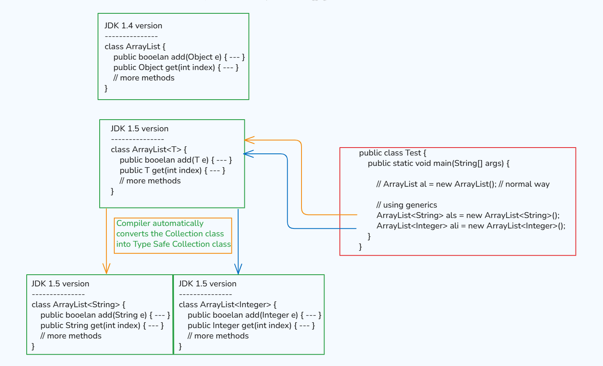

```java
void show(String s) {           // parameter
    // ----
}

t.show("Govardhan");        // argument
```
## Generics in Java

### Generics :-
- **Generics means parametrized types** which means that we can provide any type of parameter to the `classes`, `interfaces` or `methods`.
- Generics were introduced in `JDK 1.5 version`.
- Generics are represented by angular braces - `< >`

#### The main objective of Generics are
1. To provide type safety
2. To resolve type casting problem
- By default, "`arrays are type safe`".
- Now for collections, till `JDK 1.4 version`, collections were not generic types.
- In `JDK 1.5 version`, Generic Collections were introduced.
- **NOTE** : We can only provide non-primitive values in generics.





- Till Java 1.4, when method call that time it returns Object that is why it is not type safe.
- So, I can provide String object or int object.
- Then, we need to do conversion (type cast).

#### See Programs:
- ArraysDemo:  [Test.java](_20%2Farraysdemo%2FTest.java)


### Generic Classes :-
- If any class is declared with type parameters then it is known as `Generic Class`.
- Generic classes can be `user-defined classes` or `predefined classes (collections classes)`.
- Generic type can be any valid identifier name.
- We can provide any number of parameters in generics.

#### See Programs:
- ArraysDemo:  
  - [Demo.java](_20%2Farraysdemo%2FDemo.java)
  - [Test1.java](_20%2Farraysdemo%2FTest1.java)

### Generic Bounded Types :-


- We can bound the type parameter for a particular range by using `extends` keyword. And  this concept is known as `Generic Bounded Type Concept`.
- Syntax : 
  ```java
  class A<T extends X>
  (X can be any class or interface)
  ```
#### Cases
1. We can only use extends keyword, not implements keyword.
2. We can only use Non-Primitive data types.
3. `class A<T extends X & Y>`.


#### See Programs:
- BoundsDemo: [Test.java](_20%2Fboundsdemo%2FTest.java)


### Generics Methods & Generics Wildcards (?)

#### See Programs:
- GenericMethods: [Test.java](_20%2Fgenericmethods%2FTest.java)