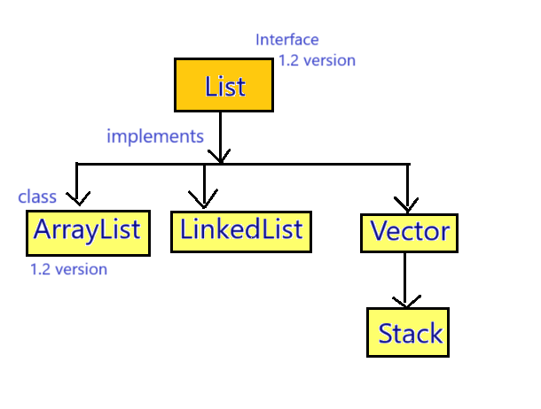

## List & ArrayList in Java

### List Interface :-
- List is a interface which is present in java.util package
- List is the child interface of Collection interface
- Syntax : 
   ```java
   public interface List extends Collection {
        //  --- 
   }
   ```
- List was introduced in JDK 1.2 version.

#### Hierarchy of List interface :-


#### Properties of List Interface :-
1. List is an index based Data Structure which means that first element will be inserted at 0 index position.
2. List can store different data types or heterogeneous elements.
3. We can store duplicate elements in the List.
4. We can store any number of null values in the List.
5. List follows the insertion order which means the sequence in which we are inserting the elements, in the same sequence we can retrieve the elements.
6. List does not follow the sorting order.

#### Methods of List Interface :-
1. List contains all the methods of Collection interface.
2. `void add(int index, Object obj);` : add at particular index.
3. `boolean addAll(int index, Collection c);`
4. `Object get(int index);` : get value(in Object form) at particular index. 
5. `Object remove(int index);` : remove at particular index and store in Object (last time, so you want to do anything with it then you can do it.)
6. `Object set(int index, Object newobj);` : set method is used to replace the object at given index position
7. `int indexOf(Object obj);` : it will return the index position of provided object and if object is not found then it will return -1
9. `int lastIndexOf(Object obj);` 


## ArrayList 


- ArrayList is an implemented class of List interface which is present in `java.util` package.
- Syntax : 
   ```java
   public class ArrayList extends AbstractList implements List, RandomAccess, Cloneable, Serializable {
       // --------
   }
   ```
- The underline Data-Structure of ArrayList is resizable array or growable array.
- ArrayList was introduced in JDK 1.2 version


### Properties of ArrayList :
1. ArrayList is an index based Data Structure which means that first element will be inserted at 0 index position.
2. ArrayList can store different data types elements or heterogeneous elements.
3. We can store duplicate elements in the ArrayList.
4. We can store any number of null values in the ArrayList.
5. ArrayList follows the insertion order which means the sequence in which we are inserting the elements, in the same sequence we can retrieve the elements.
6. ArrayList does not follow the sorting order.

(above all properties are same as List interface)

7. ArrayList is non-synchronized collection because ArrayList does not contain any synchronized method. 
   - [Go to Synchronized Object](#synchronized-object) 
   - [Go to Non-Synchronized Object](#non-synchronized-object)
8. ArrayList allows more than one thread at one time.
9. ArrayList allows parallel execution.
10. ArrayList reduces the execution time which in turn makes the application fast.
11. ArrayList is not thread safe.
12. ArrayList does not guarantee for data consistency.
    
### Working of an ArrayList :
1. When we create default ArrayList, a new ArrayList with initial capacity 10 is created (but size is 0).
2. When the ArrayList capacity is full, a new ArrayList will be created with new capacity.
   - The new Capacity is calculated by this formula:-
      - a. (CurrentCapacity * 3 / 2) + 1
   - [Go to ArrayList Capacity](#arraylist-capacity)
3. Then all the elements will be copied into the new ArrayList (and due to this reason performance of an ArrayList decreases).
4. When new ArrayList is created automatically, then reference variable will point to the new ArrayList.
5. Then old ArrayList object will be not referenced by any reference and then garbage collection will delete that object.

#### Note : There is no way by which we can find the capacity of an ArrayList.


### Constructors of ArrayList :-
1. `ArrayList al = new ArrayList();`
   - In this arraylist, an ArrayList collection object is created whose capacity is 10.


2. `ArrayList al = new ArrayList(int initialCapacity);`
   - In this arraylist, an ArrayList object is created with provided initialCapacity.


3. `ArrayList al = new ArrayList(Collection c);`
   - In this arraylist, another collection object is copied into new arraylist object.

#### See Programs

Demo
* [Test1.java](_3%2Fprograms%2Fdemo%2FTest1.java)
* [Test2.java](_3%2Fprograms%2Fdemo%2FTest2.java)
* [Test3.java](_3%2Fprograms%2Fdemo%2FTest3.java)
* [Test4.java](_3%2Fprograms%2Fdemo%2FTest4.java)
* [Test5.java](_3%2Fprograms%2Fdemo%2FTest5.java)
* [Test6.java](_3%2Fprograms%2Fdemo%2FTest6.java)
* [Test7.java](_3%2Fprograms%2Fdemo%2FTest7.java)
* [Test8.java](_3%2Fprograms%2Fdemo%2FTest8.java)
* [Test9.java](_3%2Fprograms%2Fdemo%2FTest9.java)
* [ArrayAndArrayList.java](_3%2Fprograms%2Fdemo%2FArrayAndArrayList.java)


#### When we should use ArrayList ?
- When we use retrieval operation mostly (Retrieval operation is fast in case of ArrayList because it implements RandomAccess interface).

#### When we should not use ArrayList ?
- When we have mostly insertion or deletion operation, then we should not use ArrayList.

### RandomAccess interface :-
- RandomAccess interface is a marker interface that means it does not contain any methods or fields (variables).


- The purpose of RandomAccess interface is to retrieve any random element in collection object at the same speed. 


- For example, we have collection object having 1 crore elements, we have to search 3rd element or middle element or last element then it will search with the same speed.


- There are only 2 classes which inherits the RandomAccess interface
  1. ArrayList
  2. Vector

### Cloneable Interface :
- Cloneable interface is also a marker interface.
- It was introduced in JDK 1.0 version.
- It is used to clone the object without using the new keyword.


- See Programs:
[CloneableDemo](_3%2Fprograms%2FCloneableDemo) : [Test.java](_3%2Fprograms%2FCloneableDemo%2FTest.java)


### [Synchronized Object](#synchronized-object)


### [Non-Synchronized Object](#non-synchronized-object)


### [ArrayList Capacity](#arraylist-capacity)


