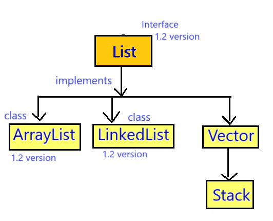
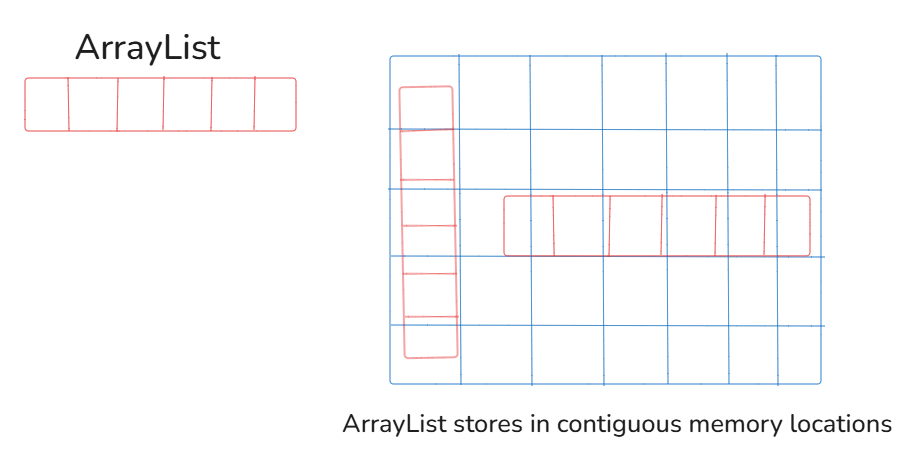
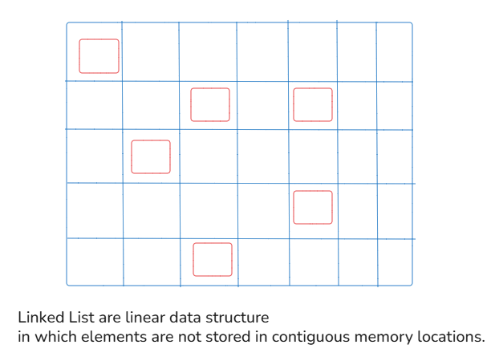
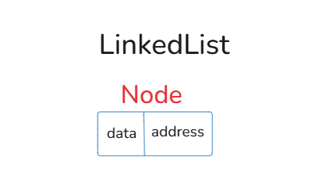
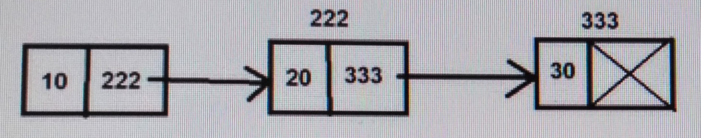
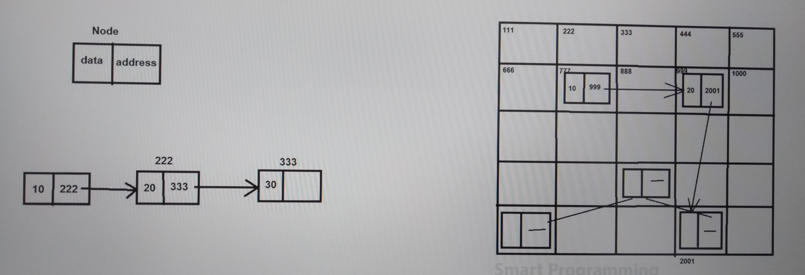
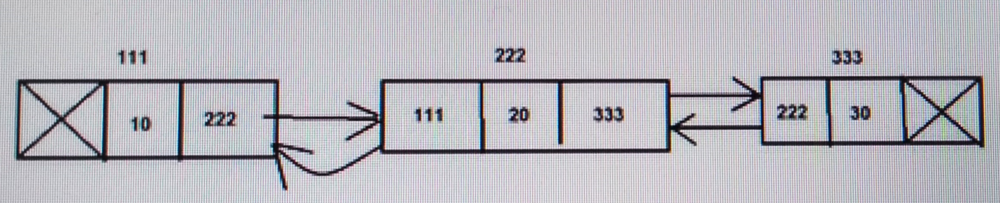
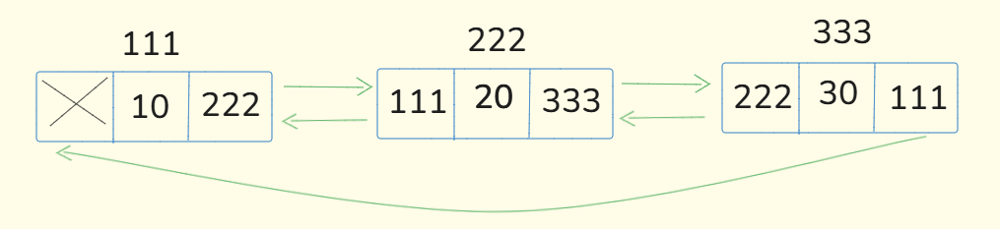
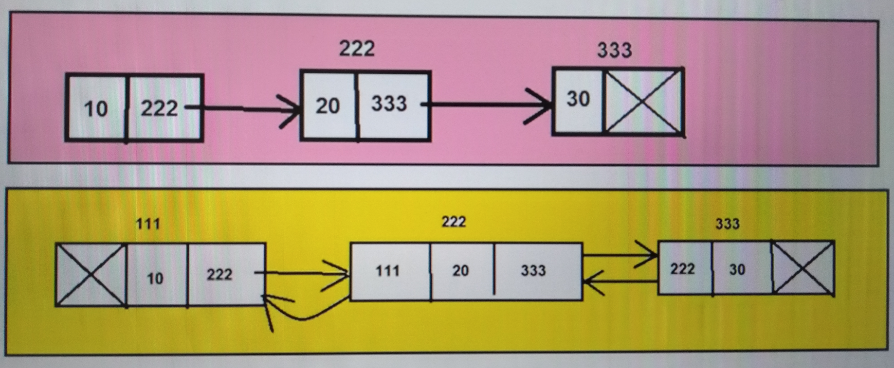
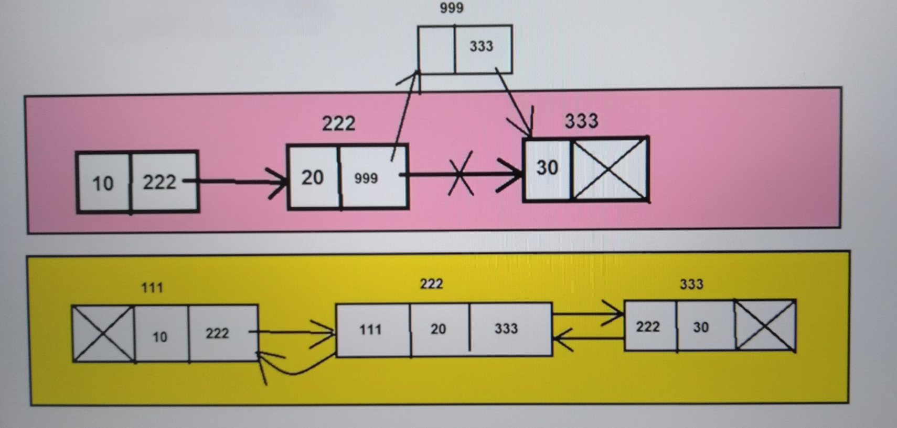

## LinkedList in Java

### LinkedList :-


- LinkedList is an implementation class of List interface which is present in `java.util` package.
- Syntax : 
   ```java
   public class LinkedList extends AbstractSequentialList implements List, Deque, Cloneable, Serializable {
      //   ----- 
   }
   ```
- The underline data structure of LinkedList is Double Linked List or Circular Linked List.
- LinkedList was introduced in JDK 1.2 version.

#### Properties of LinkedList :

1. LinkedList is an index based Data Structure which means that first element will be inserted at 0 index position.
2. LinkedList can store different data types or heterogeneous elements.
3. We can store duplicate elements in the LinkedList.
4. We can store any number of null values in the LinkedList.
5. LinkedList follows the insertion order which means the sequence in which we are inserting the elements, in the same sequence we can retrieve the elements.
6. LinkedList does not follow the sorting order.

(above properties are same as List interface.)
7. LinkedList is non-synchronized collection because LinkedList does not contain any synchronized method.
8. LinkedList allows more than one thread at one time.
9. LinkedList allows parallel execution.
10. LinkedList reduces the execution time which in turn makes the application fast.
11. LinkedList is not thread safe.
12. LinkedList does not guarantee for data consistency. (It means there are chances of data loss during data manipulation.)

#### Working of LinkedList :-
1. Types of LinkedList (all programming languages) :-
   - a. Single Linked List
   - b. Double Linked List
   - c. Circular Linked List
- Java is made base on Double Linked List or Circular Linked List.
2. Linked List are linear data structure in which elements are not stored in contiguous memory locations.
3. There is no capacity concept in LinkedList like ArrayList.







- In LinkedList, it creates nodes and each node has two parts, data and next_node_address.

### Single Linked List



- ArrayList stores data directly and it does not care about the address. If it doesn't care about the address then how it finds next element. It finds based on the index position.
- Here in single linked list, we can find the next value based on the index, but actually it stores data in memory by using the memory address. 
- We are talking about backend. We get it based on the index because LinkedList is an index based Data Structure. 
- It means programmer finds the elements based on the index. Internally in LinkedList, it points the memory address of the next element.
- In Java, programmer never ever enter in the memory that is why here we are not consider memory address.
- Last element does not point to any other element address so, in address it does not store anything.
- Similarly, we normally use `Head node` (first node) and `Tail node` (last node) terms. 

### Double Linked List


- 3 parts of each node : first address of previous node, second data, third address of next node.
- First node, first address is empty because it does not point to any previous node(because there is no node before first node).
- Last node, last address is empty because it does not point to any next node(because there is no node after last node).

### Circular Linked List


#### Single Linked List and Double Linked List Compare


#### insertion in Linked List



#### Constructors :-
1. `public LinkedList()` : default constructor, create single empty node
2. `public LinkedList(Collection c)` : if I have different collection and want to convert in different then I use this.
   - example: convert arraylist to linkedlist : just pass the object in the argument. 

#### Methods of LinkedList :-
1. `Methods of Collection Interface`
2. `Methods of List Interface`
3. `public void addFirst(Object obj)`
4. `public void addLast(Object obj)`
5. `public Object getFirst()`
6. `public Object getLast()`
7. `public Object removeFirst()`
8. `public Object removeLast()`

#### See Programs:
* [Test1.java](_4%2FLinkedListDemo%2FTest1.java)
* [Test2.java](_4%2FLinkedListDemo%2FTest2.java)
* [Test3.java](_4%2FLinkedListDemo%2FTest3.java)
* [Test4.java](_4%2FLinkedListDemo%2FTest4.java)

#### When we should use LinkedList ?
- LinkedList is best when we have to use insertion or deletion operations.

#### When we should not use LinkedList ?
- LinkedList is worst in case of retrieval or searching operations (as LinkedList does not inherit RandomAccess interface).

#### What is difference between ArrayList & LinkedList ?
1. 
   - ArrayList underline data structure is dynamic array or resizable array.
   - LinkedList underline data structure is double linked list or circular linked list.


2. 
   - ArrayList stores the elements in contiguous memory locations.
   - LinkedList does not store the elements in contiguous memory locations.


3. 
   - ArrayList acts as List.
   - LinkedList can acts as List or Deque.


4. 
   - ArrayList is good in case of retrieval operations.
   - LinkedList is good in case of insertion and deletion operations.


5. 
   - ArrayList is worst in case of insertion or deletion operations.
   - LinkedList is worst in case of retrieval operations.


#### Note:
- when you make a program that time you will get so many suggestion of the methods then how you will find which method is which interface.
- You need to see in the parameter it writes Object means majority those are methods from Collection.
- Because collection provides methods in that way so it can satisfy everyone(list, set, queue). 
- But, remember you  can see in suggestion `addFirst(Object e)` and `addLast(Object e)`, these methods are LinkedList methods.
- List methods, when you see index in the parameter because list is index based Data Structure.
  

