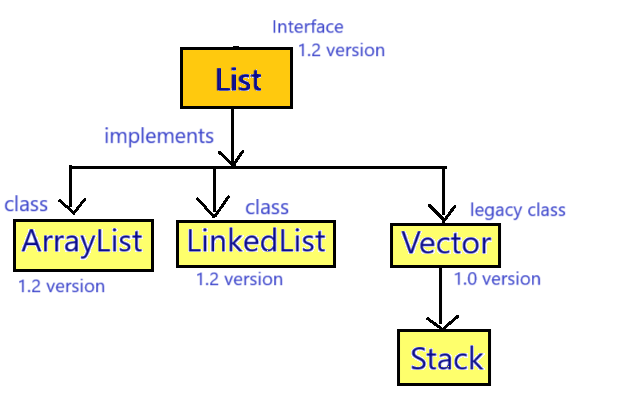

## Vector in Java



### Vector :-
- Vector is an implementation class of List interface which is present in java.util package
- Syntax : 
   ```java
   public class Vector extends AbstractList implements List, RandomAccess, Cloneable, Serializable {
      //  ---- 
   }
   ```
- The underline data structure of Vector is resizable array or growable array.
- Vector was introduced in JDK 1.0 version.
- Vector class is also known as **legacy class**.
  - (Legacy class is the class which was formed in previous version and was restructured or re-engineered in new version.)

### Properties of Vector :-
1. Vector is an index based Data Structure which means that first element will be inserted at 0 index position.
2. Vector can store different data types elements or heterogeneous elements.
3. We can store duplicate elements in the Vector.
4. We can store any number of null values in the Vector.
5. Vector follows the insertion order which means the sequence in which we are inserting the elements, in the same sequence we can retrieve the elements.
6. Vector does not follow the sorting order.

(above properties are same as List interface)
7. Vector is synchronized collection because Vector contains many synchronized method.
8. Vector does not allow more than one thread at one time.
9. Vector does not allow parallel execution or Vector allows sequential execution.
10. Vector increases the execution time which in turn makes the application slow.
11. Vector is thread safe.
12. Vector guarantee for data consistency.
    
### Working of Vector :
1. When we create a vector, a vector of 10 initial capacity is created.
2. When the vector is full, then new vector will be created automatically with `new capacity = current capacity * 2;`.
3. When new vector is created then all the elements from old vector will be copied to new vector and then the reference variable will point to the new vector and garbage collector will delete the previous vector from the memory.

Note : In vector we can find the capacity.

### Constructors of Vector :-
1. `public Vector()`
2. `public Vector(int capacity)`
3. `public Vector(int capacity, int incremental_ratio)`
4. `public Vector(Collection c)`

### Methods :-
1. Vector contains all the methods of Collection interface.
2. Vector contains all the methods of List interface.
3. `public synchronized int capacity()`
4. `public synchronized void addElement(Object obj)`
5. `public synchronized Object firstElement()`
6. `public synchronized Object lastElement()`
7. `public synchronized boolean removeElement(Object obj)`
8. `public synchronized void removeElementAt(int index)`
9. `public synchronized void removeAllElements()`

### See Program
VectorDemo
* [Test1.java](_5%2FVectorDemo%2FTest1.java)
* [Test2.java](_5%2FVectorDemo%2FTest2.java)
* [Test3.java](_5%2FVectorDemo%2FTest3.java)
* [Test4.java](_5%2FVectorDemo%2FTest4.java)

### When we should use Vector ?
We should use Vector in case of retrieval or searching operations.
- (Vector inherits the RandomAccess interface)

### When we should not use Vector ?
We should not use Vector in case of insertion or deletion of elements.


### What is difference between ArrayList & Vector ?
1. 
   - ArrayList was introduced in JDK 1.2 version.
   - Vector was introduced in JDK 1.0 version.


2. 
   - ArrayList is not a legacy class.
   - Vector is legacy class.


3. 
   - ArrayList is non-synchronized collection.
   - Vector is synchronized collection.


4. 
   - ArrayList allows more than one thread at one time.
   - Vector does not allow more than one thread at one time.


5. 
   - ArrayList allows the parallel execution.
   - Vector does not allow parallel execution.


6. 
   - ArrayList decreases the execution time which in turn makes the application fast.
   - Vector increases the execution time which in turn makes the application slow.
   

7. 
   - ArrayList is not thread safe.
   - Vector is thread safe.
   

8. 
   - ArrayList does not guarantee for data consistency.
   - Vector guarantee for data consistency.


9. 
   - In case of ArrayList, `new capacity = (present capacity * 3/2)+1.`
   - In case of Vector, `new capacity = present capacity * 2`.


10. 
    - In ArrayList, we cannot find the capacity.
    - In Vector, we can find the capacity.
   