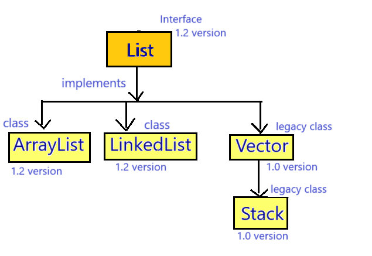
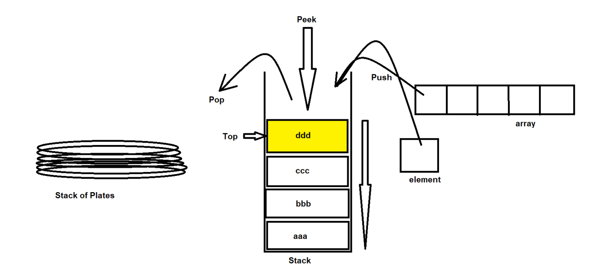
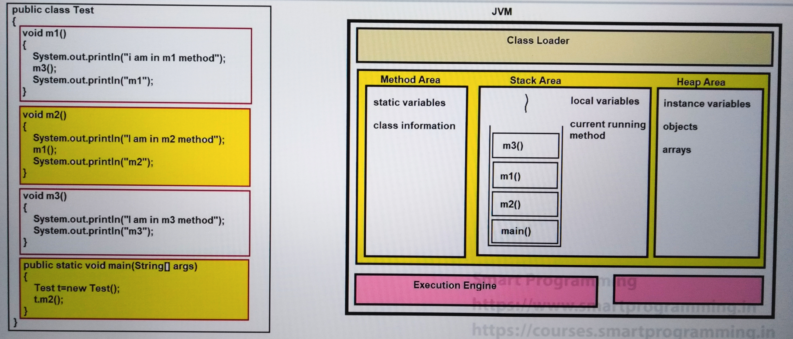
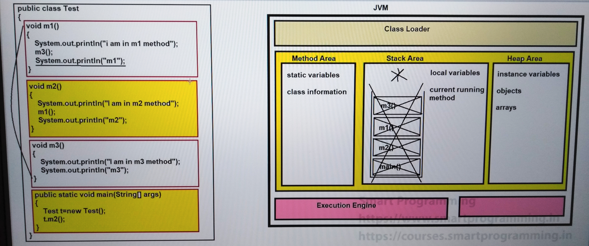

## Stack in Java


### Stack :-
- Stack is the child class of Vector class present in java.util package.
- Syntax : 
    ```java
    public class Stack extends Vector { 
        // ------- 
    }
    ```
- Stack was introduced in JDK 1.0 version.
- Stack is also known as `legacy class`.
  - (legacy class is the class which was re-engineered or restructured in newer version.)

### Properties of Stack :-
1. Stack class was specially designed for Last In First Out (LIFO) but we can change this algorithm according to our requirement.
2. Stack can be implemented using Array, ArrayList, LinkedList or Vector.
3. Stack is also index based data structure.

### Working of Stack :-
In java stack is implemented by `LIFO (Last In First Out)` algorithm.



### Constructors :-
1. `public Stack() { - }`

### Methods :-
1. Methods of Vector, List and Collections.
2. `public Object push(Object obj)`
3. `public synchronized Object pop()` : just see element and return it, and also remove from the stack.
4. `public synchronized Object peek()` : just see element and return it, but does not remove it.
5. `public synchronized int search(Object obj)`
6. `public boolean empty()`

### See Programs:

StackDemo

* [Test1.java](_6%2FStackDemo%2FTest1.java)
* [Test2.java](_6%2FStackDemo%2FTest2.java)


* [Test.java](_6%2FStackDemo%2FTest.java)



