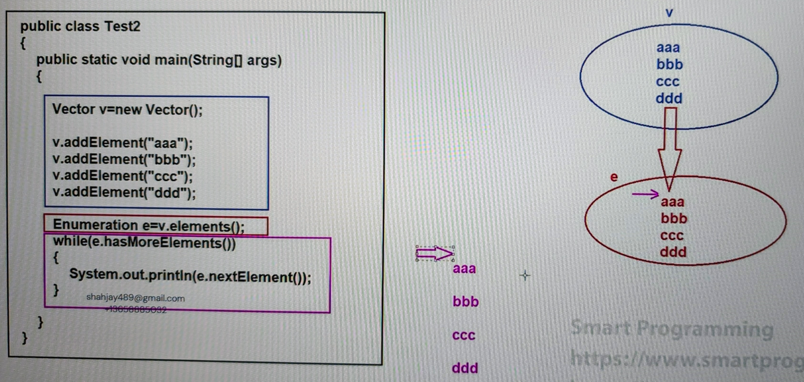

## Cursors in Java

### Cursors :-
- In java, whenever we print the object reference, internally JVM will call `toString()` method of Object class. 
- In case of simple object it will print `ClassName@referencevalue` but in case of printing Collection object it will print the elements present in Collection object.
- When we print the collection object it will retrieve all the elements at one time, but we want to retrieve the elements one by one then we have to use cursors.

#### See Program
- [Test1.java](_8%2FCursorsDemo%2FTest1.java)

### Types of cursors :-
1. Enumeration
2. Iterator
3. ListIterator

### 1. Enumeration :
- Enumeration is the cursor which is used to get the elements one by one from the collection object.
- Enumeration was introduced in `JDK 1.0` version.
- Enumeration is used only for legacy class.

#### Steps "how to use" enumeration cursor :
1. Create Enumeration Cursor Object
   - `public Enumeration elements()`
   - (this method is present in Vector & Stack legacy class)

2. Read one by one all the elements from Enumeration Cursor
   - `public boolean hasMoreElements()`
   - `public Object nextElement()`
   - (these methods are present in Enumeration interface)

#### See Program
- [Test2.java](_8%2FCursorsDemo%2FTest2.java)

#### Limitations of Enumeration :
1. It can be used only with Legacy class, and thus it is not universal cursor.
2. By using enumeration cursor we can only perform read operation but not update or remove operation.
3. It can be used to traverse the elements only in forward direction.

### 2. Iterator :
- Iterator is a cursor which is used to get the elements one by one from the collection object.
- It is universal cursor which means that we can use it with all collection objects.
- It can be used for read and remove operation.
- It was introduced in `JDK 1.2 version`.

#### Steps "how to use" iterator cursor :-
1. Create Iterator cursor object :-
   - `public Iterator iterator()`
   - (this method is present for every collection object)

2. Read one by one all the elements from iterator cursor :-
   - `public boolean hasNext()`
   - `public Object next()`
   - `public void remove()`
   - (these methods are present in Iterator interface)

#### See Program
- [Test3.java](_8%2FCursorsDemo%2FTest3.java)

#### Limitations of Iterator cursor :-
1. It can be used only for read and remove operation but not for replacement or addition operation.
2. It can be used to iterate the elements only in forward direction.

### 3. ListIterator :
- ListIterator is a cursor which is used to get the elements one by one from collection object.
- ListIterator is bi-directional cursor which means it can be used to traverse the elements in forward or backward direction.
- It can be used to read, remove, insert and replace operations.
- It was introduced in `JDK 1.2 version`.

#### Steps "how to use" ListIterator cursor :-
1. Create ListIterator cursor object :
   - `public ListIterator listIterator();`
   - (which is present in only List implementation classes)

2. Read one by one all the elements from ListIterator cursor :-
   - `public boolean hasNext()`
   - `public Object next()`
   - `public int nextIndex()`

- (above methods are used to traverse the elements in forward direction)

   - `public boolean hasPrevious()`
   - `public Object previous()`
   - `public int previousIndex()`

- (above methods are used to traverse the elements in backward direction)

  - `public void remove()`
  - `public void add(Object obj)`
  - `public void set(Object obj)`
- (above methods are used to remove, add and replace operations)

#### See Program
- [Test4.java](_8%2FCursorsDemo%2FTest4.java)

#### Limitations of ListIterator cursor :
1. It can be used only with List implemented classes thus it is not universal cursor.

### What is difference between Enumeration, Iterator & ListIterator :
1. 
   - Enumeration can be used only with legacy classes.
   - Iterator can be used for any collection object.
   - ListIterator can be used only for List implemented classes.

2. 
   - Enumeration can be used to traverse the elements only in forward direction. 
   - Iterator can be used to traverse the elements only in forward direction.
   - ListIterator can be used to traverse the elements in forward and backward direction.

3. 
   - Enumeration is used only for read operation.
   - Iterator can be used for read and remove operation.
   - ListIterator can be used for read, remove, add and replace operations.
