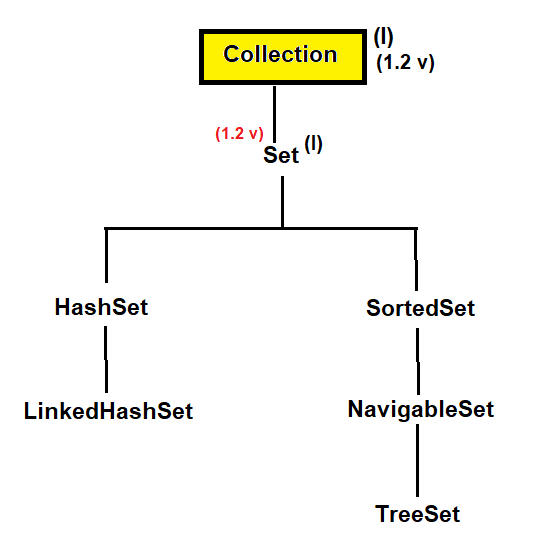
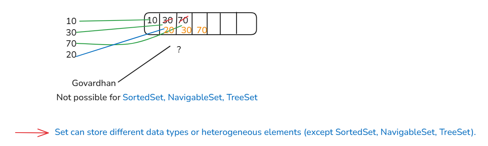
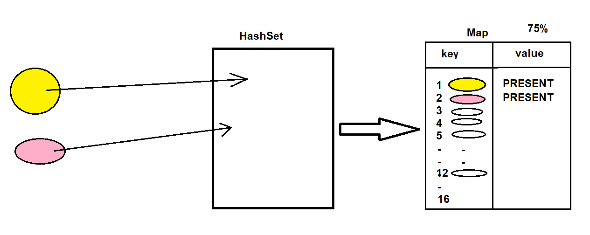
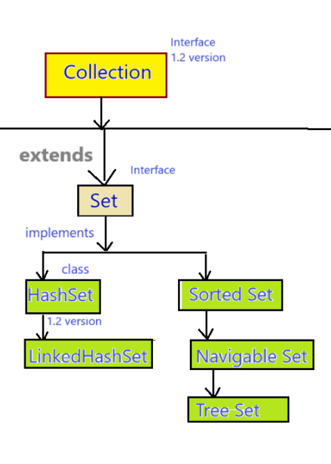
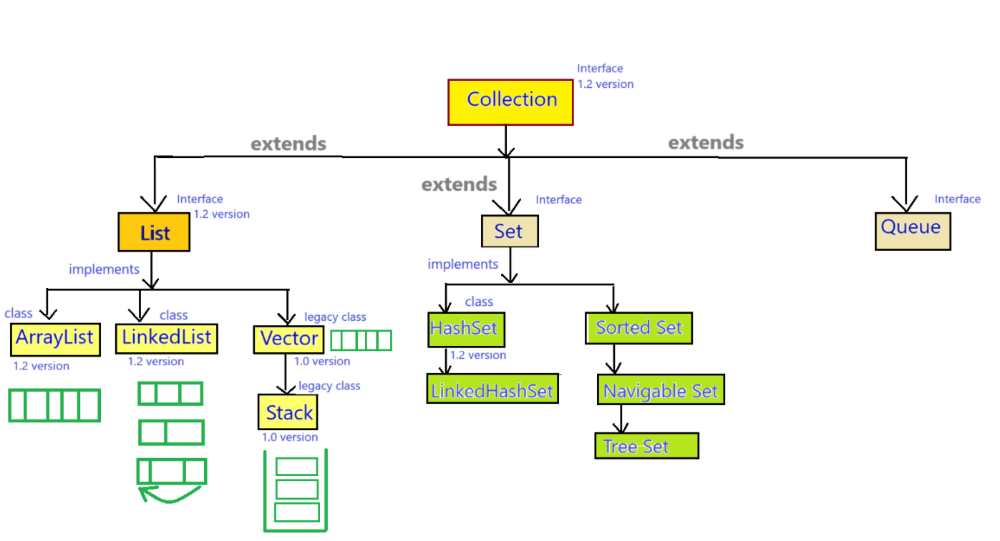

## Set & HashSet in Java
### Set
- Set is an interface which is present in java.util package.
- Set is the child interface of Collection interface.
- Syntax : 
    ```java
    public interface Set extends Collection { 
        // ---- 
    }
    ```
- Set was introduced in `JDK 1.2 version`.

#### Hierarchy of Set interface :



#### Properties of Set interface :-
1. Set is not an index based data structure, it stores the elements as per elements "`hashcode`" values.
   - hashcode: unique integer value
2. Set does not follow the insertion order (except LinkedHashSet).
3. Set does not follow the sorting order (except SortedSet, NavigableSet & TreeSet).
4. Set can store different data types or heterogeneous elements (except SortedSet, NavigableSet, TreeSet).
5. We cannot store duplicate elements in Set.
6. We can store only one null value in Set.



#### Methods of Set interface :-
- approx same methods as that of Collection interface
   
### Difference between List & Set :-
1. 
   - List is index based data structure which means in list data is stored by using index position.
   - Set is not an index based data structure, it stores the data according to hashcode values of the elements.


2. 
   - List allows duplicate elements.
   - Set does not allow duplicate elements.


3. 
   - List can store any number of null values.
   - Set can store only one null value.


4. 
   - List follows the insertion order.
   - Set does not follows the insertion order.
   
      
5. 
   - In case of List we can use Iterator & ListIterator cursor.
   - In case of Set we can use only Iterator cursor.


6. 
   - List is used in case of retrieving the elements.
   - Set is used when we do not want to allow duplicacy.


## HashSet :-
- HashSet is an implemented class of Set interface which is present in `java.util` package.
- Syntax : 
   ```java
   public class HashSet extends AbstractSet implements Set, Cloneable, Serializable { 
      // ---- 
   }
   ```
- The underline data structure of HashSet is Hashtable (HashSet is backed up by Map).
- HashSet was introduced in `JDK 1.2 version`.

#### Properties of HashSet :-
1. HashSet is not an index based data structure, it stores the elements according to elements hashcode values.
2. HashSet can store different data types of heterogeneous elements.
3. HashSet cannot store the duplicate elements.
4. HashSet can store maximum only one null value.
5. HashSet does not follows the insertion order.
6. HashSet does not follow the sorting order.

a. (same properties as Set interface).

7. HashSet is non-synchronized collection because HashSet does not contain any synchronized methods.
8. HashSet allows more than one thread at one time.
9. HashSet allows the parallel execution.
10. HashSet reduces the execution time which in turn makes our application fast.
11. HashSet is not thread safe.
12. HashSet does not guarantee for data consistency.

#### Working of HashSet :-
1. HashSet internally works on the basis of Hashtable (it internally backed up by Map).
2. When we insert any element in HashSet, it stores as a key inside the Map and at value position PRESENT reference variable is stored which is the reference variable of Object class.
3. Initial capacity of HashSet is 16 elements. (by default capacity of map is 16 so HashSet also has the 16 capacity.)
4. Its load factor or fill ratio is 75%.
   - 75% of 16 = 12.
   - It means when 12 elements are full then size of the map will be double.
   - so next capacity of the map is 32 (because 16 x 2 = 32.)
5. After load is filled then a new Map is created with its double capacity.
   


```
import java.util.HashSet;   => ctr+click on HashSet

HashSet has so many methods 

    // Dummy value to associate with an Object in the backing Map
    private static final Object PRESENT = new Object();
    
    public boolean add(E e) {
        return map.put(e, PRESENT)==null;
    }

```
#### Constructors of HashSet :-
1. `public HashSet()`
2. `public HashSet(Object obj)`
3. `public HashSet(int initialCapacity)`
4. `public HashSet(int initialCapacity, float loadFactor)`
   
#### Methods of HashSet :-
- approx same methods as that of Collection or Set interface

#### When we should use HashSet ?
- HashSet is good for searching or retriving operations




