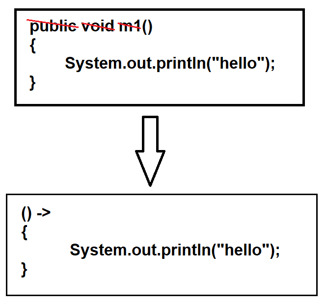

## Lambda Expression in Java

### Lambda Expressions :-
- Lambda is a function which does not have
  - any name
  - any modifier
  - return type

### Advantages of Lambda Expressions :-
1. It reduces the number of lines of code.
2. It can call the API very effectively.
3. It supports parallel and sequential execution.
4. It is used to write readable, maintainable and concise code.

NOTE : "`Lambda Expressions`" are always used with "`Functional Interfaces`".

### Rules related to lambda functions :-
1. If we have only one statement in lambda expression then we can remove curly braces - `{}`.
2. Lambda expression can take any number of parameters.
3. Providing data type with parameters in lambda expression is optional. If we don't provide then compiler automatically deducts the type of data based on context.
4. If we have only one parameter then we can remove round braces - `()`.
5. If lambda expression is returning any value, then we can remove "`return`" keyword.
6. We can provide any number of statements in lambda expression.

### See Programs:

* [Test1.java](_2%2Fdemo%2FTest1.java)
* [Test2.java](_2%2Fdemo%2FTest2.java)
* [Test3.java](_2%2Fdemo%2FTest3.java)
* [Test4.java](_2%2Fdemo%2FTest4.java)
* [Test5.java](_2%2Fdemo%2FTest5.java)
* [Test6.java](_2%2Fdemo%2FTest6.java)
* [Test7.java](_2%2Fdemo%2FTest7.java)
* [Test8.java](_2%2Fdemo%2FTest8.java)
