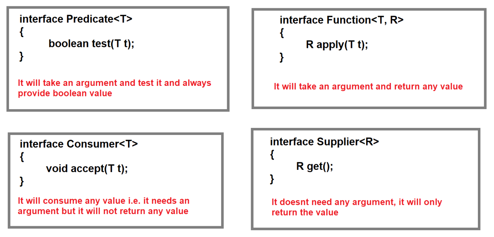

## Predefined Functional Interfaces
* Predicate
* Function
* Consumer
* Supplier

### Predicate :-
- Predicate is a functional interface which is present in `java.util.function` package.
- Syntax :-
    ```java
    public interface Predicate<T> {         // T : type
        boolean test(T t);
        //some default methods are also present
    }
    ```
- It improves manageability of the code and also helps in unit-testing.
- Whenever you want to test something, and then we want return value as boolean, then in this case we use `Predicate`.

#### See Programs:
- [Test1.java](_3%2Fdemo%2FTest1.java)
- [Test2.java](_3%2Fdemo%2FTest2.java)
- [Test3.java](_3%2Fdemo%2FTest3.java)


### Function :-
- Function is a functional interface which is present in `java.util.function` package.
- Syntax :
  ```java
  public interface Function<T, R> {        // T : type, R : return
      R apply(T t);
      //some default methods are also present
  }
  ```

#### See Programs:
- [Test4.java](_3%2Fdemo%2FTest4.java)
- [Test5.java](_3%2Fdemo%2FTest5.java)


### Consumer :-
- Consumer is a functional interface which is present in `java.util.function` package.
- Syntax :
  ```java
  public interface Consumer<T> { 
      void accept(T t);
      //default methods..
  }
  ```
- Consumer, it only consumes/uses value, but it will not return anything (void).


#### See Programs:
- [Test6.java](_3%2Fdemo%2FTest6.java)


### Supplier :-
- Supplier is a functional interface which is present in `java.util.function` package.
- Syntax :
  ```java
  public interface Supplier<R> {        // R : return
      R get();
  }
  ```
- Supplier, always return (something) value, which kind of value you want, you need to mention in the argument.

#### See Programs:
- [Test7.java](_3%2Fdemo%2FTest7.java)

### What is difference between Predicate, Function, Consumer & Supplier ?




