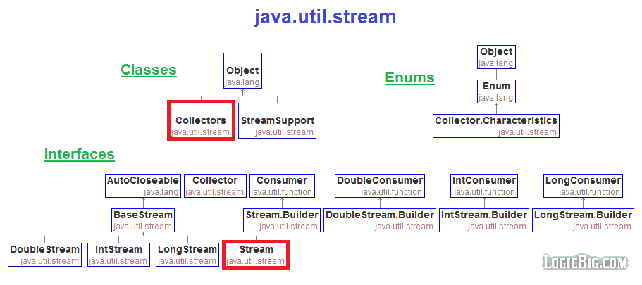
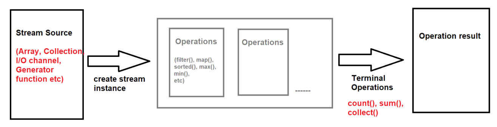

## Stream API in Java

### Stream API :-
- Stream API is related to "`Collection Framework`" or "`Group of Objects`".
- **Note** : **Stream API** is not related to Java IO Stream, it is totally different from IO stream.
- Stream API was introduced in `Java SE 8 version`.

#### Use of Stream API :-
1. It is used to process or to perform bulk/multiple operations on collection objects or group of objects.
2. It decreases the number of lines of code.


### Hierarchy of Stream API :-


### Stream API Operations Lifecycle :-

1. Get stream from the source and create stream instance.
2. Perform operations(0,1 or many operations) such as `filter()`, `sort()`, `map(`) etc. and transform it into another stream.
3. Perform terminal operation such as `count()`, `sum()` etc. and produces the result.

### Stream Interface :-
- Stream is an interface which is present in java.util.stream package
- Syntax :
    ```java
    public interface Stream {
        forEach();      : print element
        filter();       : filter( Predicate ) : Predicate<T> : take one argument and provide boolean value
        map();          : map( Function ) : Function<T,R> : take one argument - return any value
        collect();
        sorted();       : sorted( Comparator ) : Comparator<T> 
        min();
        max();
        count();
        
        //some static methods
        of() { --- }        : to get stream object
        empty() { --- }     : to get empty stream
        builder() { --- }   : to get stream object
    }
    ```

###

How to get stream interface reference?
- We can see in the stream hierarchy diagram, there is no implemented class. 
- As we know, we need implemented class, by using this class we make object and through this object we can get reference of the  stream interface and use interface class methods.

#### 
How to get Stream instance? :  [Test1.java](_4%2Fstreamapidemo%2FTest1.java)

Stream on ArrayList :  [Test2.java](_4%2Fstreamapidemo%2FTest2.java)

Map :  [Test3.java](_4%2Fstreamapidemo%2FTest3.java)
    -  [Test4.java](_4%2Fstreamapidemo%2FTest4.java)

Sorted: [Test5.java](_4%2Fstreamapidemo%2FTest5.java)


### Task :-
1. WAP to print all the numbers which are greater than 30.
2. WAP to print all the string values whose length is greater than 5. : (govardhan, dwarkesh, giriraj, mahaprabhuji, yamunaji)
3. WAP to print all the names whose name starts with d. (filter)
4. WAP to get the first character of each name. (map)
5. WAP to replace the "a" character with z character. (map)
6. WAP to sort an arraylist contain integer values. (sorted)
7. WAP to get Minimum and Maximum element in an ArrayList. 
8. WAP to print the sum of all the even numbers in an ArrayList. (maptoint, sum)

