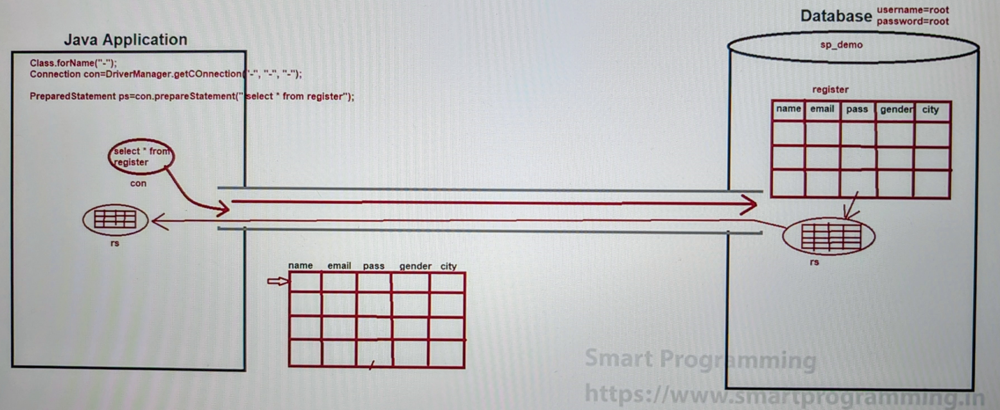

### Java Database Connectivity (JDBC) :

- [JavaMysqlConnection.java](_3%2FJavaMysqlConnection.java)

#### Difference between PreparedStatement and Statement
#### Difference between PreparedStatement and CallableStatement
#### PreparedStatement(Interface) vs prepareStatement(method)