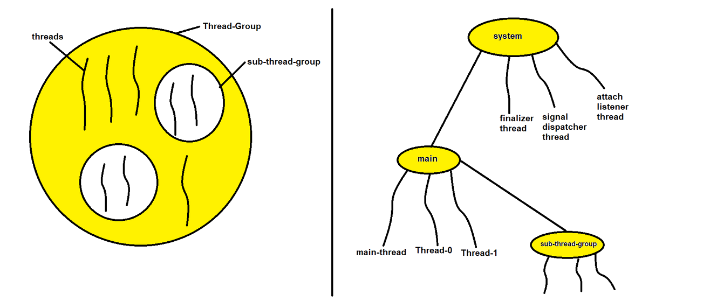
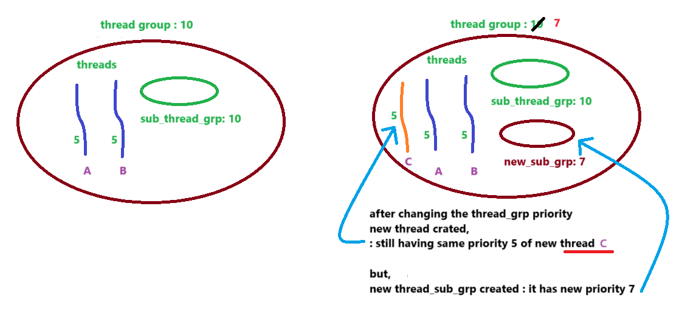
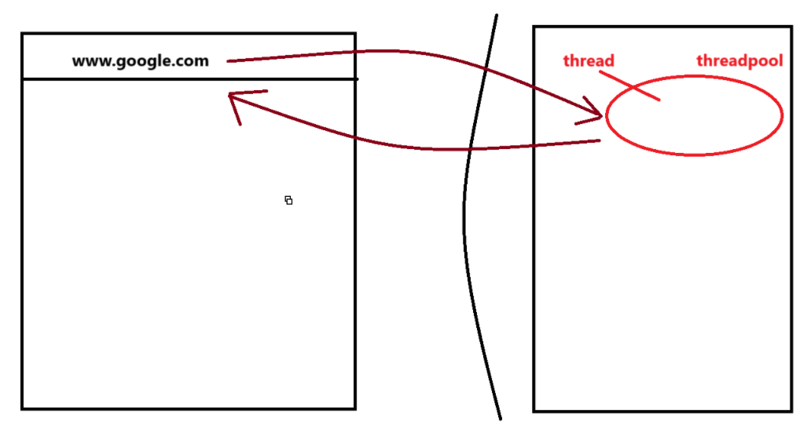
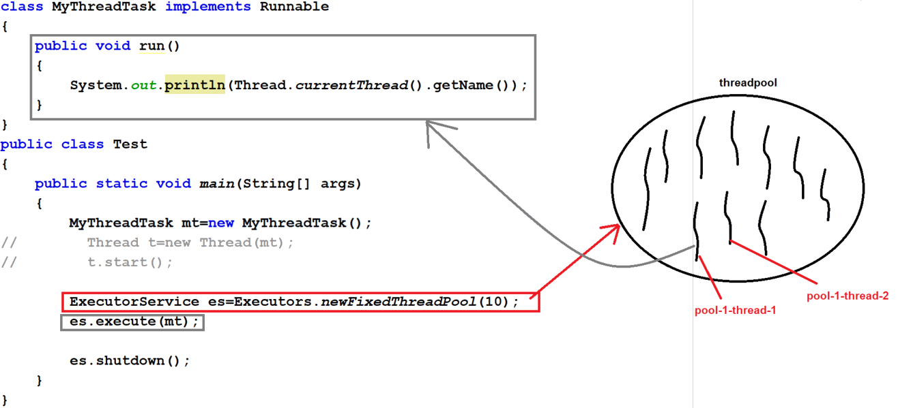

## ThreadGroup class & Thread-Pool Framework

### ThreadGroup :-
- It is the group of several threads into a single unit or object.
- A thread-group can contain multiple thread-group.
- The thread-group creates a tree in which every thread-group will have a single parent thread-group.

- Every thread-group belongs to some thread-group except system thread-group.
- **"system" thread-group is the root group of all the thread-groups in java.**
- Main thread belongs to the "main" thread-group
- The main advantage of thread-group is we can perform several common operations very easily in order to improve our application performance
- For example : creating groups in messenger or mails and sending message.
- ThreadGroup is the class which is present in `java.lang` package.

- Constructors of ThreadGroup :-
  1. public ThreadGroup(String name);
  2. public ThreadGroup(ThreadGroup groupname, String name)

- Methods of ThreadGroup :-
  1. activeCount()
  2. activeGroupCount()
  3. getMaxPriority()
  4. getName()
  5. getParent()
  6. setMaxPriority()
  7. list()
  8. isDaemon()
  9. setDaemon()
  10. interrupt()
  11. suspend()
  12. destroy()

- A current running thread can only get the information about current thread-group but not the parent/child thread-group

- See Programs:
  - [Test.java](_10_Thread_Group_Pool%2FMultiThreadinDemo9%2Fthreadgroupdemo%2FTest.java)
  - [Test2.java](_10_Thread_Group_Pool%2FMultiThreadinDemo9%2Fthreadgroupdemo%2FTest2.java)
  - [Test3.java](_10_Thread_Group_Pool%2FMultiThreadinDemo9%2Fthreadgroupdemo%2FTest3.java)
  - [Test4.java](_10_Thread_Group_Pool%2FMultiThreadinDemo9%2Fthreadgroupdemo%2FTest4.java)

#### Priority 
- thread default priority - 5 
- thread group default priority - 10
- If we change the priority of ThreadGroup, then the priority of new sub-thread-group will be same as parent-thread-group.

### ThreadPool :-
- ThreadPool represents a group of worker threads that are waiting for the job and can be reused many times.
- "`ThreadPool framework`" is also known as "`Executor framework`".
- ThreadPool was introduced in `JDK 1.5 version`.
- `Advantage` : It saves a lot of time in creating threads and providing jobs to them which leads to the better performance of our application.
- ThreadPool is already implemented in Servlet & JSP containers which each request is processed by thread which comes from thread-pool.

- This is how JSP-Servlet has ThreadPool.
  

- ThreadPool framework contains following classes and interfaces :-
  1. Executors (class) (important)
  2. ExecutorService (interface) (important)
  3. Executor (interface)
  4. ExecutorCompletionService (class)

### Executors class :-
- Executors class provides factory and utility methods for ExecutorService, Executor, ThreadFactory, ScheduledExecutor Service & Callable.

- Methods of Executors class :
  1. Executors.newFixedThreadPool(int no_of_threads)
  2. Executors.newSingleThreadExecutor()
  3. Executors.newCachedThreadPool()
  4. Executors.newScheduledThreadPool()
  5. Executors.newSingleThreadScheduledExecutor()
  
### ExecutorService interface :-
- ExecutorService interface allows us to execute the thread task asynchronously.
- ExecutorService helps in maintaining a pool of threads and assign them tasks. It also provides the facility to queue up the tasks until there is any free thread available.
- ExecutorService defines the methods that executes the threads and returns some results.
- Methods of ExecutorService interface :-
  - Below methods will assign the task to ExecutorService :-
    1. execute(Runnable r)
    2. submit(Runnable/Callable r)
    3. invokeAny(Collection c)
    4. invokeAll(Collection c)
  - Below method is used for shutdown the ExecutorService :-
    5. shutdown()
    6. shutdownNow()
   
### See Programs

- [Test.java](_10_Thread_Group_Pool%2FMultiThreadinDemo9%2Fthreadpooldemo%2FTest.java)
- [Test2.java](_10_Thread_Group_Pool%2FMultiThreadinDemo9%2Fthreadpooldemo%2FTest2.java)   

### ThreadPool have some risks which are as follows :-
1. `Deadlock`
2. `Thread interference`
3. `Thread leakage` : 
   - This risk can occur if any thread removed from the thread-pool but that thread didn't return in the thread-pool
4. `Resource thrashing` : 
   - This risk can occur when there are a lot of thread in the thread-pool, then time will be wasted in context-switching between the threads.
