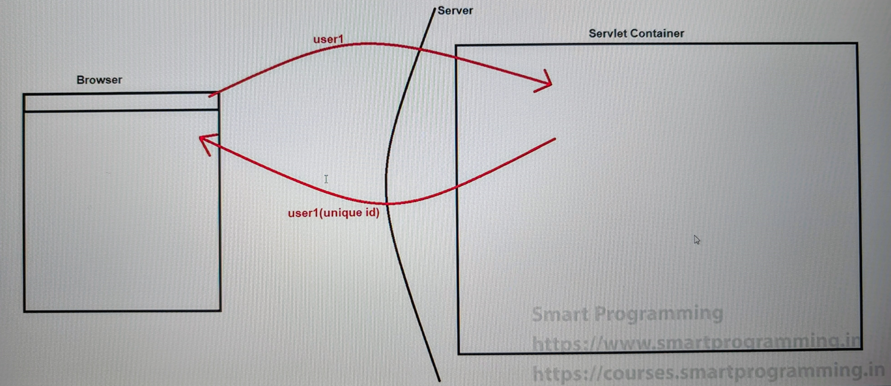

## Callable & ThreadLocal class

### Callable & Future :-
- We have total 3 ways to create threads in java
  1. By extending "Thread" class
  2. By implementing "Runnable" interface
  3. By implementing "Callable" interface

### Callable :-
- The main advantage to use Callable interface is that it returns some value after the thread completes its task.
- Callable is an interface which is present in `java.util.concurrent` package.
- Callable contains only one method i.e. Object call() throws Exception.
- **Callable is a `FunctionalInterface` because it contains only one method.**

### See Programs:
- [Test1.java](_11_Callable_Future_intf_ThreadLocal%2Fcallabledemo%2FTest1.java)
- [Test2.java](_11_Callable_Future_intf_ThreadLocal%2Fcallabledemo%2FTest2.java)

### Future :-
- Future is an interface which is present in `java.util.concurrent` package.
- A Future represents the result of an asynchronous computation.
- In simple way we can say that Future is used to store the returned value of thread.
- Methods of Future interface :-
  1. `V get() throws InterruptedException, ExecutionException`;
  2. `V get(long timeout, TimeUnit unit) throws InterruptedException, ExecutionException, TimeoutException`;
  3. boolean `cancel(boolean mayInterruptIfRunning)`;
  4. boolean `isCancelled()`;
  5. boolean `isDone()`;

### What is difference between Runnable & Callable ?
1. 
   - We should use Runnable interface when our thread does not return any value.
   - We should use Callable interface when our thread returns some value after execution completes. (with Callable need to use Future because it returns in the Future.)

2. 
   - Runnable interface is present in java.lang package
   - Callable interface is present in java.util.concurrent package

3. 
   - Runnable interface was introduced in JDK 1.0 version
   - Callable interface was introduced in JDK 1.5 version

4. 
   - Runnable interface has one method i.e. run() method
   - Callable interface has one method i.e. call() method

5. 
   - Runnable method (run() method) does not throw any exception
   - Callable method (call() method) throws an exception

### ThreadLocal
- ThreadLocal provides the thread-local variables. 
- It means that we can create a variable in reference to the thread which can be manipulated(read-write) or removed by that thread only.
- Examples are we can pass the user id or transaction id for users request. (Servlet container considers/treats user request as thread.)
- ThreadLocal is the class which is present in `java.lang` package.
- **ThreadLocal is a class that is part of the java.lang package, which is automatically imported by default in every Java program. This is why we do not need to explicitly import ThreadLocal.**
- ThreadLocal concept was introduced in `JDK 1.5` version
- ThreadLocal methods :
  1. get()
  2. set(Object obj)
  3. remove()

### See Programs:
- [Test3.java](_11_Callable_Future_intf_ThreadLocal%2Fcallabledemo%2FTest3.java)
- [Test4.java](_11_Callable_Future_intf_ThreadLocal%2Fcallabledemo%2FTest4.java)

### Note :-
1. ThreadLocal concept was introduced in `JDK 1.2` version and was enhanced in `JDK 1.5` version
2. A thread can access its own thread-local variable, and it cannot access any other thread-local variable value.
3. If the thread does to dead state then that thread-local variable is eligible for garbage collection.
