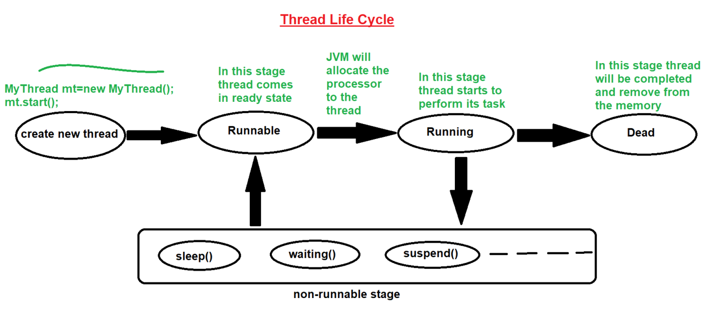

### Creating Threads (Part 2) in Java

#### By using "Runnable" interface :-
- Steps to create thread using "Runnable" interface :-
1. inherits the "Runnable" interface
2. override the run() method
3. create an instance of the class
4. create an instance of Thread class and pass the above class instance in thread class constructor
5. start the thread (through Thread class)


- See Programs:
  - [Test.java](_3_ThreadCreation_2%2FMultithreadingDemo2%2FTest.java)
  - [Test2.java](_3_ThreadCreation_2%2FMultithreadingDemo2%2FTest2.java) 


### Life cycle of thread :-
1. `Born` : New thread is created.
   ```
   MyThread mt = new MyThread();
   mt.start();
   ```
2. `Runnable` : In this stage thread comes in ready stage
3. `Running` : In this stage thread starts its task i.e. `run()` method is executing
4. `Non-Runnable` : In this stage thread does not perform any task. But when the thread is invoked then thread goes to the runnable stage, and then it goes to the running stage
5. `Dead` : In this stage thread completes its task and removed from the memory

- example: 
  - Running competition.
    - player born
    - then come on track and to be ready
    - ....
    - ....
  - Baby.
    - born
    - ready for any task
    - meanwhile going to sleep
    - then awake and again going tobe ready
    - running task - perform its task
    - once a day baby will say good by to this life
 
#### Diagram:


- once thread goes into the `non-runnable` stage then first it will go in the `Runnable` stage then it goes into the `Running` stage. 
- example: 

   ```
   
            _________________________________________
           |                                         |
           |       VLC         Media Player          |
           |        /\        _____________          |
           |       /  \      |             |         |
           |      |    |     |             |         |
           |      |____|     |_____________|         |
           |            \      /                     |
           |             \    /                      |
           |             Sound                       |
           |_________________________________________|
         
   - VLC and Media Player both are task/process
   - In each of the task there is a thread
   - They both need sound resources
   - If VLC thread takes sound resource then Media Player wait
      - once VLC thread release the sound resource, its free, then Media Player thread take it.
   - Similarly if first Media Player thread take then VLC thread will wait
      - Once Media Player thread release, its free, then VLC thread can take   
   
   -> so like this any one thread is going into the waiting stage,
    this kind of condition known as non-runnable stage
     
   ```


#### Note :
- We can invoke (start) the thread only once. If we try to start the thread again it will provide an exception saying `java.lang.IllegalThreadStateException`
- This is `interview question`.
- but why we can not again start it? The reason is once thread born, after finishing its work it is die. So, once die then how can anyone live again (that is why that thread is die so can not start again).

### Different cases of executing the threads:
1. Performing Single Task from Single Thread
2. Performing Single Task from Multiple Thread
3. Performing Multiple Task from Single Thread : By using the one thread we call multiple run() method (multiple task perform using one thread). **Not-Possible** 
4. Performing Multiple Task from Multiple Thread


- thread is the smallest subtask/subprocess, so we can divide it. That is why one thread has only one type of task.
- One thread can not do multiple task.

#### See Programs:
1. Performing Single Task from Single Thread : [Test1.java](_3_ThreadCreation_2%2FThreadCases%2FTest1.java)
2. Performing Single Task from Multiple Thread : [Test2.java](_3_ThreadCreation_2%2FThreadCases%2FTest2.java)
3. Performing Multiple Task from Single Thread : _**Not-Possible**_
4. Performing Multiple Task from Multiple Thread : [Test4.java](_3_ThreadCreation_2%2FThreadCases%2FTest4.java)