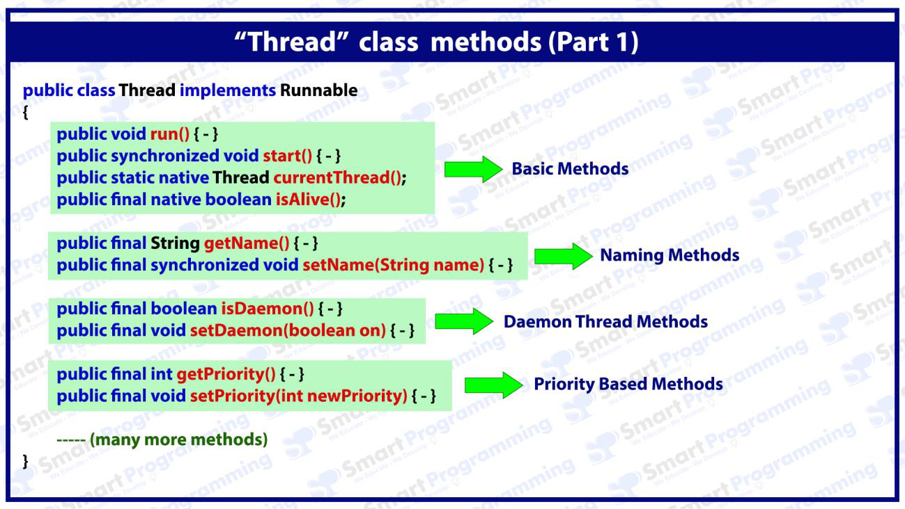
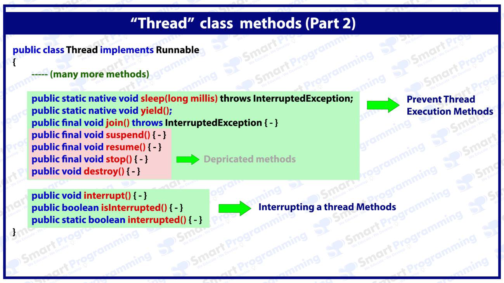
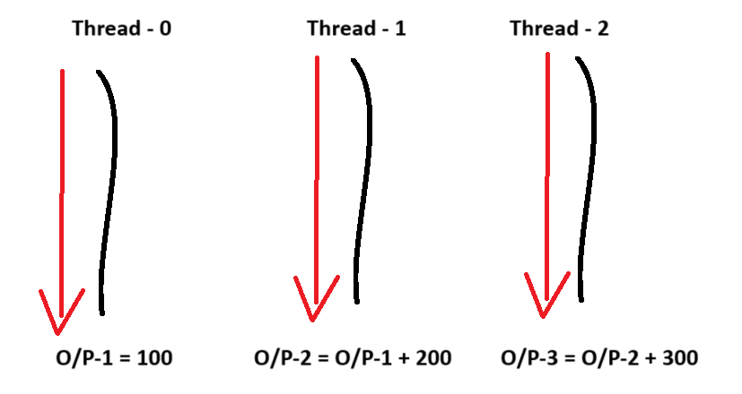
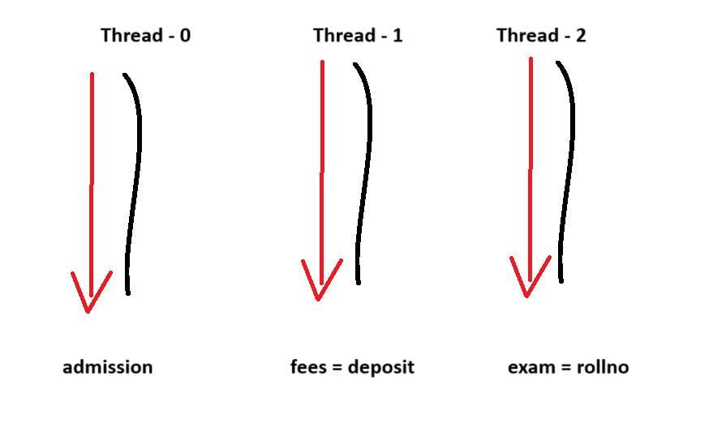
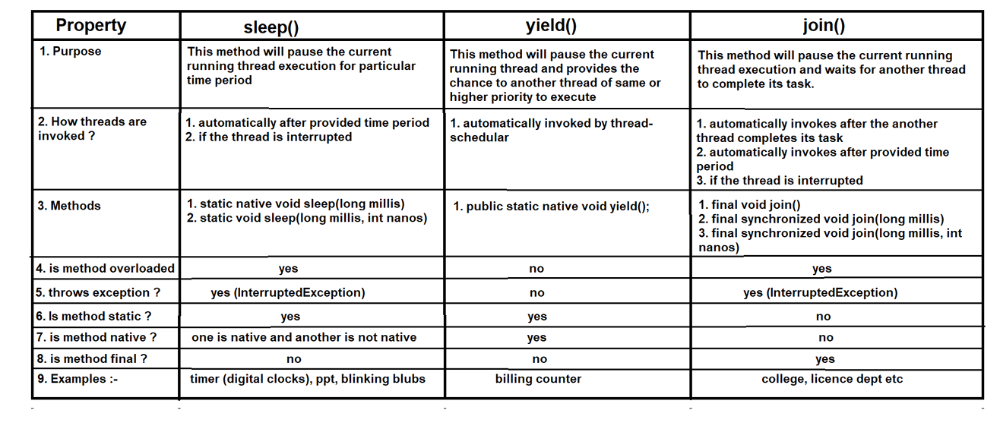

### Thread class methods (Part 2) in Java

#### Thread class methods diagram:-
- calling images from the `Thread class methods (Part 1)`





### Thread class methods :-
4. Priority Based Methods :
- `getPriority()` - This method is used to get the priority of the thread
- `setPriority(int priority)` - This method is used to set the priority of the thread


5. Prevent thread execution method :-
- `sleep(long mili)` - This method is used to pause the current running thread for the provided time period
- `yield()` - This method is used to stop the current running thread execution and provide the chance to another thread for execution
- `join()` - This method allows the thread to wait till another thread complete its task.

### What is thread priority :-

- Thread priority is an integer value of the thread, the thread having high priority or high integer value will get the priority first to execute by JVM.
- Priority integer value ranges from 1 to 10.


- Java provides 3 pre-defined priorities :-
  - `1` - `MIN_PRIORITY`
  - `5` - `NORM_PRIORITY`
  - `10` - `MAX_PRIORITY`
- MIN_PRIORITY, NORM_PRIORITY and MAX_PRIORITY are final static int values.


- Below are not priorities :-
  - 0, <1, >10 (these priorities will provide an exception saying `java.lang.IllegalArgumentException`)
  - LOW_PRIORITY, MINIMUM_PRIORITY
  - NORMAL_PRIORITY, MIDIUM_PRIORITY
  - MAXIMUM_PRIORITY, HIGH_PRIORITY


- See Programs:
  - [Test.java](_5_ThreadClassMethods_2%2FMultithrreadingDemo4%2FTest.java)
  - [Test2.java](_5_ThreadClassMethods_2%2FMultithrreadingDemo4%2FTest2.java)


#### NOTE :
1. Priorities depends on the platform (Windows does not support thread priorities)
2. By default main thread has priority 5
3. Thread default priorities are inherited by parent thread (It also depends on the platform).
4. If multiple threads have same priority then which thread will get the chance to execute first depends on the JVM (thread scheduler).
   
---

### sleep() method :
- This method is used to pause the current running thread for the provided time period
- sleep() method is static method thus we have to call it by class name i.e. Thread class.
- sleep() methods throws InterruptedException thus we have to use throws keyword or "try-catch block"
- We can provide time as 0 but it cannot be negative integer value (java.lang.IllegalArgumentException)
- JVM does not provide the guarantee that the sleeping thread will invoke exactly after provided time period
- When the thread goes into sleeping stage then it doesn't release the lock


- See Programs:
  - [Test3.java](_5_ThreadClassMethods_2%2FMultithrreadingDemo4%2FTest3.java)
   
--- 

### yield() method :-
- This method stops the current thread execution and provide the chance to the other thread to execute.
- Output is not constant in case of yield() method.


- See Programs:
  - [Test4.java](_5_ThreadClassMethods_2%2FMultithrreadingDemo4%2FTest4.java) 

 
- `example-story`: 
  - You are waiting for billing at the billing counter. 
  - Persons: A, B, C, ...
  - Person has a lot of things, and it takes around 15 minutes for billing.
  - Person B has only 1 item, and it will take few seconds for billing.
  - So, yield() method put on the person A and allow other threads to do its job like person B to finish billing, then again person A has turned and do its billing. 
  
```

PersonLine
(Threads)
____________

  D     _\0/_
          X

  C     _\0/_
          X

  B     _\0/_  01 item
          X

  A     _\0/_  15 items   :  yield()on the Person A
          X

    |            ________       ________
    |           |        |     |        |
    |           |________|     |________|
    |            Billing        Billing 
    |            Clounter       Clounter
    |              1             2
    |             OPEN          CLOSED
    |
    |
    
      
```

#### NOTE :-
- Till JDK 5 version, yield() method internally calls the sleep() method
- After JDK 5 version, yield() method working has been changed. It provides the hint to the thread scheduler to yield(stop), but it totally depends on the `thread-scheduler` that it will accept its request or not.
- If current running thread is stopped or yield, then which thread will get the chance for execution depends on the `thread-scheduler`.
   

--- 

#### Prototype of the methods:
- sleep(), yield() : see the method in the diagram.
- `public static native void ....`
- static : it means the calls throw its class (here Thread)
- native : it means implementation of this method is provided in the different language and here Java is using it. 


---


#### join() Method

- This method allows the thread to wait till another thread complete its task.
- it stops one thread execution (wait till finish second thread) and proceed for second thread. Once second thread finish back to back first thread start execution.


- **Example: Threads** 
  - 
  
  - See in this diagram thread-0 needs to be finished and then by using that output thread-1 will do work and after its output thread-2 will perform its task.
  - So, thread-1 will wait till thread-0 finish,
  - then thread-2 wait till thread-1 take output of thread-0 and finish its work
  - this is how join() method works


- **Example: School** : (1.) take admission (2.) fee deposit  (3.) having rollno for exam 
  - 


- See Programs:
  - [Test5.java](_5_ThreadClassMethods_2%2FMultithrreadingDemo4%2FTest5.java)
  - [Test6.java](_5_ThreadClassMethods_2%2FMultithrreadingDemo4%2FTest6.java)
  - [ClgAdmin.java](_5_ThreadClassMethods_2%2FMultithrreadingDemo4%2FClgAdmin.java)

---


#### What is difference between sleep(), yield() and join()


