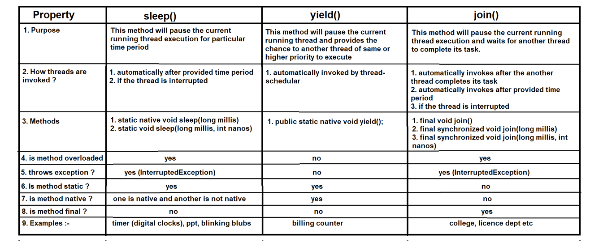
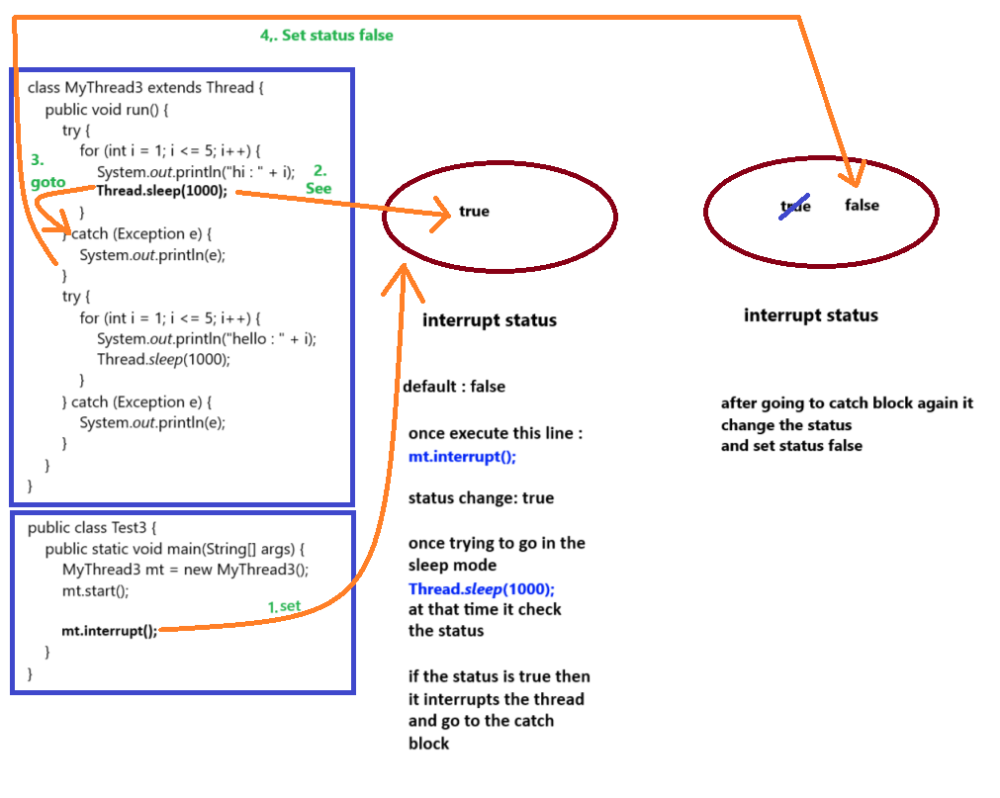
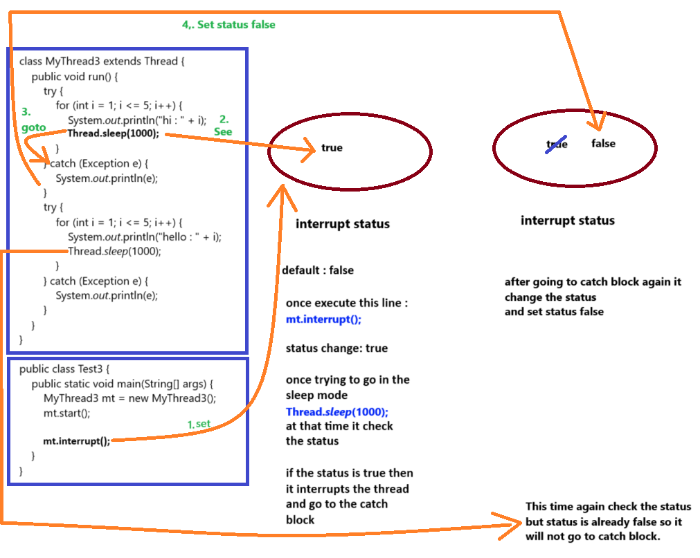
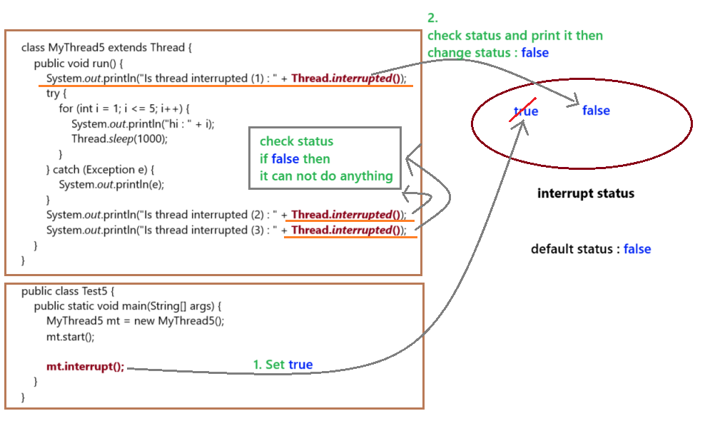

### Thread class methods (Part 3) in Java

- What is difference between sleep(), yield() and join()

#### Thread class methods diagram:-
- calling images from the `Thread class methods (Part 1)`

### Thread class methods :-
6. Thread interrupting methods :-
- `interrupt()` - It is used to interrupt the sleeping or waiting thread.
- `isInterrupted()` - It is used to check the thread interrupt status. It will return true if interrupt status is true otherwise it will return false.
- `interrupted()` - It is used to check the thread interrupt status but if the interrupt status is true it will change the interrupt status into false.

#### interrupt()
- It is used to interrupt the thread.
- It will work only when the thread is in sleeping or waiting state otherwise interrupt statement will be of no use.
- It throws an exception "`java.lang.InterruptedException`".
- each thread use interrupt() method only one time. if you write again then it will not do anything

- See Programs:
  - [Test3.java](_6_ThreadClassMethods_3%2FMultithreadingDemo5%2FTest3.java)

#### isInterrupted()
- It is used to check the thread interrupt status. It will return true if interrupt status is true otherwise it will return false.
- just check status

- See Programs:
  - [Test4.java](_6_ThreadClassMethods_3%2FMultithreadingDemo5%2FTest4.java)

#### `interrupted()` 
- It is used to check the thread interrupt status but if the interrupt status is true it will change the interrupt status into false.
- `Note`: it changes from true to false. But, if status is already false then it will not change it to true.

- See Programs:
   - [Test5.java](_6_ThreadClassMethods_3%2FMultithreadingDemo5%2FTest5.java)

- See Programs:
    - [Test6.java](_6_ThreadClassMethods_3%2FMultithreadingDemo5%2FTest6.java)

### What is difference between isInterrupted() and interrupted() method ?
1. 
   - `isInterrupted()` method does not change the interrupt status
   - `interrupted()` method change the interrupt status

2. 
   - `isInterrupted()` method is non-static method
   - `interrupted()` method is static method
