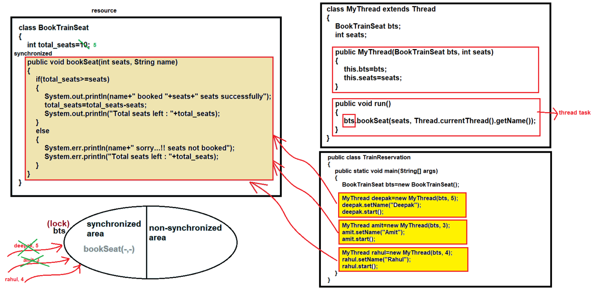

### Synchronization in Java (Part 1)

#### NOTE : 
- Whenever we execute multiple threads, all the threads starts their execution and thus the output is not constant. And due to this data inconsistency problem may occur. 
- This problem can occur in case of projects like banking, reservation (bus, train, airplane etc.), theater booking etc.
- See Programs:
  - [Test.java](_7_Synchronization_1%2FMultithreadingDemo6%2FTest.java)
  - [TrainReservation.java](_7_Synchronization_1%2FMultithreadingDemo6%2FTrainReservation.java)  


- To solve the above problem we use `synchronization` concept.


#### What is Synchronization ?
- Synchronization is the process by which we can control the multiple threads execution for a particular shared resource.

#### Problems without Synchronization :-
- Data Inconsistency
- Thread Interference

#### Advantage of Synchronization :-
- Resolves the Data Inconsistency problem
- Resolves the Thread Interference problem

#### Types of Synchronization :-
1. Process Synchronization (not the part of multithreading)
2. Thread Synchronization
   - 2.1 : Mutual Exclusive
     - Can be achieved by 3 ways:
       - By "synchronized method"
       - By "synchronized block"
       - By "static synchronization"

   - 2.2 : Cooperation (inter-thread communication)
     - Can be achieved by methods
       - wait(), notify() & notifyAll() methods


#### How to achieve synchronization :-
- We can achieve synchronization by 4 ways :-
1. By "synchronized method"
2. By "synchronized block"
3. By "static synchronization"
4. By using wait(), notify() and notifyAll() methods

   
#### 1. "Synchronized method" :-
- If we declare any method as synchronized by "synchronized" keyword, that method is known as "synchronized method"
- Syntax :
    ```java
    synchronized  void show() {
        // ....
    }
    ```

#### Internal working of synchronization :-
- In case of synchronization object lock comes in the action. 
- Every object has one unique lock. 
- Whenever any thread tries to enter the synchronized area that thread has to acquire the object lock. 
- After acquiring the lock that thread can access the synchronized area and all other thread has to wait to access that synchronized area. 
- After the thread (the thread who has acquired the lock) execution completes, it will release the lock and other thread can again acquire the lock and can enter the synchronized area.

    

- See Programs:
  - [TrainReservation.java](_7_Synchronization_1%2FMultithreadingDemo6%2FTrainReservation.java)


#### 2. "Synchronized block"
- Syntax :-
  ```java
  synchronized (object reference) {
      // ....
  }
  ```

- "Synchronized block" is used to achieve synchronization but on the specific lines of code.
- The scope of "Synchronized block" is smaller than the "synchronized method".
- It is always preferable to use "Synchronized block" in order to increase the application performance.

- See Programs:
  - [TrainReservation2.java](_7_Synchronization_1%2FMultithreadingDemo6%2FTrainReservation2.java)

   
    