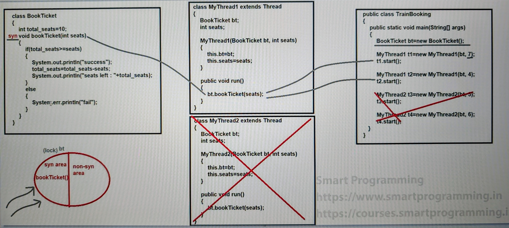
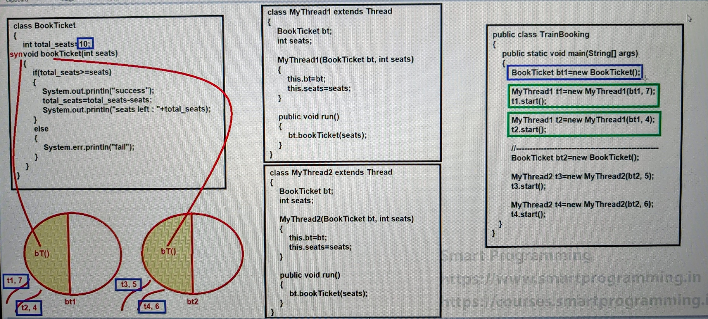
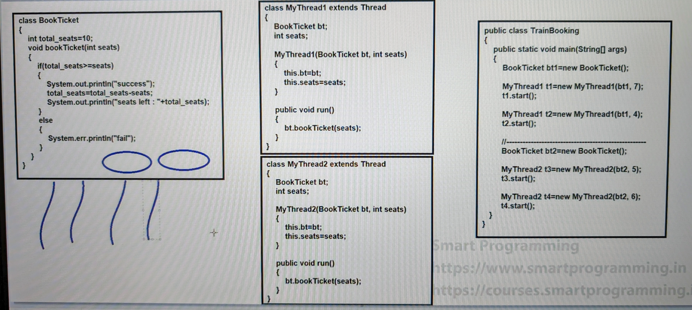
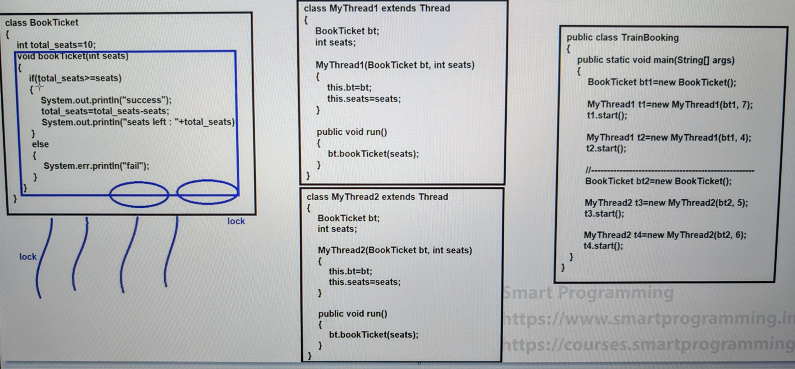
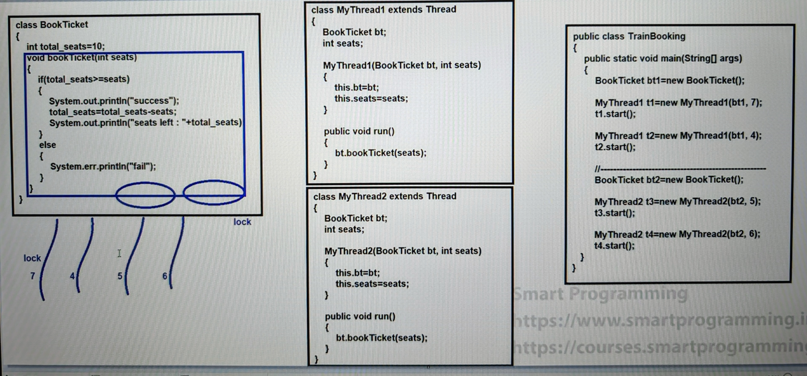
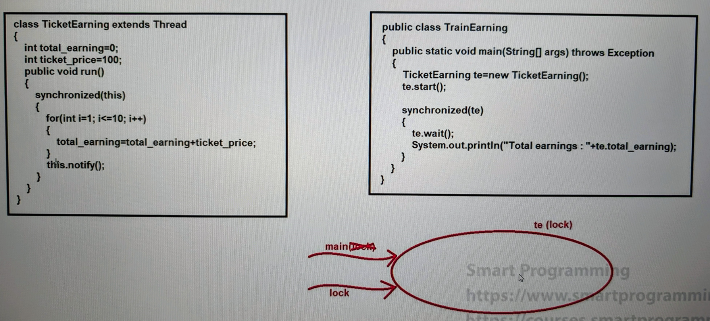
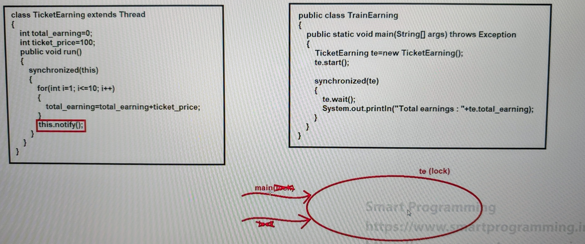

### Synchronization in Java (Part 2)

#### "static synchronization" :-
- In this part, lock comes for class level. All other working is same.

- SeePrograms:
  - [TrainBooking.java](_8_Synchronization_2%2FMultithreadingDemo7%2FTrainBooking.java)




- if we have multiple objects then there are high chances for data inconsistency problem occurs.
- both objects are calling same method.
- if you use only `synchronize` key word, then still you will get the same problem.



- so for this kind of problem we need to use `class level lock` and for that use `static synchronization`.


- there is random result will be generated and do not control on the thread, which thread first execute and book the seats.
- below photos are just an example.




- static methods we call directly through class name 
- static variables we call directly through class name 
- static synchronization concept, similarly for class level lock. 

---

### wait(), notify() and notifyAll() methods :-
- These methods are used for `inter-thread communication`.
- These all methods are of Object class. (not Thread class methods - we just use in the multithreading)
- To call these methods on any object, thread should own the lock of that object i.e. **the thread should be inside the synchronized area.**


- See Programs:
  - [Test.java](_7_Synchronization_1%2FMultithreadingDemo6%2FTest.java)
  - [TrainEarning.java](_8_Synchronization_2%2FMultithreadingDemo7%2FTrainEarning.java)

- `wait()` method :-
  - This method will release the current running thread lock and waits until it will get the notification.


- `notify()` method :-
  - This method is used to wake up the **single waiting thread** and releases the object lock.


- `notifyAll()` method :-
  - This method is used to wake up all the waiting thread and releases the object lock.






#### What is difference between sleep() and wait() method :-
1. 
   - sleep() is the Thread class method.
   - wait() is the Object class method.


2. 
   - sleep() is static method.
   - wait() is non-static method.


3. 
   - sleep() method doesn't release the lock.
   - wait() method releases the lock.


4. 
   - sleep() method is invoked after the provided time period.
   - wait() method can be invoked by notify() or notifyAll() or by provided time period.


---

### Anonymous Thread creation:

- create thread directly and run that thread too.

    ```java
    public class Test {
        public static void main(String[] args) {
            Thread t1 = new Thread(){
                public void run() {
                    for (int i = 1; i <= 10; i++) {
                        System.out.println(Thread.currentThread().getName() + " : " + i);
                    }
                }
            };
            t1.start();
    
            Thread t2 = new Thread(){
                public void run() {
                    for (int i = 1; i <= 10; i++) {
                        System.out.println(Thread.currentThread().getName() + " : " + i);
                    }
                }
            };
            t2.start();
        }
    }
    
    ```