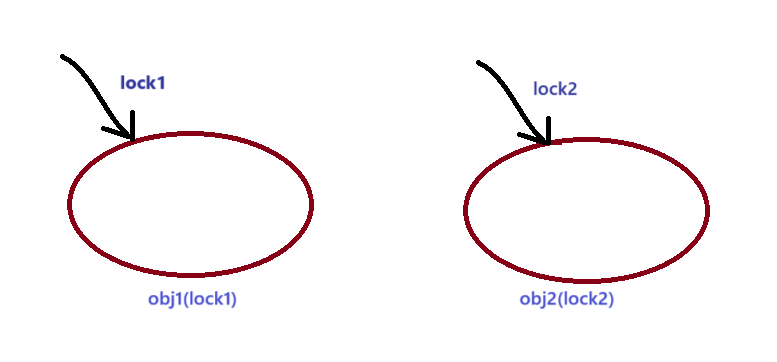
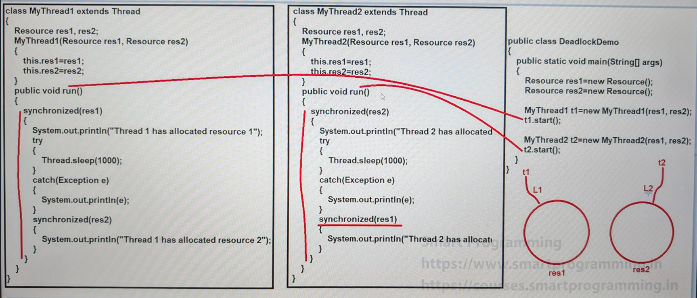

### Synchronization in Java (Part 3)

#### Disadvantages of Synchronization :-
1. It will decrease the application performance because the threads has to wait for the object lock.
2. Due to synchronization "deadlock" condition may occur.
   
#### Deadlock :-

- Deadlock is the situation where one thread is waiting for an object lock that is acquired by another thread and second thread is waiting for an object lock which is acquired by first thread. 
- In this type of situation both threads will wait for each other locks to release and this situation goes for infinite time, thus deadlock condition will occur.
 


- **See Program:** 
  - [DeadlockDemo.java](_9_Sychronization_3%2FMultiThreadingDemo8%2Fdemo%2FDeadlockDemo.java)


- Program Explanation:


#### Problems with "synchronized" keyword :-
1. If we want to acquire the lock in one method and release the lock in another method then this cannot be done with synchronized keyword.
   ```
   class Test {
      void m1() {
         // 100 lines code
         // thread should acquire the lock
      }
      void m2() {
         // thread should release the lock here
      }   
   }
   ```
2. There is no flexibility to try for the lock without waiting.
3. There is no way to get the list of all the waiting threads.
4. We cannot judge/control which thread will acquire the lock when the first thread will release the lock.

#### To overcome these problems java introduced java.util.concurrent.locks package (Lock interface & ReentrantLock class) in JDK 1.5 version
   
   
### Lock interface :-
- Lock interface is used to achieve synchronization same as synchronized blocks.


- Syntax :
   ```java
   public interface Lock
   {
      void lock();
      void unlock();
      boolean tryLock();
      boolean tryLock(---) throws InterruptedException;
   }
      
   ```   
- Click on and see predefine class and its method:
   ```java
   // click on ReentrantLock interface and see different methods
   import java.util.concurrent.locks.ReentrantLock;
   
   // click on Lock interface and see different methods
   import java.util.concurrent.locks.Lock;
   ```

### ReentrantLock class :-
- It is the implemented class of Lock interface.
- Syntax :-
   ```java
   public class ReentrantLock implements Lock, Serializable
   {
      //constructors :-
      1. public ReentrantLock();
      2. public ReentrantLock(boolean fair);
      
      // contains all the methods of Lock interface
      final int getHoldCount();
      final boolean isLocked();
      public boolean isHeldByCurrentThread();
      
      public final int getQueueLength();
   }
   
   ```
- See Programs:
  - [Test1.java](_9_Sychronization_3%2FMultiThreadingDemo8%2Fnewsync%2FTest1.java)
  - [Test2.java](_9_Sychronization_3%2FMultiThreadingDemo8%2Fnewsync%2FTest2.java)

#### Fairness
- if the fairness is true, the longest waiting thread can acquire the lock. If fairness is false, then which waiting thread will get the chance we cannot except.
- Remember, default value of fairness is false.

   ```java
   import java.util.concurrent.locks.ReentrantLock;
   
   ReentrantLock rl = new ReentrantLock(boolean fairness);
   ```


### Note
1. We should always use unlock() method in finally block.
2. If we use lock() method multiple times then we have to unlock it multiple times only.
